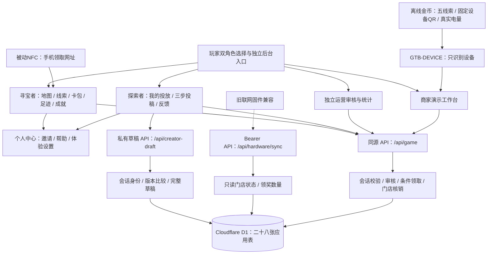

# 逛道宝 · 技术架构

> 文档版本：v2.3.49（高德门店搜索独立服务）
> 最后更新：2026-10-04（Asia/Shanghai）
> 对照依据：当前项目代码；《技术架构(2)》《商场寻宝 v2.1 迭代方案》《商场迭代方案v2.4》及《版本v2.9》作为设计建议参考。《版本v2.9》正文标为版本2.0；本轮另对照F:/逛到宝/src全部新增功能，源文件保持只读，真实业务沿用本项目服务端。  
> 维护方式：每次功能变更同步更新本文件、版本与变更记录，规则见 [AGENTS.md](./AGENTS.md)。

## 1. 当前实现范围

平台名称统一为“逛道宝”，中文品牌下方以小字换行显示英文名“wander about”，覆盖入口、登录、客户端页头、工作台侧栏/移动顶栏、发现卡和报表。当前客户端沿用v2.3.16的参考结构与动画、v2.3.17的LevelCenter成就中心；v2.3.18将商家和运营全部工作台页面及其登录统一为coin-hunt参考色调与动效。v2.3.14的近似皮肤和四张角色入口卡属于历史。来源`F:/逛到宝`是实际文件夹名，文档保留真实路径。

### v2.3.44 高德首页、POI 与多边形围栏

- 客户端首页使用真实高德JS地图替代楼层示意地图；首次定位授权成功后移至当前位置。当前楼层已启用、有效围栏的门店显示位置标记及圆形/多边形边界；门店标记沿用既有任务选择和详情流程。门店数据、主题、楼层与覆盖物更新不会反复重建地图或自动重设中心；“重新定位”显式请求新的位置。定位只保留在内存，奖励验证仍获取新定位。
- 商家注册的名称输入提供高德AutoComplete联想；选择POI后填入名称、地址与WGS84坐标，缺坐标时查询PlaceSearch详情。快速改名、锁定、卸载与过期请求不会回填旧结果；保留手填和地图选点。注册仍写待审核申请，审核通过才创建正式门店及默认圆形围栏。
- 商家/运营围栏编辑支持圆形与自定义多边形。多边形逐点绘制、撤销、重绘、完成及删除顶点，采用3–64个顶点；拒绝自相交、重叠边、零面积、无效坐标及超过门店锚点5000米的顶点。所有持久坐标为WGS84，高德显示/选点通过现有GCJ02转换。
- store_geofences增加shape_type和polygon_json，迁移0016_store_geofence_polygons.sql只增加字段与约束，原圆形记录默认不变。多边形radius_meters为兼容旧约束的包络半径，到店结果按实际多边形计算；distanceMeters仍是到门店锚点距离。30秒时效、5秒未来容差、完整定位精度盘包含规则、后台授权与revision CAS不变。
- 活动列表、围栏API与地图DTO同步传递形状及顶点，无效几何不视为合法门店范围。客户端角色切换不授予后台权限。
- 验证边界：交付程序记录实际类型检查、构建、几何及内存SQLite迁移/接口检查结果。它不执行运行库迁移。真实高德瓦片、POI、手机GPS及线上代理配置须单独浏览器验收；SDK实例ready不等于生产服务可用。服务器代理与密钥修复由并行部署任务处理，本批不覆盖该任务的文件。
- 新增职责：lib/amap-sdk.ts共享SDK/插件加载；components/client-store-map.tsx首页定位与门店地图；components/amap-poi-search.tsx POI搜索；components/geofence-editor.tsx边界编辑；lib/polygon-geofence.ts纯几何判定。实际检查结果见本批交付报告。

### v2.3.43 金币离线设备码

配套金币新增独立离线入口`coin_offline.c`，由默认启用的`CONFIG_COIN_OFFLINE_DEMO`选择；旧联网`main.c`及其配网、动态入口和sync逻辑作为历史兼容保留，不进入当前离线应用。金币本地显示茶间集五条线索和一页设备二维码，UP/DOWN短按循环翻页，线索页6秒轮播、二维码页停留，OK短按进入二维码。电量来自BSP实际SOC，读取失败显示`--`，不填造电量或领奖数量。离线应用不初始化Wi-Fi、BLE、HTTP、音频或NVS，不要求手机热点，也不在设备上同步领奖结果。

设备二维码固定为`GTB-DEVICE:coin-tea-01`，只标识已登记的“测试金币”，没有网址、设备凭据或个人券。商家网页联网扫码后按本店授权关联该设备的待领申请，选择正确玩家、核对申请及收到实物金币，再明确确认发券；正式券此时未核销，玩家以后消费另出示卡包个人券码。固定码可重复识别设备，不能证明防复制、玩家碰过NFC或实物已经回收；回收记录来自商家的明确确认，发券仍由既有后端权限、设备绑定、30秒新鲜到店许可、奖励快照和库存事务校验。本批不改变待领接口、正式每玩家/活动/门店一次限制或隔离的本机录制展示券规则。

板载被动NFC仍是手机写入的网址标签，正确入口为`/client/nfc/quest-tea?device=coin-tea-01`，不是设备二维码内容。此前用户写读回的`http://your-server.example.com/client/coin/quest-tea`仅为旧标签记录；新路径尚未物理改写。手机及商家网页仍须联网，公网HTTP不满足手机定位、网页内NFC和相机的安全上下文要求；最终手机可达HTTPS地址、云端当前源码/迁移/绑定及真实领取核销闭环仍待验收。修改部署地址后须重新写被动标签，固定设备码不随网址变化。

本批固件完整gate、构建、摘要归档和只读烧录预检已通过；Python的21项权限跳过不计通过。取得本候选明确授权后COM11三段烧录及20秒启动日志通过；用户对屏幕/中文、三键、电量与二维码读取合并问题回答“可以的，一切正常”，记为PASS_USER_REPORTED。未取得具体电量或原始扫码文本，不扩展为商家发券核销、NFC改写或多轮多玩家实物闭环通过。证据和精确候选摘要见第10节本版验收记录；本机公开绑定只读核对已完成。网页v2.3.42入口整理完整保留，本批没有网页功能、API或数据库变更，没有生成新网页源码压缩包或执行云部署。

### v2.3.42 客户端与运营入口整理

客户端普通页头的帮助按钮统一调用既有`navigate("help")`进入玩法帮助，地图原帮助入口保持相同去向。个人中心已有“玩法帮助”菜单，因此不再显示第二个页头帮助按钮；帮助页不再提供指向自身的按钮。试玩点位牌继续从帮助页进入，沿用原弹窗关闭、Esc与历史返回。体验设置页只显示正文的浅色/深色选择，收起重复的页头主题切换；其它页面的主题按钮、刷新与偏好保存不变。

探索者“我的投放”在数据已加载、作品总数为0且筛选为全部时，只保留空态的“创作第一条线索”，收起标题旁相同去向的“新建宝藏”。加载中、有作品或仅筛选后为空时保留标题新建入口；筛选空态的“查看全部作品”仍用于恢复列表。创作步骤、服务端草稿、角色权限与原导航保护均沿用。

运营概览待处理列表原来每行“去审核”均进入同一内容审核列表，没有指定任务。现将入口合为标题旁一个“查看待审核投稿”，继续调用`onNavigate("review")`，不伪造按行定位或预筛选。任务标题、门店、作者与时间仍逐条展示；无待处理记录时不显示入口，处理期间禁用，与原忙碌导航保护一致。账户入驻、投稿内容及门店活动审核是不同流程，各自入口保留。

本轮只合并去向与上下文相同的入口。个人中心统计快捷与卡包卡、地图点位和任务列表、抽屉、草稿恢复和结果核对具有实际用途，继续保留；探索者底栏没有卡包入口，因此个人中心卡包卡不能删除。未修改API、数据库、账号、审核或奖励规则，商家业务分支及已交付v2.3.41商家压缩包保持原快照。入口整理阶段未生成新包，后续用户要求完整源码封包，见本版交付补充。

#### v2.3.42完整源码交付补充

用户本轮明确要求“整个发，不用拆”，因此交付一份`逛道宝_完整项目源码_v2.3.42_20261003.zip`，包含寻宝者/探索者客户端、商家端、运营端，以及完整共享接口、公开资源、16个增量迁移、构建插件和文档。完整源码保留`PROJECT_EDITION="full"`与所有现有页面路由，不再按角色裁剪。此前v2.3.41商家独立包继续作为历史已交付快照，本批不覆盖它；旧三端单独封包等待事项由本次完整包请求替代。

该包的网页源码版本为v2.3.42；同时保留另一窗口补充后的v2.3.43架构说明，其中硬件构建与设备待验记录属于独立固件工程。完整网页包不附独立金币固件、Android工程或SDK工具链，版本说明分别记录网页与架构版本，不将硬件说明更新当作网页功能变更。

源码包以明确白名单冻结并逐文件校验，不包含依赖、缓存、生成的构建产物、QA、私有环境变量、设备Token、邮件授权码或实际业务数据库。接收者安装依赖和填写私有配置后运行；已有部署保留配置与数据库，并只增量应用缺失迁移。包内`构建验证.json`记录该冻结源码的实际类型与生产构建结果，`文件清单_SHA256.json`用于核对所有交付文件。完整工程提供三端页面不等于所有账号共享权限，原登录、门店绑定、审批、定位、领奖和核销规则均保留。本批交付不表示云端部署、真实邮件、实物硬件或Android APK验收完成。

### v2.3.41 任务绑定与试玩说明界面

商家及运营共用的`DeviceTaskManager`将“绑定任务”原生选择框改为已有`ChoiceField`主题下拉，使用顶层选项列表、选中标记、键盘选择及焦点恢复。选择框与“保存绑定”按钮采用同一网格宽度和边框盒，最小高度统一为48px，窄屏长文字自然换行、右侧箭头保持对齐。仅此绑定控件启用`matchTriggerWidth`，展开列表随选择框宽度定位，继续按可见视口限制宽度及坐标，长列表只在浮层内滚动；既有日期和其他选择列表保留原尺寸。控件保留设备ID对应的独立无障碍名称；不提供该名称的既有选择控件继续关联可见标签，旧浏览器的原生备用选择框也保留设备名称。

选项仍仅来自该设备所属门店的已发布任务；`coin-tea-01`仅可选择`quest-tea`。空选项、忙碌禁用、维护设备隐藏绑定、原`deviceBind{deviceId,taskId}`动作和成功后清空选择的行为保持不变。本批只调整选择界面，未改动后台权限、设备登记、任务绑定规则或数据库。

商家及运营端试玩说明保留介绍及示例门店，但不再显示“回到地图，开始探索”按钮，避免说明弹窗将后台角色切换到客户端；客户端仍保留此入口。关闭说明继续使用原弹窗历史及当前路由，不退出后台身份。

试玩说明的专属`.demo-point-modal`主题样式扩展到商家和运营工作台，卡片背景、标题、正文及介绍区使用对应浅深主题变量，修复工作台浅色弹窗混用旧深蓝示例卡和深色文字的问题。700px及以下为单列门店卡，图片与文字分列，380px及以下缩小图片列；长文字换行、正文内部滚动及关闭入口保留。样式仅作用于此说明弹窗，不改其它弹窗、门店图片数据或任务流程文案。

#### 同版展示补充：商家最近领奖记录

商家概览底部的记录卡改称“最近领奖记录”，说明数据来自本店当前活动的最近8条正式优惠券及积分奖励，不受上方统计时间筛选影响，待领取申请与演示展示券不计入。发放时间及个人券码增加文字标签，积分不显示空券码，状态分别显示“积分已到账 / 已核销 / 未核销”；“未核销”只描述核销记录，不表示优惠券当前一定可用。原授权范围、排序、排除演示券、8条限制及只读刷新动作保持不变。

该卡与上方统计卡保持24px间距；标题说明区按内容自然占位，移除窄屏纵向布局下220px的flex基础尺寸，避免说明与刷新按钮之间出现大块空白。长奖励名称及券码可自然换行。此项仅为文案与排版纠正，沿用当前文档版本，不新增接口、数据库或真实业务写入。

#### 同版展示补充：三端滚动条

根布局最后加载`app/scrollbars.css`，统一客户端、商家与运营页面、说明弹窗、抽屉、表单、选择浮层、表格及文本框的滚动条。浅深配色分别由既有`html[data-quest-theme]`和所在壳的`data-client-theme`继承，页面根`color-scheme`同步主题；未增加主题开关或存储。支持WebKit滚动条部件的浏览器采用8px轨道、透明背景、细圆角滑块及悬停加深，弹窗轨道内缩，已有卡券轨道22px内缩保留；标准备用样式采用thin和相同主题颜色。

已知可见滚动区单独处理标准与WebKit样式优先级，避免旧组件的原生thin或灰色滑块阻止圆角样式生效。横向工作台导航、客户端筛选与成长轨迹、`scrollbar-none`及自动滚动隐藏规则继续保留。高对比模式采用CanvasText/Canvas系统色，压过旧组件装饰。此项为共用视觉修正，不改overflow、滚动锁、滚动条占位策略、导航、弹窗历史或业务操作，沿用当前文档版本。

#### 本轮商家端独立源码交付

用户本轮改为先交付商家端，客户端与运营端的最终包继续暂缓。商家副本沿用既有固定edition机制：`PROJECT_EDITION="merchant"`，默认`/merchant/login`，只保留商家页面路由，保留完整共用API、业务组件、数据库结构及增量迁移；原完整工程保持full。它是固定商家入口源码版本，不是另拆的新后端服务，不替代真实账号与门店权限。配套交付说明区分新环境首次私有配置、既有部署保留配置与数据、共享后端/数据库联动及客户端公开硬件链接。

源码压缩包包含本文件、运行说明及源码文件清单，构建结果在包内`商家端构建验证.json`记录；排除真实环境变量、凭据、设备Token、本机数据库、依赖目录、缓存、QA和构建产物。本批交付不代表云端部署、真实邮件投递或实物硬件验收完成。

### v2.3.40 功能入口整理与卡包展示顺序

商家和运营以现有`navItems`主导航为唯一全局菜单，删除此前已由CSS隐藏的第二套工作台菜单及别名定义；七个商家入口、八个运营入口、当前页标记、审核数量、忙碌锁与历史导航沿用。商家侧栏门店卡只展示当前身份，资料管理由“商家信息”菜单进入。工作台“试玩说明”集中到顶栏，手机显示带无障碍名称的44px图标；概览底部两项通用菜单快捷按钮移除，待处理事项中的“去审核”保留。

个人中心将贡献和投放合为“我的投放”，保留进入探索者投放页的原回调；成就功能集中在带等级与进度的“成就中心”卡。地图“本层宝藏”统计按钮改为聚焦并滚动到当前楼层任务列表，不再跳转成就页；保持楼层、搜索与任务状态，应用及系统减弱动效下即时滚动。卡包按待领草稿、正常卡包内容、演示展示券排列，展示券的申请/核对/打开原回调及服务端录制开关保持。

商家资料编辑器有固定顶栏工具区时只显示一组普通保存与退出按钮，独立使用、无顶栏插槽时保留原底部操作；未知正式保存结果的核对与原参数重试继续显示。表单已打开时隐藏重复“继续编辑”，已保存草稿和删除入口仍保留。优惠券抽屉中的创建入口统一叫“新建优惠券”。帮助与邀请文案同步当前账号和领取流程；录制模式说明的当前段采用现行NFC申请、商家确认与后续个人券核销规则，旧版本章节保留历史。本批未修改API、权限、库存、数据库或录制启用规则；三端最终源码包继续等待并行修改完成后的共同验收。

### v2.3.39 商家表单控件、有效期与发布提示

商家表单复用主题日期与选择控件。`WorkbenchFields`在原表单DOM中使用原生popover顶层显示圆角日历和选项，继承浅深主题，避免被父抽屉裁切；展开和收起采用140ms轻位移淡入淡出，退出选项立即inert、不可再选择。键盘及初始选中定位只滚动浮层自身，不带动页面或父表单。日历按整个可用视口定位，空间足够时显示完整六周与清除按钮；选择、清除和关闭不重建当前浏览月份。系统及应用减弱动效使用即时状态，旧浏览器保留原生备用控件。

优惠券“模板状态”显示为“发放状态”，选项为“正常发放 / 暂停发放”，实际active/inactive值保持不变，提示暂停仅影响后续发放。“长期有效”勾选后隐藏日历并清空日期，保存为原接口允许的空期限；未勾选时起止日期必填，截止不得早于开始，继续按北京时间保存。编辑已有无截止券时保留其原开始日期，明确重新选择长期有效才清空。名称、金额、总量及期限满足原约束后才能保存，提交处理器也复核条件，保留原库存、已发券快照和保存流程。

门店活动将“公告状态”改为“筛选活动”，六个筛选值不变，选择列表采用同一圆角浮层；运营门店筛选也复用该控件。筛选和含义说明位于下方“活动公告记录”栏的标题/数量之后、实际记录之前，加载或读取失败时仍保留标题和筛选，未获得当前数据时不显示旧数量或假定0条。发布区域保留范围说明与操作，按钮旁直接显示真实受限原因，区分读取中/失败、处理或结果待确认、门店缺失/下线、范围未保存/未启用/无效，并关联无障碍描述；编辑时还说明后台版本变化。门店范围提示与设置入口使用对应原因，不替用户定位或开启范围；原审批、范围、分页、撤下及结果核对规则保留。

门店NFC设备选择改为相同的主题列表，仍只显示本店启用且绑定当前已发布canonical任务的设备，单设备自动选中，多设备由用户选择。设备ID、NFC网址、固定设备码、复制与无可用设备的处理保持原实现，本批不改写实物标签或硬件。

`StoreIconField`将20项预设图标改为四列网格：默认8项常用图标，另12项通过“更多图标”展开；选中摘要一直显示，收起保留已选值。额外区采用180ms展开/收起并尊重减弱动效，收起后同时隐藏于辅助技术、inert及禁用输入。原自定义图标可以原样保留，修改仍须使用预设；实际保存校验、后端白名单、图片及未知结果保护沿用原实现。

门店信息抽屉的关闭受限说明固定在标题下方，不随正文滚走。“返回编辑表单”只滚动并聚焦表单内可用的核对按钮，保留原输入，不执行取消或重复保存。本批初始StoreEditor阶段在普通编辑时也锁定关闭；随后并行窗口已接入`MerchantStoreProfileEditor`与退出guard，普通编辑可在资料草稿保存后退出，图片处理、正式保存及未确认结果继续受保护。编辑/保存按钮使用不同key，编辑点击阻止默认提交，避免同一次点击因React更新按钮type而意外保存公开资料。原11组验证只证明初始阶段，最新4组组件集成另行记录，不替代资料草稿后端完整验收。本批UI调整没有新增API、迁移或真实数据写入；三端封包仍按用户要求等待并行修改完成后合并验收。

商家核销页将领取区域标题显示为“金币领取确认”，浏览入口为“查看待领申请”，最终按钮为“确认领取”。说明明确核对领取编号、玩家及收到实物金币后，奖励进入玩家卡包；优惠券以后使用时在下方单独核销。设备识别、申请选择、未知结果核对与重试的提示同步采用领取确认用语；动作、参数、权限与积分/已核销券/未核销券成功分支保持原实现。

### v2.3.38 领取草稿、设备回收发券与优惠券抽屉

正式硬件任务改为三段流程：玩家碰读普通NFC打开带设备标识的入口，查看奖励并授权到店定位，保存待领取申请；商家扫描这台金币的固定设备码，自动打开该设备的待申请抽屉，选择正确玩家、确认已收到金币后发放正式奖励；玩家以后自行选择时间，凭手机卡包的个人券二维码消费核销。不回答硬件观察题。普通独立网页任务继续原观察题与范围规则，本机录制展示券继续隔离保存，不能当作实体设备验证。

待申请窗口关闭后保留服务端草稿，卡包提供“领取草稿”抽屉，每页最多20条，可继续、重新定位或删除尚未发券的草稿。草稿不生成claims、积分、成就、贡献、金币计数或库存扣减；删除为软删除且不能删除已发正式奖励。玩家在同一活动、门店最多一条pending；设备可服务多名玩家及多次演示，正式奖励仍遵守同玩家/活动/门店唯一规则。定位许可有效30秒，过期保留草稿，商家不能直接发券；玩家回到门店范围重新定位续期。只保存位置时间戳和范围版本，不保存原始经纬度。

固定设备二维码内容为`GTB-DEVICE:<已登记设备ID>`，例如`GTB-DEVICE:coin-tea-01`；现有coin-tea-01显示“测试金币”。扫码只识别设备、加载本店待申请，不自动发券，不用于个人券核销，也不当作加密防复制证明。发券需要已通过且未封禁的本店商家账号、明确`receivedDevice=true`与申请版本；最后条件更新同时重验玩家会话、设备启用/绑定/凭据摘要、任务及作者、围栏版本/许可时间、模板快照/有效期/库存。pending→issued触发器原子写claims与既有积分成长，保存商家账号和`device_returned_at`回收记录；券的redeemed_at仍为空，后续核销独立执行。旧原UUID正式领取仅只读恢复，不重新发行。

创建、续期、删除、商家发券均冻结原UUID和完整参数，结果未知时只读核对原操作，不换请求或自动重发；确认未查到后由用户明确重试原UUID及原参数。服务端请求回执保存操作者、用途、内容摘要与版本，借用其他玩家/角色/设备或变更原参数返回冲突。草稿保存不等于已经获券，页面不以聚合硬件sync计数判断某位玩家成功。

“奖励与库存”主区改为数量摘要及管理入口，优惠券列表收进分页抽屉，每页8张，保留全部/启用/停用筛选、编辑与停删权限。新建、编辑和绑定金币复用原生`FormDialog`，固定标题、内部圆角滚动、历史返回与焦点恢复；用引用计数锁滚动并保留滚动条槽及背景提示几何，避免打开时背景跳动。入场320ms、退场260ms轻微位移淡入淡出，支持系统/应用减弱动效，忙碌或未知绑定结果不能关闭。折扣值按百分比换算并最多保留3位小数，88显示8.8折，不显示浮点长尾。

停用券卡新增“启用”按钮，调用`couponActivate{templateId}`只恢复模板status并更新updated_at，不提交旧表单覆盖名称、数值、数量或有效期。所属本店商家/运营权限和当前活动归属在写入时重验；已删除不能恢复，已过期或模板配额发完明确提示编辑日期/额度，尚未生效的有效模板可恢复计划发放。同条件下已active幂等返回，不重复改写；不生成券、返还额度、变更已发快照或改绑设备。门店总额度和门店状态仍由实际发券最终校验，模板启用不等于立即发行。读取刷新后全部/启用/停用筛选同步，写入期间按钮禁用。

券卡提供“绑定金币”窗口，仅选择本店已登记、启用且已绑定活动的设备；新设备尚未接入时保留说明，不伪造登记、通信或成功绑定。`deviceCouponBind`只修改现有活动的后续券模板，CAS校验原任务/原券及实际后台权限、目标券状态/日期/额度；已发券快照不变，没有发券或核销副作用。改绑后旧pending快照不再可确认，玩家须重新定位并读取当前奖励；未知绑定可查询当前工作台状态，再明确重试原参数。

商家信息主页面保留门店名称、类别和位置摘要，资料、展示图、活动额度与准确设备NFC配置集中在“门店信息与设置”抽屉。编辑工具条的“保存资料”固定在抽屉滚动区域顶部；不完整输入以800ms防抖、串行保存为本商家账号的服务端草稿。修改后也能返回、点关闭、背景、Esc或同页Back，退出前异步补存最后输入；草稿失败/结果未知保留输入并明确核对，不能把未写成功当作已保存。再打开提示恢复或删除草稿，刷新也可读取；业务草稿不写浏览器存储，正式门店仅点“保存资料”后更新。正式成功再按原草稿版本清理，别的页面新草稿保留；图片处理、正式保存中或正式未知结果仍保护原输入。未知正式保存冻结原规范参数/图片版本，查询真实本店状态后确认成功，或明确按原参数重试并由原图片版本CAS阻止覆盖新资料。门店图标改为20项预设emoji选择，服务端拒绝新的自由文字/HTML图标；原历史自定义值仅可保持不变，修改时必须选择预设。展示图片仍可选3张示例或上传1张，原图片格式/大小和版本校验保留。运营门店管理继续原显式保存流程。

`merchantProfileDraftGet/Save/Delete`只服务实际通过且未封禁的merchant，按当前活动、账号与所属门店隔离；请求中的页面玩家快照与真实商家会话不匹配即拒绝。草稿保存允许名称/类别/地址等尚未填完整，仍校验字段类型/长度、预设或当前确切历史图标、单张图片格式及限额。新0015表保留revision、最后UUID/内容摘要；save/delete用最终授权的条件UPSERT，原UUID同内容可恢复，不同内容或过期版本冲突。删除写null tombstone并增加版本，不抹掉版本元数据；旧清理请求不能删除更新草稿。只改草稿表，不发布门店、改库存、定位或发券。

草稿前端以读取序号避免StrictMode旧读取覆盖较新草稿或本地输入，页内原操作意图按商家玩家/门店分区，晚回执仅清理自己的UUID。确定400/413/422校验失败保留输入并允许修正，暂停自动写入直到用户修改；未知结果继续冻结原UUID/参数、只读核对后明确重试。保存循环与正式保存每个异步边界都检查组件仍在当前账号；`merchantProfileAction`在正式写入前、响应后校验原玩家/账号/商家门店。正式原保存核对读取成功后同步当前工作台与对应门店摘要，避免提示成功却仍显示旧资料。打开抽屉但尚无修改时，即使初始只读失败也可关闭；有未确认写入则继续保护原输入。

商家核销页还提供“待领申请”抽屉（入口“查看待领申请”），未扫码也能只读浏览本店所有pending申请、分页与查看对应金币ID。选人本身不能发券，需扫描或明确输入对应设备码加载实际设备待领列表，再选择申请、核对玩家与实物并点击“确认领取”；扫描不同设备清空原选择，不把总列表中设备ID当作自动验证成功。选中边框与阴影使用工作台浅深主题的绿色变量，深色仍清晰可辨。玩家打开或刷新草稿抽屉时同步只读刷新卡包，商家另一页面已发券后可及时看到正式券。

工作台菜单切换时当前项平滑移到可见中心，首屏、尺寸变化和减弱动效立即对齐；菜单选中与未选中使用相同字重，不因字体宽度变化跳位。页面过渡改为320ms、6px轻位移与淡入，取消卡片叠加的重复延时入场，点击立即更新内容和URL。原两端浮层箭头、边缘隐藏与导航权限继续保留。

统计时间范围和优惠券类型复用`ChoiceField`主题圆角下拉，选项有选中标记、140ms轻位移动效、键盘移动与Esc焦点恢复；原生popover顶层放置且退场即不可交互，避免被表单弹窗裁切或误触退出选项。不支持popover的浏览器保留原生select备用。范围仍为7/30/90天，切换沿用原统计读取/请求锁和Excel、CSV口径；读取期间选择与导出禁用。手机范围控件占一行，两个导出按钮另排两列，保持48px触控区与12px间距。券类型的discount/cash/gift值、对应金额字段、边界及保存验证保持原实现。

0014仅新增`nfc_claim_drafts`与`nfc_draft_operations`两张表，应用表从25增至27；0015再新增独立`merchant_profile_drafts`至28张，旧表/账号/券/令牌保留。网页提供准确设备的NFC复制入口`/client/nfc/<taskId>?device=<deviceId>`；旧无设备URL仅在活动有唯一可用绑定设备时兼容。未来加密离线设备证明接口继续返回明确未配置状态，固定码与回收发券接口已实现；本批未改固件、屏幕码、实物NFC或云端部署，实体联调另验收。

### v2.3.37 工作台导航浮层箭头

商家和运营工作台的窄屏横向导航保持整行宽度，不再为左右提示预留栏位。`WorkspaceNavOverflow`容器使用相对定位和独立层叠上下文，左右箭头绝对定位在两端并叠在菜单上方；隐藏或显示箭头不改变菜单宽度，首尾菜单滚动到边缘时没有箭头占位造成的空隙。两侧提示底色使用60%主题色混合透明背景，边框70%、背景模糊6px；悬停底色为85%，图标保持清晰。图标保持16px、点击区域44px，左右隐藏判定继续按实际可滚动内容执行。箭头层级限制在导航内部，继承工作台顶栏层级，不覆盖普通或原生弹窗；桌面侧栏、菜单目的地、授权和数据保持原实现。

三端最终源码包仍按用户要求等待另一个窗口的修改完成后统一检查和生成；本轮导航修改不纳入尚未验收的并行优惠券弹窗或API改动。

优惠券新建和编辑表单的“模板状态”改为“发放状态”，选项显示“正常发放”与“暂停发放”，并关联说明：暂停后不再发放新券，已领取的券仍按原条件和有效期使用。仅修改展示文案与提示，实际active/inactive值、保存接口、期限、库存和已发券规则不变；并行窗口的弹窗、绑定及保存实现保留。

### v2.3.36 三端独立入口源码版本

另存客户端（寻宝者＋探索者）、商家端和运维端三个可各自安装、启动及构建的源码版本。运维端对应已有staff/admin运营后台，不增加服务器监控功能。原项目固定为full，继续提供合并入口；三个副本分别固定client、merchant、operations，不通过查询参数、用户角色偏好或网页开关选择版本。

`lib/project-edition.ts`提供固定PROJECT_EDITION、默认入口、页面路径限制、内部导航限制和读取上下文。客户端根页面保留两个玩家角色并隐藏工作台按钮；商家根路径归到/merchant/login，运维根路径归到/staff/login。只有本端app页面路由进入各自源码包，客户端NFC/金币深链接与运营/ops兼容路径保留，商家拒绝原运营别名/merchant/review。软导航、首屏、刷新及popstate都复核版本路径；工作台强制workspace读取且不处理quest客户端查询。品牌回本端入口，已获当前正确后台身份时回本端概览；独立后台登录页隐藏通向合并角色选择页的按钮。网页标题也按版本区分。

专属版本的原生浏览器后退还通过已有文档head历史拦截器优先处理：遇到其他端路径时先归回本端，再转发规范化popstate给框架与页面，避免框架先进入404而卸载普通返回监听。结果未知的注册申请优先保持原页面与原UUID；合法后退继续执行，full保留原历史监听方式。

商家与运营工作台在980px及以下宽度使用横向菜单；共用`WorkspaceNavOverflow`根据实际隐藏内容独立显示左侧“向左查看更多导航”和右侧“向右查看更多导航”箭头，点击向对应方向滑动，到达相应边缘时隐藏。图标从20px缩小至16px，保留各44px的触控区域；初版为两侧独立留白，已由上方v2.3.37浮层布局替代。通过scroll、尺寸、菜单文字及字体变化重测，窗口变化后保持当前项可见；隐藏的已聚焦箭头将焦点交给对应首尾菜单项。桌面无横向溢出时不显示，客户端导航继续原结构；尊重系统与应用减弱动效。此提示也适用于full合并版工作台，不改变菜单目的地或后台权限。

同时修复合并版与三个副本的登录身份标识问题。原页面在其他标签页或同主机端口改变Cookie后，会把旧玩家ID附在登录请求上，导致API在校验密码前返回409“登录身份已变化”。明确切换账号的accountLogin、staffLogin和用户主动点击的recordingLogin不再附旧玩家快照；正常密码、角色、审批、封禁、门店限制及录制入口的本机/私有开关/预设身份校验继续在服务端执行，登录后仍核对实际Cookie刷新结果与返回的账号ID、账号名、角色和本店一致。领奖、投稿、核销、注册、邮箱绑定等保留原身份快照，身份变化仍拒绝写入；没有移除API的全局防串号检查。

每包保留共用组件、全部API/backend、数据库增量迁移、公开图片、锁文件与运行文档，确保原单体导入和门店/券/账号互相依赖完整。它们是固定页面入口版本，不是三个已经完全拆分的后端服务。后端真实角色、审批、封禁、门店权限继续生效；版本限制不替代授权，不更改现有账号、SMTP、NFC、围栏、录制开关或库存规则。本次没有新增数据库迁移或修改实际持久数据，沿用25张应用表和0013。

三个副本默认使用各自本地持久目录，数据不会自动同步；不同本地端口仍共享主机Cookie。联动部署须配置同源共享API与数据库，或正确绑定同一D1实例，不能把三个空库当作联动完成。未新增跨域API配置、CORS许可或Cookie命名空间，未部署云端反代。硬件QR/NFC及玩家分享必须指向客户端公开地址。独立运行与单进程宝塔限制见[三端源码说明](./三端源码说明.md)。本版软件与包验证在下方验收记录追加，不将计划验证写成完成。

### v2.3.34 本机录制展示券、邮箱验证码与门店图片

已通过玩家在本机卡包明确领取一张标记`Coupon.demo=true`的茶间集展示券，券码为`GTB-D-`加20位十六进制，共26个ASCII字符，有效期7天。券复用正常卡包的原始二维码、复制码、商家预览及一次核销交互；商家流水显示演示标记。展示券不等待实物NFC、不要求定位，不代表可信物理碰触、真实到店或云端设备联动。正式NFC与独立网页任务的条件继续沿用下节，不因录制而跳过。

展示券权限仅由既有服务端`RECORDING_SHORTCUT_LOGIN`控制，须精确`true`且请求主机为`localhost`或`127.0.0.1`；没有新的网页模式开关。玩家领取和结果恢复还须已通过、未封禁的实际player账号，商家预览与核销遵守本店真实后台授权。读取页面不自动发券；固定tea且不创建门店、任务、GPS或正常券模板。开关关闭后`recordingCouponAllowed=false`、展示券不进入玩家卡包和商家流水，对展示券领取/恢复/预览/核销返回403，保留数据库记录；普通密码账号和正式券核销不受影响。

`recordingCouponGrant({requestId})`冻结UUID后写入，返回`{coupon,newlyIssued,requestId,message}`；`recordingCouponStatus({requestId})`只读返回`{found,requestId,coupon?}`且仅查本人精确请求。结果未知时保留原UUID，只查询，不自动重发或换UUID。每玩家当前活动最多一张未用且未过期展示券；新UUID复用现有有效券时也持久保存请求映射，旧请求在核销后仍恢复原券，不能误认下一张。用完或到期后可用新UUID领取下一张。

`0010_recording_coupons.sql`新增`recording_coupons`与`recording_coupon_requests`两张独立表，应用表从22增至24。它们不与正式`claims`、积分账本或金币计数混用，展示领取与核销不触发成就/贡献、足迹、真实库存或常规统计；普通反馈和发现分享不向展示券开放。提交时重验玩家或商家授权与录制gate，核销使用未用/有效条件更新，错店和重复核销被拒绝。更新先备份实际持久状态，再应用0010和缺失的前序迁移；关闭录制保留数据，彻底移除需按[录制模式说明](./录制模式说明.md)逐项处理，不能删正常账号或共享历史模块。

本批各阶段软件验证以第10节实际报告为准；新增迁移的真实本机执行、邮件真实投递与最终构建另行记录，不以旧版测试或实体设备历史记录替代。本次没有部署云端或修改、构建、烧录固件。

### v2.3.35 注册验证邮箱，邮箱即账号

三个身份的入口统一为“登录 / 注册账号”。新注册必须填写邮箱、获取并验证6位邮件验证码，再设置密码；规范化邮箱本身就是用户名，不再填写另一个用户名，也不再单独提供邮箱验证码登录。普通登录只提交邮箱与密码；原有admin及其他历史账号继续在同一个表单使用原账号密码，不强制改名、重置密码或合并历史记录。寻宝者和探索者共用player账号，商家与运营分别注册、审核和登录；同一邮箱可分别注册不同角色，权限与密码互不共享。商家注册继续填写真实地址、位置范围和首张优惠券，未通过审核前不创建公开门店。

`accountRegister`在服务端强制要求`email/emailCode/emailChallengeId`，由邮箱派生`username`；客户端若同时提交username，必须与规范化邮箱一致。邮箱去首尾空格并转小写，最长254字符；旧用户名格式只用于历史账号登录。昵称可选，留空时使用邮箱@前面的部分（最多24字符），表单明确显示这条默认规则；公开玩家资料使用昵称。注册本身不签发登录Cookie，玩家注册后用邮箱密码登录，商家和新运营须等待审核。`emailLogin`返回410停用，`emailCodeSend`不再接受login用途，直接调用旧API也不能绕过密码登录。旧账号的`accountEmailBind`保留密码加bind验证码的升级接口，不新增独立登录页面；绑定后仍使用密码；该历史绑定接口不能更换新注册账号的规范邮箱用户名，验证同一邮箱只消费证明而不改账号版本。邮箱验证不能跳过审核或封禁。

验证码挑战以UUID标识，绑定`role/email/purpose`；6位数字、5分钟有效、最多5次错误验证，数据库仅存服务端私有密钥派生的HMAC摘要。接口不返回验证码，SMTP凭据不进入浏览器、日志或源码包。发送最多每邮箱6次/小时、每来源30次/小时，同一邮箱至少间隔60秒；注册最多每邮箱10次/小时、每来源50次/小时；验证最多每邮箱30次/15分钟、每来源150次/15分钟。以上邮箱预算与来源预算跨角色/用途共享，不能换商家、玩家或运营入口倍增次数；邮箱验证与限流用于减少恶意注册、撞码和滥发邮件，不宣称提供完整DDoS防护。邮件服务未配置或发送失败时明确阻止新注册，不降级为未验证注册；既有账号密码登录继续可用。

发码结果未知时页面内存保留原UUID，等待冷却后仅允许用户明确核对原请求，不自动重发。同请求恢复不会重复发信；新验证码成功投递后才撤销同作用域旧验证码，发送失败保留旧有效码。原UUID已确定failed时返回409并永久无效，冷却后用户明确获取才创建新UUID。改变邮箱或身份清空旧证明；密码及验证码不写入localStorage/sessionStorage。

注册冻结原UUID、规范化邮箱和完整资料。商家已成功的原申请即使首券后来过期，也能精确恢复保存结果；新申请及审核批准仍拒绝当时已过期的首券。已成功请求先核对原资料摘要与密码，可在原验证码已过期或已消费后精确恢复；改资料、改挑战或借其他身份请求不能恢复。新注册在同一D1事务内消费register用途证明并插入账号与玩家，提交时重验邮箱唯一性、证明时效和可复用玩家归属；失败回滚，不提前消费证明或留下孤立玩家。登录响应仍由根应用重新读取实际Cookie状态并核对账号、角色和商家门店。未实现忘记密码或邮件找回密码。

发信仍由`lib/smtp-mail.ts`使用Cloudflare Workers sockets、TLS SMTP465与10秒有界会话，配置私有`MAIL_HOST/MAIL_PORT/MAIL_SECURE/MAIL_USER/MAIL_PASS/MAIL_FROM`；验证码HMAC使用私有发信授权密码派生。真实邮件投递需要发信服务授权和运行网络，在模拟测试之外单独验收；本批不发送真实邮件或更新云服务器。

`0011_email_accounts.sql`继续保存角色内唯一邮箱与email_challenges，旧账号email可为空；新增`0013_email_usernames.sql`将accounts用户名长度上限由32扩至254，原位替换约束并保留所有旧列、账号ID、密码、状态、UUID、审核索引、邮箱唯一索引和会话外键。应用表仍为25张，不把旧账号自动改成邮箱；更新须先一致备份实际持久数据库，再按顺序执行缺失迁移。

### v2.3.34 门店展示图片

商家在“商家信息”编辑本店展示图，可选茶饮、书房、手作3张示例图，或上传一张PNG/JPEG/WebP图片；前端解码压缩后最长边不超过1280像素、文件不超过500 KiB。替换只保留新图，可恢复示例；保存按图片版本及当前门店权限校验，旧页面不能覆盖新图片。地图宝藏、任务详情、卡包、奖励弹窗与发现卡使用当前门店图片，已发券的奖励条款仍保持原快照。上传源文件限8 MiB且须有效PNG/JPEG/WebP；客户端真实解码后Canvas压缩为JPEG保存，最长边1280像素、单图500 KiB。`lib/store-image.ts`服务端复核声明MIME、真实容器结构（含PNG CRC）、字节与尺寸，拒绝SVG、外链和伪格式；不使用对象存储或任意远程图片代理。共享StoreImage对无效或解码失败的保存图回退示例图。

保存动作沿用`merchantProfileSave`，提供imageURL或artwork时必须带expectedImageRevision；SQL在提交时重验本人门店/既有运营权限及image_revision并递增版本，旧资料输入省略图片字段时保留图片。0012原位增加stores.image_url与image_revision，默认空图/版本0，不新增表。Store和Coupon DTO的可选imageURL读取当前门店图片（含独立展示券），不是券面图片快照；原券奖励、条件和有效期快照仍不改变。

### v2.3.33 NFC 直接领奖与个人券核销分离（历史，现由v2.3.38待领流程取代）

硬件金币通过 NFC 领取入口（`/client/nfc/<任务ID>`）读取标签并由玩家授权定位，通过启用的门店范围校验后直接发放个人奖励、记录金币，不再回答观察题，也不等待商家确认领券。个人二维码保存在玩家手机卡包，商家只核对条件并核销已发出的优惠券；积分奖励直接入账，无需核销。普通独立网页任务保留线索、观察题和范围校验。

`Task.requiresNfcClaim`对应新增`tasks.nfc_claim`持久标记。0009为现有硬件门店的固定任务及已绑定任务设置标记，绑定、发布及门店转为硬件模式时也设置；设备撤回、维护或停用不能把任务降级成答题领奖。原`claim/coinCheckIn`拒绝硬件标记任务，并提示使用 NFC 领取。未绑定、停用、跨店、已下架、过期、作者本人、库存不足、缺范围或范围外均拒绝新领奖。正式券仍用原`couponPreview/redeem`，没有待商家确认凭证表或二次发券操作。

新增写操作`nfcClaim`输入`{taskId,requestId,location,entryToken?}`，输出`{coupon,newlyIssued,requestId,message}`。玩家进入专用标签网址或在支持 Web NFC 的浏览器中收到真实 NDEF 读取事件后，显式授权新定位。前端先冻结 UUID 与原请求；写入发生网络未知结果时仅以`nfcClaimStatus({requestId})`只读查询本人的精确结果，不自动重发。正式claim以此UUID为ID，新增可空`claims.nfc_request_hash`核对原账号、任务、入口及请求定位摘要；不新增表，不持久保存原始GPS。数据库单条INSERT SELECT在提交时再次验证玩家会话/角色/封禁、任务、设备绑定及授权摘要、围栏版本/位置30秒时效、模板日期/库存和同店仅一次。同UUID同内容返回原券；同UUID改内容或他人查询不能冒充成功，同店已有另一请求的奖励也不假称这次成功。积分、贡献与成就沿用正式claim触发器，仅在实际新增时产生一次。

被动NTAG213不是可签名或可检测玩家身份的MCU传感器。专用网址只识别门店任务，手输或转发网址不能称为可信物理碰触；Web NFC成功读取也不改变浏览器位置申报的验证边界。服务端范围校验必须满足距离加精度半径不超过门店圈，不能用读标签代替位置条件。支持网页内 NFC 读取的Android浏览器需要HTTPS；iPhone可使用系统读取标签网址。公网HTTP网页不能请求手机定位，此版本不会伪造定位或绕过围栏。

商家NFC复制组件改为硬件任务的专用领取网址。此前写入的`/client/coin/quest-tea`是旧详情网址，需要重新写入并读回新`/client/nfc/quest-tea`，且网站地址须升级为手机能请求定位的HTTPS地址。金币屏幕旧动态入口二维码属于历史兼容显示，不作为个人券核销码；本次未修改、构建或烧录固件，设备五字段sync保持不变，统计直接领取完成后的正式claims。用户报告硬件已连接；该报告不等于本次已完成实体NFC、手机GPS、云端迁移或核销验收。

本批继续保留独立账号注册与审核、后台录制开关、门店活动同步和既有移动进度卡修复。独立移动布局检查132场景（320/390/462px、浅深色）通过，未发现额外正文落入图标窄列的问题；只证明报告列出的场景，所有业务、位置和地图均隔离模拟，见`work/qa-mobile-grid-audit-v2332/report.json`。NFC直接领奖的最终软件、迁移与源码构建验证已通过，具体范围见下方v2.3.33验收记录；不使用撤回的待确认流程测试替代。

### v2.3.32独立账号、商家入驻、录制入口与门店寻宝同步

四个角色入口改为账号密码登录，寻宝者和探索者共用`player`账号；客户端直达地图、任务与个人页也先检查实际登录状态。玩家注册后开通，注册本身不签发登录Cookie，仍须输入密码登录。商家与运营注册进入`pending`，由已授权运营在`/staff/accounts`“入驻与账号审核”查看、通过或退回。商家注册分账号、真实门店位置、首张优惠券三个步骤；填写地址、楼层/区域、分类、联系电话、WGS84经纬度及20–5000米范围，位置由地图点选、浏览器定位或手填获得，不预填虚构中心。券类型沿用满减/折扣/赠品，填写数量、使用门槛、条件及可选有效期；注册折扣值8.8表示8.8折，批准后转为原券模板的百分比值88，避免混用单位。

本节保留v2.3.32独立账号及修正版ZIP的历史验证快照；下述3–32字符新用户名规则已被v2.3.35必填验证邮箱取代，原短用户名仅兼容既有账号登录。后续曾准备待商家确认的金币流程，用户最终改为NFC直接领奖、商家只核销；该准备方案曾撤回；当前已由上方v2.3.38待领、回收发券流程取代，v2.3.33亦为历史。

服务端`accounts`按“角色＋用户名”唯一，三类账号使用独立密码和权限；同名账号不能跨端登录。用户名归一化为NFKC、去首尾空格及小写，接受3–32位字母、数字、点、下划线或短横线；密码原样3–128字符，允许用户指定的演示密码（具体值不写入公开文档）。密码使用随机16字节盐与PBKDF2-SHA256、100000轮派生，数据库只存盐、迭代数与摘要，公开DTO不带凭据。联系电话是未验证的联系资料，不以电话号码合并或接管其他玩家。已有未绑定账号的当前玩家可在注册时关联，以保留其记录，包括持有原手机演示登录Cookie的当前玩家；其他账号的券和积分不强行合并。旧会话的历史标记不提供新的核心写权限，须注册并实际密码登录后再确认金币、领奖、投稿、付费解锁或反馈。

用户指定的演示管理员为`admin`（密码私下交接），通过私有服务端变量`DEMO_ADMIN_PASSWORD`首次初始化真实数据库账号；后续登录校验账号密码摘要。初始化仅在运营命名空间尚无同名账号时创建，不覆盖已有账号的任何状态或密码。运营注册保留`admin`给此初始化账号，玩家和商家仍可独立使用同名用户名。私有配置不进入源码包，`.env.example`初始化密码留空。旧`LOCAL_STAFF_DEMO`空码许可、共享`DEMO_STAFF_CODE`和站点拥有者请求头不再提供登录授权；公开演示验证码`sendLoginCode/playerLogin`返回410停用，避免通过网页验证码绕过密码体系。没有新开放的服务端口，沿用`/api/game`及现有D1/本地SQLite持久目录；当前公网服务尚需部署者更新代码、变量与增量迁移，不能把本机开发修改当作云端已更新。

`0008_accounts.sql`新增`accounts`、`account_rate_limits`至22张应用表，给会话增加`account_id`与明确的历史认证标记；增量撤销旧商家/运营演示会话并清除旧登录挑战，保留玩家、券、积分、任务、设备与其他业务记录。新后台会话必须关联已通过、未封禁且角色匹配的账号，商家`store_id`由审核绑定，登录页面和请求不能自行选择别人的门店。账号注册、密码登录、申请状态查询、20条分页申请列表、精准详情与版本审核使用`accountRegister/accountLogin/staffLogin/accountApplicationStatus/accountApplications/accountApplication/accountReview`。

商家申请未通过时不创建公开门店、范围或券模板。通过审核在一个原子D1批次内重验审核者及申请版本，创建门店、真实范围、首张券模板并绑定商家账号；并发/旧版本决定不能重复建店或发券。没有预生成虚构寻宝任务，商家后续仍通过现有发布流程创建真实线索。注册UUID与内容摘要只用于精确重放；网络未知结果保留原提交于页面内存，先核对申请再显式重试同一次请求，不自动重发，也不把密码写入浏览器存储。账号审核同样保留原版本、决定与说明核对未知结果。账号与来源尝试次数由数据库限制；用户名密码错误、待审、退回与封禁分别有明确结果。

注册发起前，将原UUID、冻结的提交资料与表单快照保存到`account-registration-memory.ts`管理的页面级易失内存，按player/merchant/admin分开。注册请求、定位或未知结果期间阻止页面入口和返回导航，并启用离页提示；待核对的浏览器返回由预注册历史拦截器阻止，另保留框架/HMR重挂后的原申请恢复，用准确UUID与密码核对，只有明确结果才解锁。旧组件晚回包不能清除新组件待核对意图；显式重试仍使用原UUID和原资料。没有localStorage/sessionStorage、URL或Cookie中的密码缓存，整页重载不能保证保留未确认申请。表单步骤变化会滚动并聚焦步骤标题，错误在浅深主题均有可读留白。

按用户录视频的需求保留临时“快捷演示登录”，网页不放模式开关。服务端仅在`RECORDING_SHORTCUT_LOGIN`精确为`true`且主机为localhost/127.0.0.1时开放`recordingLogin`，默认与公开示例均关闭；公网即使设为true仍403。当前本机私有配置已显式开启，正常账号密码体系同时可用。玩家创建/复用自己的专属演示player账号；商家专属演示账号仅绑定已有tea门店；运营仅使用初始化标记匹配的真实`demo-admin`。不接管正式同名身份，不创建虚构地址、围栏、券或任务，随机演示密码不返回前端。GET只返回是否允许，不自动建录制身份。预设/录制账号没有真实注册requestId，不进入申请列表或详情。关闭变量后按钮隐藏且接口拒绝，但已签发会话仍须正常退出；模块清单、关闭与彻底移除步骤见[录制模式说明](./录制模式说明.md)。

“附近门店”的活动抽屉现在直接复用`GameState.tasks`中同店、已发布且未过期的寻宝任务，与地图“这一层的宝藏”使用相同ID、标题、首条公开线索、奖励与条件，点击先完成抽屉退出再打开同一原任务。任务单独每页20条，已收集/奖励领完明确标记；原门店公告仍独立查询和分页，公告失败不隐藏已知任务。不新增公告、日期、GPS或数据库表；该浏览能力属于正常产品，关闭录制模式仍保留。浏览活动不代表到店成功，确认金币和领奖继续单独进行原范围与答题校验。

快速关闭活动再打开门店抽屉时，原同页`popstate`可能触发Vinext恢复旧页面并卸载新抽屉。`app/layout.tsx`在HTML head以自包含内联脚本预注册`history-interceptor.ts`的单例分发器，先于框架模块启动；组件只登记当前弹层同URL返回或注册待核对保护，关闭释放活动状态、卸载清理登记，根组件常驻的惰性登记在无弹层时不匹配。不能只把晚注册监听改为capture：`popstate`目标是Window，AT_TARGET仍按注册顺序执行。普通不同URL的返回继续交给路由，关闭动作仍先消费自己的历史再播放退场，保留原焦点、滚动锁和减弱动效。

本机0008增量迁移已完成并核对22张应用表，迁移前做一致SQLite私有备份。迁移时18张原业务表完整摘要与行数不变，撤销37份旧后台会话、保留17份玩家会话、历史认证标记新增0份、清除1条旧验证码挑战，完整性ok、外键问题0，见`work/qa-accounts-v2332/local-migration.json`。此结论仅对应迁移时点；随后真实登录诊断与明确快捷录制登录产生的专属身份/会话分别记录，不冒称零写。软件、浏览器、最终构建与交付结果见第10节；此前v2.3.31空码排障和模拟验证码只属于历史，不能作为当前登录方法或新版验证证据。

同批修正探索者“我的投放”投稿进度卡的手机竖列问题：旧手机样式隐藏图标，但后置网格仍保留42px图标列，正文自动进入窄列。`ExplorerProgress`给正文明确`.explorer-progress-copy`，局部参考样式恢复装饰图标并固定第一列、正文第二列，正文`min-width:0`且撑满可用宽度，投稿额度跨列独立一行。累计发现、积分和日额度的计算不变，不修改全局reset或其它卡片。

按用户要求进一步检查类似窄列和贴边问题。发现卡的保存/分享/打开卡包按钮原来均分可用宽度，200%文字下会变成单字竖排；专属`coupon-controls.css`改为可折行、以文字单位计算的弹性宽度，44px最小高度和不缩小的图标，空间不足时整组换行。后台`.wb-metric-note`从手机9px/普通10px统一为11px，并采用正文色，避免说明文字在深色水位背景上偏暗。帮助FAQ同步当前玩家密码登录、两玩家角色共享账号、后台独立审核和到店确认/答题规则，移除已停用的匿名/验证码登录描述。

### v2.3.31门店活动、附近筛选与抽屉（历史批次，登录规则已由v2.3.32替代）

2026-10-03客户端文案修正：地图和个人中心入口、页面主标题统一“附近门店”，主卡说明为“发现门店与活动”，任务中的范围卡称“到店确认”，玩家提示使用“到店范围”；商家/运营配置继续称“电子围栏”。路由仍为`/client/geofence`，查询、定位/领奖规则与数据模型保持。仅文案与本机配置纠错，沿用v2.3.31，不虚构新功能版本。

同日登录配置排障：当前本机`.env`原有`LOCAL_STAFF_DEMO=true`，但新增私有`.dev.vars`仅含地图变量；Cloudflare开发环境优先加载后者，导致空码登录403。已在私有`.dev.vars`补回同一本地演示设置，地图变量保留；该文件不打包。空码许可仍要求请求主机为localhost/127.0.0.1且本地演示开启，用户名为`admin`（运营）或`merchant`（商家）；不设通用默认密码，不改后台权限条件。公网需部署者设置并提供`DEMO_STAFF_CODE`，不能按本机空码方式登录。

补回变量后还须重启开发Worker，单纯组件热更新不会刷新其环境。本机通过Vite配置文件时间戳触发原生重启后，实际浏览器空码登录返回200，进入`/staff/stats`显示运营工作台；使用页面退出按钮后`staffLogout`返回200并回到`/staff/login`，见`work/qa-store-activities-v2331/staff-login-diagnostic-final-flow-report.json`及`staff-login-summary.json`。此为真实本地登录验证，不是公网密码验证。排障共4个独立匿名上下文，各产生1名诊断玩家与初始账本，保留5条新增会话（含第三次探针未退出的12小时运营会话），没有活跃、领奖、核销或门店活动写入，也未读取或删除既有用户会话；原迁移时的数据不变证明仅对应迁移时点。第三次探针误等不存在的`/staff/dashboard`，超时报告原样保留，不当作产品故障或通过证据。

本次纯文案版7项命名核对通过；全量TypeScript、17文件定向ESLint和生产构建通过，242个选定源码/资源/配置文件检查前后摘要稳定，见`work/qa-client-copy-v2331/report.json`。119个构建文件未含私有变量文件或地图安全密钥，见同目录`artifacts.json`。此前v2.3.31功能版报告保留为阶段记录，不将其6个文案文件的旧摘要冒称当前摘要；定位规则与权限实现未在本次改动。当时准备的`逛道宝_网站源码_v2.3.31.zip`未执行打包，随后新账号需求纳入v2.3.32交付；本段类型和构建证据仍为旧阶段，不证明新版账号功能。

`/client/geofence`主页面保留当前门店、真实地图、范围状态和活动摘要；门店选择与活动列表分别在抽屉中浏览，避免公告数量撑长页面。门店抽屉提供门店/楼层/区域/地址搜索及“全部门店、500米、1/3/5公里”范围。已选门店不会因搜索或半径变化自动跳到其它店；用户主动选取后切换地图，取消此前范围检查的旧定位回调。公共店铺停用时回退营业门店，全无有效门店时显示空态，不请求空门店活动。活动抽屉每页20条，显示说明、北京时间和即将开始/正在进行状态，可从地图可点击标记打开并聚焦对应公告。刷新失败提示重试，不用旧列表冒充最新结果；过期公告在页面时钟中移除。摘要数量只标本页仍有效的公告，当前页全过期仍可打开抽屉刷新/翻页，不把其它页也说成没有活动。

附近筛选沿用浏览器WGS84定位与Haversine距离，但**仅用于浏览**：内存位置最多保留为有效结果5分钟，未来偏差最多5秒；只在用户选择附近半径或点击刷新位置时请求，不后台提示权限。只有已启用、版本有效、坐标和半径有效的门店参与附近计算，近似边界条件为`距离－定位精度 <= 所选半径`；距离以“约”展示。没有定位、失败、过期或精度超过所选半径时明确回退全部门店，不冒充附近结果。全部列表保留没有有效位置的门店并提示待设置/停用。筛选不决定到店资格，确认与领奖仍单独重新定位并执行既有30秒严格范围规则。

`components/common/Drawer.tsx`与`drawer.css`使用原生`dialog.showModal()`使背景不可交互，复用`useModalHistory`和引用计数滚动锁。手机为86dvh底部抽屉，桌面为440px右侧抽屉；固定标题与44px关闭键，正文内部滚动、圆角滚动条与安全区。入口300ms、退场240ms，提前关闭从实际动画位置反向；普通关闭消费弹窗历史后退场，重复关闭不能连续后退。商家资料的可选`onBeforeClose`先等待整轮草稿保存，只有成功才退出；原生Back已消耗历史时先恢复同页边界，失败留在原抽屉，干净草稿立即批准时也不残留多余历史。系统及站内减弱动效即时完成，补存和退出期间正文inert，卸载清理动画与滚动锁。

授权商家新增`/merchant/activities`“门店活动”，运营新增`/staff/activities`“活动审核”，通过懒加载`StoreActivityManager`管理。公告复用已保存的门店围栏作为地点，不收取独立虚构经纬度；商家只能管理本店。标题1–40字、说明1–500字、北京时间开始/结束且结束晚于开始，最大截止为北京时间9999年末。新建和编辑按实际`ugcReview`设置进入待审核或直接发布，修改已公开公告在审核开启时重新隐藏等待审核。运营可通过、退回（2–160字理由）或下架；商家可撤回本店公告。范围配置页保存位置后有发布入口，公告无有效范围时禁止新建/编辑/审批，但允许退回和下架。

公告通过`/api/game`的`storeActivities/storeActivityState/storeActivitySave/storeActivityWithdraw/storeActivityReview`实现。列表每页20条；商家/运营管理可读状态和审核备注。公开列表/详情仅允许当前活动、有效门店、已发布且未结束、有效启用围栏的公告；未来开始的公告作为“即将开始”公开。公开DTO不含作者ID、新建UUID、审核备注或请求摘要。每个写SQL重验真实后台会话/门店/活动/围栏与版本；创建UUID和内容摘要提供精确重放，修改和审核使用`expectedRevision`比较。版本冲突保留草稿并提示重新加载，未知写结果保留原UUID/版本/内容，先精确查询再显式原请求重试，避免重复发布。写入/待核对期间锁定工作台导航，不改变奖励、库存、积分或硬件规则。

`0007_store_activities.sql`新增公告表与幂等/公开查询索引，当前共20张应用表。本机已先做一致SQLite私有备份再增量迁移；原19表完整数据摘要与行数不变，新公告0行，integrity ok、外键0异常，见`work/qa-release-v2331/local-migration.json`。没有预填真实门店坐标或活动；云端迁移未执行。本轮高德SDK、API响应与GPS浏览器验收均隔离模拟，真实手机定位、公网地图、HTTPS和云端设备401仍需实际部署核对，没有重新烧录设备。

验证记录按功能阶段保留：公告后端71项实际处理器/内存SQL与258项旧回归共329项通过（源码稳定），见`work/qa-store-activities-backend-v2331/report.json`；附近纯规则12项通过，见`work/qa-release-v2331/nearby-rules.json`。管理浏览器实际界面流程17项、16个浅深/四宽布局与分页回退通过；编辑滚动进一步修复手机/桌面sticky页头遮挡，10个视口场景和8个受影响布局复验通过。浏览器请求为模拟，不算真实公开活动发布。

公共页面阶段通过18个功能情景和8个双主题/四宽度抽屉布局（16组几何断言，共42记录）：鼠标/键盘/DOM触屏选择、搜索与返回焦点、GPS拒绝/超时/精度边界/缓存过期/旧回调、异步读取失败/晚回包、公告状态与文本安全、20条分页/缩页/本地过期、SDK实际content按钮打开及多个1秒时钟tick不重建地图，见`work/qa-store-activities-v2331/public-all5-report.json`。其中8个先期通过场景仅在全部源码摘要与当前阶段一致时复用，报告保留来源；测试隐藏原生radio、未滚动触摸点及晚安装fake clock的失败探针不当作产品故障或通过结果。共享内存接口的实际UI闭环另6阶段通过：商家提交待审→玩家隐藏→运营通过→玩家可见→商家编辑再待审→玩家重新隐藏，见`closed-loop-report.json`。没有真实持久公告写入或高德/GPS调用。

独立只读审查最后发现停用门店默认选择与当前页全部过期的摘要边界，修正仅涉及`geofence-panel.tsx`和`store-activity-discovery.tsx`。针对这两文件补验6情景及1手机空态几何：首店停用自动回退、当前店下线后全局刷新回退、无营业门店初始/刷新空态且不发空ID或活动请求、不创建地图/不定位、运营仍可查看停用店配置、首批20条过期后仍能翻到有效次页，全部通过，见`public-final-boundaries-report.json`。原42项与6阶段闭环按未受影响分支和对应源码摘要保留，没有把旧全局冻结证据改称修正后全量重跑；上述最终类型/lint/构建和产物检查均已在最后源码上重新通过。

公共抽屉使用实际React组件/历史与滚动锁的StrictMode隔离页面验证，6组通过：固定头/内部滚动、焦点首尾循环与返回入口、ESC/遮罩/浏览器返回、提前关闭连续反向、两类减弱偏好和退场中改变偏好、路由卸载清理，见`work/qa-drawer-v2331/report.json`。最终全量TypeScript、14文件定向ESLint（0错误、1个既有img建议）和生产构建通过，242个选定源/资源/配置文件摘要前后不变，见`work/qa-release-v2331/report.json`；119个构建文件检查未含私有变量文件、SQLite或高德安全密钥，见`artifacts.json`。抽屉render-prop只传递关闭事件函数，静态refs误报在该表达式单行说明，不读取或执行关闭引用于渲染期；早期lint失败保留`before-drawer-lint-fix.json`，不冒称首次检查通过。

### v2.3.30公共界面留白与商家奖励概览（历史批次）

客户端公共reset原选择器带有较高优先级，导致设置等旧组件已声明的padding、margin和border被清掉。本版将全局reset整体放入`:where()`，让组件自己的间距与边框生效；参考首页、卡包、个人中心三块移植布局仍保留与`all:revert`配套的后置内部reset，维持原设计。`client-cards.css`中设置/帮助卡片重复`:root`的无效选择器修正，其中设置外卡恢复手机22px×18px、桌面28px内边距，帮助保留其专用留白；不把通用`.surface`统一加padding，避免破坏地图及专属券卡。

设置页新增`components/experience-settings.css`，由实际负责设置的`profile-tools.tsx`导入：补齐标签/标题/说明间距，设置行正文与标题相隔8px；主题控制允许窄屏换行，开关至少44px高并保留原状态颜色、位移、键盘焦点及减弱动效。公共`controls.css`为玩家登录表单明确8px标签/输入间距、演示验证码通知14px×16px内边距和8px内容间距；角色选择页标签继续使用原布局。

长弹窗滚动复核另发现奖励卡关闭键随内容移出可视区域。`ReferenceCardModal`在宝藏详情和奖励卡内共用零高度sticky关闭锚点，关闭键44px×44px、始终处于滚动卡片顶部，锚点不占内容高度；保留原14/15px位置、圆角滚动条、卡片原点展开/退场、焦点管理、Escape和关闭滚动锁恢复。修正只作用于该专属卡片弹窗，不对普通确认弹窗套用。

地图楼层条和右侧展开按钮与图面同用680ms连续收起，不再先淡出后突然出现。展开按钮在全屏中以透明度隐藏但保留原flex位置，收起时不会因重新插入按钮挤动楼层条；全屏控制条上移避开玻璃底栏，再与地图一起回到紧凑位置。保持原地图图面和楼层点位，兼容提前关闭、减弱动效、历史返回、旋转及卸载。16个隔离情景通过，见`work/qa-map-controls-v2330/report.json`与`cancel-closing-report.json`。

商家导航、页面标题和概览快捷入口统一“奖励与库存”，管理对象仍为券模板及发放配额。商家数据页改为“门店券概览”，运营概览继续保留原统计与布局。`workbenchState.stats.merchantCoupons`仅对授权商家生成：范围为本人门店、当前活动、北京时间近7/30/90日、截至`asOf`的实际优惠券领取；排除积分奖励。发放券按当前状态互斥划分为待使用、已核销、已过期；尚未生效是待使用的子集。已核销优先，不随券到期再次计为过期。领券顾客按不同玩家去重，不等同真实到店人数。

“本批核销率”=本批已核销/本批发放，零发券显示“暂无样本”；“期间核销发生”按实际核销时间计算，可以包含早于期间领取的券，不混入本批核销率分子。每日发券按领取时间`issuedAt`，每日核销按核销时间`redeemedAt`统计。模板库存仅合计当前门店启用、模板启用且当前有效、未删除的模板；累计占用沿真实发券检查跨活动计算，核销/过期不返还。门店共享奖励额度按本活动全部奖励领取（积分和券均占用）计算，发券额度上限取有效模板余量和门店共享余量的较小值，仍需满足有效任务等领奖条件，不当作可立即领取保证。库存与时间筛选独立。

新增`lib/merchant-stats.ts`集中商家汇总类型、日序列及报表行，CSV和Excel与页面使用同一口径；旧响应没有新增字段时显示“待统计”，不回退将原成功领奖（含积分）误显示为发券。商家聚合只读取已有记录，不引入持久写操作或新增数据字段；实际消费金额继续标为未采集。

项目根新增[项目简介](./项目简介.md)，面向非技术读者说明玩法、四类角色、设备入口与个人核销码区别、适用活动和后续商业设想；明确演示权益、真实消费数据未接入及云端设备授权待核对。本版不改变硬件源码、已烧录固件或云端登记，v2.3.29的实机验收边界继续有效。

先期检查与本批追加范围：公共UI、商家概览和简介的先期记录在围栏接入前完成。随后用户在本会话明确要求进圈才能确认和领奖，并提供Web地图配置，围栏页面、后端、0006本机迁移及专项验收统一纳入同批v2.3.30。此前18表与缺围栏的记录保留为先期快照，当前运行条件、19表及定位验收边界以下文追加章节为准。

先期UI与商家验证记录保留在work/qa-merchant-stats-v2330/、work/qa-experience-spacing-v2330/及work/qa-ui-spacing-v2330/；原矩阵在源码变化期间未通过全局稳定性断言，不改称全库冻结。追加围栏后重新检查受影响详情、定位/配置交互和最终路由矩阵，按阶段记录依赖摘要；浏览器业务均为隔离模拟，没有真实领奖、核销或删除。

先期类型/lint/构建快照在work/qa-v2330-final/保留历史。包含高德、围栏和地图控件的新最终构建/源码一致性验收记录位于work/qa-release-v2330/，不能以旧快照代替新增功能验证。公网地图、手机真实定位、云端迁移和设备授权不在软件隔离验收范围。

公共界面与商家专项验收：商家新增15组真实处理器/内存SQLite检查与原业务68组共83组通过；设置13组、登录与偏好10组、四类弹窗12组通过。23页100个尺寸/主题组合的实际布局断言通过，原矩阵全局源码稳定断言因并行修改失败，保留原报告。商家空样本/缺字段/非零与运营保留专项12组、6组CSV/Excel实际下载内容检查通过；阶段数字不合并为每种尺寸均重复执行的交互数量，浏览器业务全部隔离。

关闭锚点最后修正后，5组奖励弹窗（390px浅深、1104px浅、320px浅、568px横屏浅）及1组宝藏退场锁通过：44px×44px关闭键在上/中/底及反馈输入聚焦后均可见可命中，退出期间不可再次点击；正文几何保持，动画、焦点、点击时窗口位置及滚动锁恢复正常。宝藏此前3组未受券padding补偿影响的滚动几何保留；调试探针及中途失败报告不当作产品验收。最新证据为`work/qa-ui-spacing-v2330/scoped-summary.json`及其中列明的`modal-close-coupon-current-report.json`、`modal-close-treasure-exit-current-report.json`。

上述追加关闭修正后的全量TypeScript、六文件定向ESLint与生产构建通过，240个源码文件在此次检查期间摘要稳定，证据`work/qa-v2330-final/after-dialog-fix/report.json`；此前构建快照与商家数据/导出证据分别保留。此记录核对公共界面及商家交付，不代替下述围栏专项、真实地图/位置或云端设备授权验收。

### 同批追加：高德地图与强制电子围栏

电子围栏独立页面为`/client/geofence`，入口位于寻宝地图与个人中心；授权商家`/merchant/geofence`仅配置本店，运营`/staff/geofence`可配置活动门店。`geofenceState`只读返回围栏，`geofenceSave`按`expectedRevision`进行版本比较，SQL同时重验后台会话权限。围栏持久化WGS84中心与20–5000米半径，高德Web JS API显示圆形范围并选点；高德GCJ-02点选坐标转换后保存，浏览器WGS84位置先转换再绘图，楼层示意的0–100% x/y不是真实经纬度。

按用户确认，**所有`coinCheckIn`与`claim`必须通过服务端范围校验**，包括直接请求和重复领取已有结果的调用；卡包GET查看历史奖励不受限制。没有配置、停用、缺定位、格式无效、过期、范围外或边界精度不足均拒绝，不降级为任意地点领取。输入`location={latitude,longitude,accuracy,timestamp}`，有效期30秒，未来偏差最多5秒。Haversine距离加精度半径不大于围栏半径才通过；精度圆跨边界为不确定，不通过。新领奖INSERT再重验启用状态、围栏版本和位置时效，防止查询后配置变化或排队过期仍发券。确认、领奖及未知结果核对后的重试都重新请求浏览器定位；离开详情后的旧定位回调不会发送业务请求。玩家位置只留内存和当前请求，不写数据库或浏览器存储。

`0006_store_geofences.sql`新增空的`store_geofences`表，应用表共19张；没有预填虚构中心。本机已做一致SQLite备份再迁移：原18表行数与完整数据摘要不变，新围栏0行，integrity ok、外键0异常，见`work/qa-release-v2330/local-migration.json`。私有备份不进入交付包。每个门店需要设置真实中心并启用；未完成前新确认与领奖暂停。云端数据库未在本轮迁移。

`GET /api/maps/config`只返回公开Web Key与代理地址，不返回安全密钥。`AMAP_SECURITY_JS_CODE`留在服务端环境；`/api/maps/service/*`只读代理固定高德HTTPS主机，覆盖客户端传入key/jscode，不转发Cookie/Authorization、不跟随重定向。`.dev.vars*`和真实`.env*`排除交付；`.env.example`仅含空变量名。地图不可用仍可定位/手填围栏，但缺位置或配置不能放行。本机只读配置响应已确认available=true且无安全密钥字段；未直接调用真实高德服务。

此功能是**浏览器申报位置的范围校验**，不是不可伪造的到店凭证；不提供室内楼层定位或强防作弊。手机定位需要HTTPS或localhost，当前公网HTTP地址无法完成手机定位。高德SDK真实联网、域名白名单/账户额度、云端0006迁移与实际门店围栏均未在本轮执行或验收；既有金币云端401仍按v2.3.29边界处理，没有重新烧录硬件。对外[项目简介](./项目简介.md)已同步加入围栏玩法与真实上线条件。

新增后端处理函数/内存SQL258项、高德实际route/坐标/定位及SDK生命周期21项通过。后端提示文字随后单独调整，逆向还原该行后的业务字节及其余14个源文件摘要与原258项报告一致，另7项纯规则检查通过，见`copy-only-report.json`；没有把旧报告改成重跑结果。围栏浏览器20个分阶段情景（含未配置中心且停用时三字段全null保存）、新金币详情8个尺寸主题组合，以及商家缺字段/零样本/导出兼容6项通过，证据`work/qa-geofence-v2330/`、`work/qa-amap-v2330/`与`work/qa-ui-spacing-v2330/`。

最终布局覆盖26路由×4宽度（320/390/482/1104）×浅深主题，共208组合通过；其中54组普通页检查复用先期结果、154组新验。复用期间唯一变化为只匹配专属弹层的`coupon-controls.css`，对应普通页未打开该弹层，已验证限定作用域；旧FAIL及全局不稳定记录原样保留。最终178个UI公共源码摘要前后稳定，见`matrix-final-report.json`和`final-evidence.json`。当前券卡/金币长弹窗另18组通过，实际滚到底后关闭键可点击，退场期间禁用重复点击；全部业务与高德请求隔离模拟，没有真实领奖、核销、删除、GPS或地图服务调用。

全量TypeScript检查、23个改动文件的定向ESLint（0错误、1个既有img建议）及当前生产构建通过。最终构建229个选定源/资源/配置文件摘要稳定，之前类型/lint结果只在TS源不变的前提下沿用；随后仅券卡CSS调整，已补生产构建及独立弹层回归，见`work/qa-release-v2330/final-build.json`。108个构建文件检查未含私有变量文件、SQLite或高德安全密钥，见`artifacts.json`。软件隔离验收不扩展为真实手机定位、公网地图、服务器变量注入或云端迁移验收。

### v2.3.29云端金币地址适配与接入检查

用户确认部署地址为`http://your-server.example.com`，目前只有HTTP。本版设备程序仅新增该精确公网HTTP origin（默认80或显式:80、可选单个末尾斜杠），不开放其它公网HTTP地址/端口/路径，保留原私网HTTP、可信HTTPS CA/SNTP及禁止重定向规则。当前维护的动态二维码与五字段sync保留。设备旧版v2.3.19不支持这个公网HTTP地址，单纯改本机JSON不能替设备更新NVS或服务端登记。

新版启动读取有效`passportcoin/config`后，仅对原`http://192.168.43.11:5173`（可带单末尾斜杠）迁移后端到云端origin；保留SSID、Wi-Fi密码、deviceId、Token、配置版本1及结构。仅保存和commit成功后采用新值，失败保留原配置，不擦除NVS/其它资源；已是云端或其它后端的配置不强制覆盖。迁移发生在新版首次实际启动时；本轮已观察到迁移保存成功的日志，USB工具没有直接读写NVS，也未擦除它。保留凭据由代码及68项实际配置/NVS注入测试覆盖；本轮没有提取实物Token或Wi-Fi密码进行比对。

这枚设备仍绑定`coin-tea-01 / tea / quest-tea`。NFC固定URL为`http://your-server.example.com/client/coin/quest-tea`，通过手机NFC Tools写为单条NDEF URI记录，网址不含设备凭据。用户本轮已确认“已写入，读回网址正确”，记为PASS_USER_REPORTED（手机标签写入/URL读回，不扩展为任务内容、确认或领奖验收），证据`work/qa-cloud-coin-link/user-observations.json`。NTAG213与MCU独立，USB不能替手机写标签。动态屏幕QR由云端签发120秒入口，需实际云端设备登记、启用hardware模式及`bound_task_id=quest-tea`；二维码必须来自配置origin，不能使用内部8787/旧LAN网址。

云端预检：执行工具的80/443访问被EACCES拒绝，不作为服务器故障证据。用户在普通终端运行只读`check-cloud.mjs`，已观察首页、任务网页壳、品牌图200；sync GET405和Allow POST匹配预期，携带现有设备凭据的同步POST401“设备授权无效或点位已停用”；HTTPS连接ECONNRESET。401不能区分缺设备登记、摘要不一致、未启用、门店/活动不匹配或非hardware模式；网页壳200不证明任务已发布，也不证明动态入口绑定。当前待核对实际服务器运行目录/持久库并补登记；没有因此调用领奖、核销或生成玩家。证据`work/qa-cloud-coin-link/cloud-check-pre-registration.json`。

设备只读枚举确认COM11、USB VID:PID 303A:1001、序列4C:11:AE:31:33:B8。15秒不重置观察收到0字节，不能据此确认当前固件身份/联网或屏幕状态；历史已烧录身份仍为v2.3.19 ef2e34…，不是本次新候选的安装证明。随后仅读取0x8000起4096字节分区表并短暂重启，确认C3 revision1.1、九分区MD5和factory 0x10000/3MiB；扇区SHA256为`a8573cf03a4dadb8a223dcbbefcfafb1dea2bcb7d84adf67c4ee53c6a79f31ea`，未读写NVS/应用/资源，见`partition-observation.json`。本次新产物已独立复核，与实物分区表前3072字节逐字节一致；用户已针对新摘要、COM11、三段范围及首次启动URL迁移明确同意烧录。

本轮网站业务接口、18表和既有迁移不变，运行与架构说明随硬件接入适配更新；已有v2.3.28界面修正版ZIP是此前交付快照，不包含这次云端固件适配。

验证与实机进度：完整官方gate及Build PASS；13个C主机程序、Python91项通过，21项因Windows符号链接权限跳过；精确origin/QR42项、实际配置/NVS68项、实际网络/cJSON51项通过。合并归档1,694,416字节，SHA256 `289507bf9dab947b9db6e35a9bc3bf3e42dca2794284fd49ba0b76e4120cf211`，ELF `eeacb30d8f1d8cbcc4a10281fe2f295ff2d4570fe03a2e83c6da0823f22b3820`。独立archive verify、冻结源码摘要及八个保护区无写入/擦除重叠检查通过，见`firmware.json`与`flash-plan.json`。

COM11授权分段烧录PASS：启动程序21,024字节@0x0、分区表3,072字节@0x8000、应用1,628,880字节@0x10000，三段写后哈希均通过；未写合并镜像或整片擦除，八个非factory区不覆盖。20秒启动观察5,570字节，新banner、匹配ELF前缀eeacb30d8、旧LAN后端迁移成功；无panic/watchdog/初始化失败。完整ELF摘要由归档复核确定，启动日志仅打印9字符前缀。首窗尚无STA IP或授权sync基线，另30秒不重置观察实际sync HTTP401，因此已证明设备能向公开服务器请求，但云端授权尚不通过。用户按OK后反馈“显示连接中或同步失败”，与授权结果一致。证据`device-flash.json`、`cloud-device-20261002T135058.json`；串口已关闭。

现有凭据已私下推导登记比较摘要，准备只读inspect和带门店/活动/发布状态/冲突守卫的最小apply SQL，置于`work/qa-cloud-coin-link/private-registration/`，不进入网站或公开源码ZIP；20项18表内存SQL场景及14项路径检查通过。未执行真实登记；用户确认由他人部署、本人没有宝塔权限，已准备不含凭据或登记SQL的只读检查文件供部署者执行，实际服务器项目目录/启动命令/持久实例仍待该检查结果；不得在猜测的`.wrangler`目录初始化或覆盖库。当前Build/Host及烧录/启动迁移通过，云端授权、可用动态QR、手机扫码与NFC碰读任务尚未完成，不宣称全链路验收通过。

### v2.3.28完整草稿、弱网核对、导航与公共控件

新增 `/api/creator-draft` 与 `creator_drafts`。按服务端当前活动和有效玩家会话保存一份私有草稿：门店、标题、五条线索/照片、难度、截止、奖励、向导步骤及投稿UUID；允许未写完的内容。`useCreatorDraft` 受控向导恢复同账号草稿，修改后600ms合并保存；不将业务草稿放入localStorage/sessionStorage。进入创作页读取，离开后已挂载写入器继续保存；刷新恢复服务器已确认的版本。未保存时离开页面显示浏览器提示，并尽力提交小于60KB的keepalive请求；较大图片或强制关页不能保证完成，界面不会提前标成已保存。匿名身份依赖原玩家Cookie；登录已有账号不会合并另一个匿名账号草稿。

保存/清空使用 `expectedRevision`、`requestId` 和完整内容摘要。清空保留版本及最后请求标记，旧保存不能复活已清理稿；最近一次请求的同ID/同内容重试返回原结果，另一内容或版本冲突409。客户端串行保存、保留未知结果请求ID并暂停自动重试，明确显示未保存/冲突与恢复按钮。恢复请求期间的新输入保留；草稿GET/PUT/DELETE必须提供 `X-Mall-Quest-Player` 并与实际Cookie匹配，否则拒绝访问，避免多标签页换号后串写。标题/线索上限40/160字、五照片逐项256KiB/总768KiB，JSON体1,200,000字节；最终投稿仍独立检查门店、期限、奖励、额度和封禁。

投稿前将UUID保存进草稿，确认保存后才调用place。请求结果未知时先核对服务器记录，再重试原参数和原ID；刷新后创作页可从草稿恢复核对入口。已找到稿只清理草稿，不再place；DELETE失败允许再次返回创作核对，清理中的旧快照不会重新生成待确认操作。新UUID用于下一份稿或退回复制投稿，不改变原tasks幂等约束。

`game-api.ts` 默认15秒超时，区分离线未发送、发送后超时/断网/5xx/无效成功响应及确定业务失败。默认零自动重试；只有显式声明只读GET可选择最多一次重试，POST/PUT/DELETE写入不自动重发。网络提示把浏览器online与真实API可达分开，使用明确client/auth/workspace作用域恢复留白与成对文字色（最低对比9.72:1、按钮44px）；提示放在动画容器之外，固定于视口底部安全位置，避免进入子页后随变换祖先偏移。投稿、领奖和核销未知结果保留输入并显示“核对结果”；投稿查自己的placements UUID，领奖查自己的同店原券，核销按原code通过couponPreview查询真实状态，确认未完成后才显示同一次请求重试。核销仍由商家显式确认，原子一次核销和每店一券规则保持。place/claim/redeem等待核对时阻止继续写操作；已成功但刷新失败继续显示已保存。`/api/game` POST支持可选当前玩家身份头，前端写请求使用它；不匹配409，头本身不授予任何权限。领奖/核销待核对输入只在当前页面内存保存；仅投稿UUID随服务器草稿跨刷新恢复。

普通客户端/后台切页立即更新内容及URL，同时播放220ms进入动画，移除原520/820ms固定等待。默认动画仅改变透明度，避免transform改变全屏地图定位；原主题切换、登录离场、地图680ms形变和弹窗过渡保留，减弱动效即时呈现。后台提交期间仍锁定后台导航。工作台管理页通过React.lazy/Suspense首次进入加载，扫码模块首次打开加载，Canvas海报在点击保存/生成时加载；加载失败提供重载，权限和业务仍在服务端。生产构建主应用脚本gzip由91,700降至71,885字节（约22%），这是该分块体积，不代表全部首屏资源或真实网络耗时。

`components/common/controls.css` 提供44px按钮、单层搜索、输入、确认弹窗和操作区规则；从适配层抽出已有公共样式，`ui-button/ui-input/ui-search/ui-dialog` 可显式复用。保留特殊地图、券卡、品牌、试玩/分享面板的布局，不重复套通用弹窗。桌面与手机浅深六组合1,134项现有样式比较零差异，14张截图，新控件对比最低9.37:1；草稿恢复/重试按钮同样至少44px。

本机在一致SQLite备份后应用 `0005_creator_drafts.sql`：18张应用表、integrity ok、外键零异常；17张原表全部数据摘要不变，新草稿0行，设备注册和凭据未改变。备份仅保留工作区私有QA目录，不进入源码包。证据 `work/qa-v2328-final/local-migration.json`。

验证：57项实际草稿处理器/内存SQLite + 16项客户端串行器隔离测试、64项弱网/身份守卫、18表下416项核心业务及硬件接口软件回归通过；浏览器35个唯一场景、26张截图、188次模拟API请求分阶段通过，合并验证见 `work/qa-integration-v2328/merged-report.json`，包含全字段/照片刷新恢复、身份隔离、409/503/丢回复、投稿/领奖/核销核对、立即导航/地图全屏、主题、手机布局和实际PNG下载。修复后只重测受影响投稿/清理及按钮布局分支，其余通过阶段保留结果与影响说明，未取得阶段摘要时明确标识，不声称整套历史UI重新执行。最终全量类型、16文件lint（0错误/1条既有img优化提示）及生产构建通过，222个产品源码/样式/资产摘要稳定。浏览器业务API全部隔离；真实持久操作仅上述本地增量迁移，未投稿、领奖、核销或删除真实业务；未访问设备/烧录/云端，未在新电脑重装依赖。

新电脑或旧目录更新后先 `npm run db:local` 再启动，新草稿功能需0005迁移。交付为 `outputs/逛道宝_完整项目源码_v2.3.28.zip`；完整网站源码及现有硬件参考包、锁文件、迁移、最新架构和交接说明同批提供，排除真实数据库/私有配置/依赖/工具链，ZIP逐项解压校验SHA256。

### 2026-10-02金币任务弹窗排版修正（沿用v2.3.28）

`components/coin-checkin.css`由`treasure-app.tsx`导入，仅作用于客户端任务弹窗：恢复金币确认卡16px内边距、12px标题/说明/按钮/注释间距和圆角边界；观察答题表单使用14px行间距、10px问题/输入间距，输入字号16px，说明与领奖按钮分开。小字使用主题配对文字色。深色线索卡与奖励说明恢复主题背景、标题/正文/序号配色，避免浅色底上的浅色文字。原确认、入口到期、解谜和领奖逻辑、动画、API、18表与硬件均未修改；本次属于排版与配色纠错，不递增功能版本。

隔离浏览器验证320/390/482px浅深六组合及确认/到期/关闭两场景通过：内边距16px，确认按钮45px，说明与领奖按钮间距14px，正文/注释对比最低6.86:1，无横向溢出。追加深色线索320/390/482px三组开合与几何复核，线索文字/序号最低8.11:1；上方奖励与使用条件另作定向复核通过，对比分别8.11/8.31:1。共12组分阶段验证、15张正式截图，证据位于`work/qa-coin-checkin-v2328/merged-report.json`，初次8组与后续局部复核分开记录，不称整套初次场景在每次CSS追加后重复执行。接口全部模拟，没有真实确认、领奖、解锁付费线索、数据库或串口访问。全量TypeScript、组件定向lint（0错误/1条既有img提示）通过，最终CSS生产构建通过。

最新交付为`outputs/逛道宝_完整项目源码_v2.3.28_界面修正版.zip`，包含本次排版修正及最新架构说明，附原样硬件源码参考包、运行说明和文件SHA256清单。原`逛道宝_完整项目源码_v2.3.28.zip`保留上一批快照，使用文件名后缀区分；交接时采用界面修正版。打包按既有源码白名单排除私有配置、真实数据库、依赖及工具链，并逐项解压校验文件摘要。

### v2.3.27交付检查、业务修复与弹窗排版（历史批次）

`components/brand-logo.css`移除品牌入场0–38%相同位置关键帧及68%中途变换，改为0%到100%的连续插值；保留0.9s时长、零延时、原坐标及缓动。角色首页和共用客户端登录一并生效；个人及系统减少动态效果仍直接显示最终位置。隔离浏览器5组通过，60/150/250ms采样持续移动、没有前段平台；最终58px图标及原图文间距不变，见`work/qa-brand-arrival-v2327/report.json`。

`app/reference-adapter.css`为共用遮罩下的客户端`section.modal`恢复20–28px内边距及24px圆角；标题与44px关闭按钮分列、间距12px，正文段落间距12px、行高1.85，操作区上方24px留白、按钮间距12px且触控高度至少44px，长文字允许折行。选择器显式排除专属试玩弹窗和分享底部面板；券卡/任务卡的article不匹配。6组浅深/桌面/390与320手机检查通过，18次留言取消/ESC/遮罩关闭、6次任务删除取消均保留记录并恢复滚动锁；专属试玩和券卡两个控制检查通过。见`work/qa-common-modal-v2327/report.json`，未提交删除。

交付审查修复同名门店重新投稿：`treasure-app.tsx`使用原任务`storeId`选择仍可用的门店，避免按名称匹配或默认落到茶店；门店缺失/已停用时提示并保留列表，由用户新建并选择门店。同名、改名、缺失、停用4分支通过，草稿仍复制原内容。深色客户端登录的“匿名试玩”恢复主题文字色，320px对比7.39:1且入口可用。

新增`discovery-share-panel.css`恢复分享底部面板18–26px内边距、44px关闭按钮、双列渠道卡、圆角和底部安全区；新增`invitation-content.css`仅恢复邀请弹窗内部图标、说明、12px文本框/提示卡留白，不重复设置共用弹窗外层。保持原分享、剪贴板、历史返回、焦点、滚动锁及减少动态效果逻辑。

商家券模板筛选原被`.main-shell .tabs`误隐藏；`reference-workspace.css`将隐藏范围收窄为`.main-shell > main > .tabs`，仅去掉重复顶导航，嵌套“全部/启用/已停用”恢复显示和切换。6组浅深/手机/桌面筛选及3组运营管理确认补测通过。

`lib/game-server.ts`补全当前活动边界：玩家`state()`券记录和后台`staffState()`券记录均按`EVENT`筛选；商家`redeem`的原子UPDATE及失败状态回读同时限定活动，拒绝直接提交其它活动的券码。防止旧活动奖励污染本轮已领取、统计和核销。继续使用券自身快照，当前活动已发券在任务/模板删除或门店停用后仍可按原授权核销；没有新增字段、迁移、环境密钥或硬件协议变更。新活动范围测试修复前复现9项失败，修复后17项通过；原9组399项在最终服务端源码上重新执行通过，共416项。使用实际处理器和迁移后的内存SQLite，见`work/qa-release-business-v2327/summary.json`。

最终客户端69项通过，覆盖46组布局、帮助/设置/草稿/错误恢复等10组交互、4个门店分支、8个分享邀请分支及匿名试玩对比检查，保留39张截图；最终工作台59个布局/筛选用例、15个用户详情/管理确认快照、11组交互及8个实际XLSX/CSV下载结构检查通过，保留65张截图。证据分别为`work/qa-release-client-v2327/merged-report.json`及`work/qa-release-workspace-v2327/summary.json`。浅深主题、320/390手机和桌面已覆盖；旧登录12组合仅在不受本轮选择器影响、原源码哈希一致的范围复用，不伪称所有历史检查均重新运行。

全部产品修改冻结后重新执行全量TypeScript、13个相关TS/TSX文件定向ESLint（0错误、1条既有img优化提示）及生产构建，三项通过且25个代码/样式/资产摘要保持，见`work/qa-release-final-v2327/report.json`。浏览器接口隔离，服务端使用内存库，没有真实业务写入、删除、设备访问、烧录或云端部署；未在新电脑重新安装依赖，也不把桌面Chromium模拟称作实体手机验收。

本版交付包`outputs/逛道宝_完整项目源码_v2.3.27.zip`包含网站源码、锁文件、迁移SQL、组件/静态资源/本地二维码库许可证、最新AGENTS/技术架构/运行说明及简明交接说明；附现有硬件源码ZIP作参考，未重新构建或烧录。按白名单排除node_modules、dist、框架缓存、真实.env/.sites-runtime设备配置、.wrangler数据库和工具链。ZIP生成后逐项解压读取SHA256与源文件核对，并检查必需文件及私有路径排除；归档摘要和验收范围置于包内。

### v2.3.26品牌图标、界面留白与主题过渡

个人页`app/reference-adapter.css`仅为包含直属`.reference-profile`的内容容器设置页头下边距12px，替代该页原25px；英文引导语保留4px上边距，与页头之间合计16px。局部`:has()`规则保持个人页字号、品牌及卡片内部布局。960×630、390×844、320×568与浅深主题6组合通过，实测间距均16px，标题区上移13px，无重叠或横向溢出；见`work/qa-profile-heading-gap/before.json`、`after.json`及7张前后截图。

后台登录样式`app/reference-workspace.css`在`.role-login-screen`定义`--role-login-width:460px`；上方`.role-login-intro`及下方`.player-login-card`统一使用该变量作为宽度上限，随父容器收缩到可用宽度，替代介绍卡620px、表单460px的不同设置。运营和商家登录共用此规则，保留原内边距、安全区、圆角、主题及入场动画，不改变认证或授权。两后台×960×630/390×844/320×568与浅深主题12组合通过，左右边缘和宽度误差均0px，宽度分别460/358/288px；垂直间隔24px桌面、19px手机，文字和控件在卡内。另两个客户端登录角色各一次桌面检查确认没有套入后台样式，见`work/qa-login-card-alignment/report.json`及4张截图。所有接口模拟，未提交登录、操作真实数据库或设备。

客户端共用操作按钮在`app/reference-adapter.css`恢复参考重置清掉的几何和文字颜色。普通`.gold-button/.outline-button`使用弱`:where()`规则恢复11px×17px内边距、9px图文间距、居中布局、44px最小高度和窄屏折行，直属SVG不压缩。普通主按钮明确使用`--client-deep`与`--client-on-deep`，避免空态从父卡片继承深绿文字；悬停也指定成对的背景与文字。次要按钮沿用surface/text/line，文字操作仅恢复布局和间距，保留危险色。排除已独立设计的`.primary-button`，不使用`!important`；Empty、创作、帮助、奖励等更具体的组件规则继续负责自身尺寸。

按钮验证覆盖960×630、390×844、320×568与浅深主题6组合、72项状态；文字对比至少4.58:1，空态主按钮浅色11.91:1、深色9.37:1，触控高度至少44px，图文留白和窄屏换行通过。创作三步切换保留未提交内容、帮助开关可用，未提交投稿；见`work/qa-client-button-padding/after.json`和截图。

共用`ThemeToggle`以太阳/月亮图标和“切换深色／切换浅色”文字显示目标外观，44px触控高度、成对高对比配色及焦点轮廓适配各页面。角色首页`/`及客户端登录`/client/login`取消主题入口，保留已保存的主题；进入后的客户端页、商家和运营工作台及其登录保留按钮。地图原40px圆形图标规则对有文字的主题按钮单独解除，手机操作组可换行。继续使用原`mall-quest-experience`本设备偏好，不增加业务存储。

`useThemeSwitch`统一按钮及体验设置的主题切换：支持View Transitions时用旧画面180ms淡出、新画面260ms淡入，伴随3–4px轻位移；不支持时采用140ms淡出、切换偏好、220ms淡入。过渡状态放在根元素`data-quest-theme-transition`，结束或卸载时清理，原生分支另设1000ms兜底；进行中重复点击不重复开启动画。用户“减弱动效”或系统减少动态效果时立即换色。更新只合并theme字段，保留声音、振动、通知等其它偏好，不重建页面数据。

探索者空列表改用`PlacementEmpty`：只有“全部”且从未创建过作品时显示首次创作引导；待审核、寻宝中、有人发现、已过期、待修改、已下架为空时显示“空空如也”及对应状态说明，并提供“查看全部作品”。筛选仍沿用原状态分类，按钮补充`aria-pressed`；真实记录存在时不显示空态。60项隔离业务分支已通过，见`work/qa-theme-placement-v2326/placements-business-branches-validated.json`。

奖励弹窗的反馈字段改为三行textarea，仍限制120字并使用原状态和提交接口。专属`coupon-controls.css`恢复反馈面板16px内边距、8px选项间距、44px按钮及明确选中色，手机输入字号16px。Chrome滚动条为8px圆角滑块、透明轨道、上下22px安全间隔且隐藏箭头；不支持WebKit部件的浏览器采用细滚动条。原超出卡片的装饰圆弧改为卡内有界背景绘制，避免伪元素撑出横向滚动，保留正文滚动、关闭和滚动锁。

券卡实际可见滚动条验收覆盖960×630、390×844、320×568与浅深主题6组合、12张顶部/底部截图；卡内scrollWidth等于clientWidth，圆角滑块/无箭头、长留言折行、选项切换、ESC/遮罩关闭和滚动锁恢复通过。反馈文字最低对比7.75:1，未提交反馈。Firefox备用样式已实现但未做运行测试；见`work/qa-coupon-controls-v2326/report.json`。

根据用户城市寻宝图片编辑得到本地`public/brand/wander-about-logo-v1.png`，保留城市塔、道路、券和宝箱元素，配色为森林绿、柔金及米白，圆角外透明。`BrandLogo`和`brand-logo.css`统一输出图标，`ClientWordmark`在文字左侧组合40px图标；工作台及其登录使用44px、手机40px，角色入口和客户端登录使用58px。普通客户端中文14px/英文9px、入口及登录18px/11px沿用原字体；logo与中英名称一起回角色首页。图片用本地next/image的unoptimized模式，无远程图片代理依赖，原参考图未覆盖；生成来源和摘要见`work/qa-brand-logo/asset.json`。

客户端登录的返回入口与品牌返回共用`RoleLoginScreen`局部退出流程，按钮跟随原内容延迟入场，点击后登录面板180ms淡出、轻上移及缩小，再执行原返回回调；200ms兜底、重复点击保护、inert和卸载清理避免重复导航或遗留定时器。系统或用户减弱动效时直接返回，进行中开启系统减少动态效果也可提前结束；后台登录沿用原返回行为。新样式为`client-login-motion.css`。

个人页“我的留言”由`my-feedback.css`恢复桌面24px/手机20px外卡内边距，与上方榜单保持24px间隔；各条留言16px内边距，删除按钮至少44px，长标题和中英文留言可折行。删除继续打开原二次确认，不改变接口或权限。六组浅深/三尺寸及8张截图验证间距、折行、空留言默认文字、确认取消和底栏避让通过，删除文字最低对比5.80:1；见`work/qa-my-feedback-v2326/report.json`，没有执行真实删除。

地图保留原单一680ms边界及整幅图面几何过渡，将标题/说明、关闭按钮和楼层控件纳入同一可取消的控件动画：标题300ms延迟80ms、楼层控件280ms延迟140ms，退出180ms；轻微位移6–8px，提前关闭从当前透明度/transform继续退出。楼层控件保留原横向居中变换，展开按钮增加1px悬停/按压反馈及键盘焦点；系统和用户减弱动效覆盖普通、悬停及按压状态。主体定位、历史、滚动锁和尺寸变化处理沿用原实现。新增8组浅深/320和960px/普通及站内减弱动效，加1组系统减少动态效果，共9组/8张截图通过；包含早关闭、连续展开、按钮/ESC/历史返回、展开中旋转、焦点和滚动恢复。最后CSS修正只针对系统下:hover/:active选择器，保留此前8组证据并补测系统分支，见`work/qa-map-chrome-v2326/report.json`。

主题/品牌、投放空态及登录返回分阶段验收120项，168次模拟API请求、41张截图；原48项主题轮期间仅登录组件按新增要求改动，原严格冻结检查未通过，因此不记为整轮源码冻结PASS。后续8项登录返回及2项返回颜色定向补测均在对应源码冻结后通过，其它同范围文件摘要一致；60项投放分支未重复运行。最终汇总`work/qa-theme-placement-v2326/merged-report.json`明确各阶段和覆盖，登录返回最低文字对比深色10.36:1、浅色12.73:1。

最终全量TypeScript、10文件定向ESLint通过（0错误，1条既有实景img优化提示）。首生产构建通过后，地图系统减弱动效CSS有一处修正；TS/TSX摘要完全一致，保留类型/lint结果，仅以最终CSS重复生产构建，exit0且20个源码/图片文件构建前后摘要一致。见`work/qa-v2326-final/report.json`及保留的`before-final-css-report.json`。API、17表、认证、积分/奖励/投稿规则及固件均未改动，所有浏览器验收使用隔离数据，不作为实体手机或硬件验收。

按用户明确选择的“旧版源码压缩包和重复备份”范围，清除`outputs/逛到宝_网站初版源码.zip`（v2.3.13）及`outputs/逛道宝_网站初版源码.zip`（v2.3.25），合计5,758,964字节，约5.49MiB。删除前逐项验证绝对路径、大小、SHA及存档路径在当前源码中存在；当前网站目录和硬件源码包保留，未清理数据库、参考导入包、测试日志/截图或现有固件。本轮不生成新网站ZIP，历史章节的打包路径仅说明当时交付。盘点及结果为`work/qa-cleanup-source-inventory.json`和`work/qa-cleanup-source-result.json`；D盘迁移仍按用户要求暂停。

交付前本地预览连接曾被拒绝，确认后以原`node scripts/run-framework.mjs dev`恢复服务；最后`http://127.0.0.1:5173/client/profile`实际GET为200且无缺失导入错误，启动日志位于`work/qa-v2326-final/preview-stdout.log`。没有改变运行命令、端口或设备后端地址。

### v2.3.25客户端品牌、地图统计与帮助留白

新增`components/client-wordmark.tsx`作为客户端共用字标，地图、卡包、个人页和探索者列表/投放页使用同一组件。中英文沿用卡包页的字体家族：中文14px、700字重、21px行高；英文9px、400字重、13.5px行高及0.1em字距，英文独占下一行。颜色与键盘焦点由`app/reference-adapter.css`统一适配浅深主题，移除地图h2及动效样式中的独立字体覆盖；有`onHome`时使用标记“返回首页”的按钮，没有回调时保留静态字标，不改变既有导航行为。

地图`.quick-stats`改为100%宽度、横向margin为0，保留原-1px顶部衔接和内部三列布局，使左右边界与地图图面一致。紧凑地图上角保持28px、下角改为0，与下方统计条衔接；展开/收起动画读取实际起止圆角，避免退出时跳回旧的四角圆弧。图面缩放、楼层和历史交互沿用v2.3.24实现。

帮助中心新增`components/help-center.css`并由`profile-tools.tsx`导入，使用明确的客户端作用域恢复被参考样式重置清掉的内边距。外卡内边距随窗口为20–28px、区块间距20px；顶部文字和操作按钮分列，600px及以下改为上下排布。搜索仅外层保留边框，输入本身透明无边框，手机字号16px；分类、问题行、展开答案和无结果提示分别保留内边距与折行规则。关键词搜索、分类筛选、FAQ开关、清除筛选和点位牌入口保持原功能。

试玩点位牌弹窗通过通用`Modal.className`的可选扩展，仅该实例增加`demo-point-modal`；不改变其它弹窗样式。独立规则设置20–28px外层内边距，标题与40px关闭按钮分列，介绍区与点位卡各有16px内边距，段落采用明确行高及间隔。点位牌默认三列、700px及以下两列、480px及以下一列；沿用弹层安全区和可用高度，内容在弹窗内滚动，保留关闭、ESC、浏览器返回和回地图功能。

品牌/对齐隔离验收覆盖1536×900、960×630、390×844、320×568与浅深主题，五个客户端页面共40组合、40张截图，384项字标样式比较和32项结构比较一致，40次实际点击均返回首页。地图与统计条8组边界/宽度误差为0px，一组手机展开/收起后仍对齐，见`work/qa-client-brand/summary.json`。所有业务API均模拟，未操作真实数据库或设备。

帮助中心及试玩弹窗最终验收覆盖320×568、390×844、960×900与浅深主题共6组合、30张截图，验证卡片/问题/弹窗留白、搜索单边框与焦点、分类/搜索/清除、FAQ展开和长中英文字折行，弹窗无横向溢出且可滚动到底部按钮。实际点击关闭、ESC、浏览器返回和回地图均通过，见`work/qa-help-layout/report.json`。根代理另目视确认窄屏浅色弹窗顶部、暗色底部与桌面暗色全弹窗；全部18个业务API请求被拦截，没有真实数据写入或串口访问。

最终全量TypeScript、四组件定向ESLint及Vinext生产构建均exit0 PASS；lint无错误，仅保留一条既有实景`img`优化提示。七个改动源码文件构建前后摘要一致，见`work/qa-v2325-final/report.json`。API、17表、权限、奖励/投稿规则、运行配置及固件保持；本批更新工作区源码和三份文档，没有更新历史源码压缩包，不将浏览器模拟视为实体手机或硬件验收。

### v2.3.24投放提示、地图内容与品牌入口

投放页`components/reference-creator.css`将三条提示改为两列网格：28px序号列、12px间隙和可折行文字列；01/02/03移除绝对定位，占用独立列，标题及正文在第二列并保持4px行间距。修正参考样式重置清空旧`padding-left`后，序号与中文叠在同一位置的问题，不改三步表单、额度或提交流程。

地图品牌通过`ReferenceHome.onHome`调用应用既有`navigate("entry")`返回`/`角色首页，与其他客户端页的品牌入口行为统一。品牌使用有“返回首页”标签的按钮，保留中英文名称与键盘焦点轮廓。地图顶部刷新、帮助和用户按钮外框统一40×40px，刷新/帮助SVG及用户文字视觉大小统一18px。

地图的网格、道路、水面、标签、宝藏标记和示意定位共用`.map-artwork`图面层。紧凑态保持原CSS与点位数据；展开时记录紧凑图面尺寸及绘制坐标，完整图面等比缩放并居中适配全屏窗口，不再将道路、水面分别变形成另一幅布局。外框及图面共用680ms时序，楼层、关闭和标题控件在外层保留可点击尺寸；视口比例不同时保留背景区域。原位高度槽、滚动条补偿、取消动画、历史、嵌套详情焦点及850ms关闭兜底继续保留；正常关闭恢复地图滚动，切去其他页面不覆盖其置顶。窗口旋转后重新读取当前紧凑参考尺寸，随后继续统一缩放。

投放提示隔离检查覆盖960×630、390×844、320×568及浅深主题6组合、18行，数字到标题及正文的最小间隙均12px，无重叠、卡内越界、横向溢出或页面错误。6个业务GET全部模拟，12张截图已目视检查；证据`work/qa-creator-tips/result.json`，未访问真实数据库或设备。本批地图和整体构建验收与v2.3.23用户详情的证据分别记录。

地图验收47组PASS：三尺寸×三动效模式×按钮/ESC/浏览器返回/提前关闭共36组，真实品牌点击回`/`9组，以及动画中旋转和全屏真实点击宝藏来源/嵌套ESC层级2组；另有9组修复前紧凑几何基线逐项比对，未计入47组。展开图面归一化后，各道路、水面、网格、标签、标记及示意定位相对几何保持一致，紧凑图面与基线一致，关闭边界连续、滚动及锁恢复，三个按钮实测40×40px、两SVG18×18px。证据`work/qa-map-fixed-content/summary.json`及before/after/extra明细，全部业务API拦截，未进行真实领奖或设备测试。

最终仅追加全屏地图信息面板标题的深绿文字规则，修正深色主题浅色面板内文字过淡；未改变图面几何。追加后的两主题实际文字对比均11.66:1，无页面错误，见`work/qa-v2324-final/title.json`。全量TypeScript、两组件定向ESLint和Vinext生产构建随后按顺序均exit0 PASS，lint0错误、1条既有实景`img`优化提示，四文件构建前后摘要一致，见`work/qa-v2324-final/report.json`。

代码、本版技术架构及协作规则同批打包至`outputs/逛道宝_网站初版源码.zip`，内容/CRC及私有配置排除检查记录于`work/qa-v2324-final/source-archive.json`。API、17表、权限、投稿/奖励规则和固件不变；实体手机浏览器与硬件本批未测，47组浏览器模拟不替代实物验收。

### v2.3.23运营用户详情、界面间距与迁移恢复

`/staff/users` 的“查看详情”使用独立的 `components/operations-users.tsx` 与 `operations-user-detail.css`。详情通过 portal 挂载到工作台根节点，沿用森林绿/奶油白主题；桌面弹窗、手机底部面板均有进入/退出过渡、读取状态、错误重试、标签切换与真实成长积分水波。正文独立滚动，头部关闭和底部返回始终可用；支持安全区、短横屏、键盘焦点约束、关闭后焦点还原、Escape/遮罩/浏览器返回以及减少动态效果偏好。后台保存期间禁止关闭和切换管理对象；浏览器返回保留当前详情并提示等待，不丢失正在保存的操作。

详情提供概览、领奖记录、投稿记录、积分账本、管理操作五个分类。领奖和未删除投稿限定当前活动；账本与历史成长积分按该账号全部历史记录统计，手机号仅返回脱敏值。每类记录独立每页10条，按时间和ID倒序稳定排序；页码必须为正安全整数，超出末页时钳制到末页，空列表为第1/1页。DTO 位于 `lib/operations-user-types.ts`，包含三类分页元数据、真实统计及账号状态操作权限；发布状态投稿数包含已过期记录，界面以“发布状态投稿”说明，单条记录另标记过期。积分奖励显示已入账，不误作待核销优惠券。详情顶部说明最多两行，完整昵称保留在正文；分类导航在正文内吸顶，切换分类及成功翻页滚动至记录入口，避免长昵称或手机横屏反复回到身份卡而看不到所选内容。

`opsUserDetail` 沿用运营服务端授权，直接只读请求，不触发全局保存提示、账号活跃写入或整页刷新；旧响应及关闭后的响应被请求序号和生命周期检查丢弃。搜索保留关键词和列表位置，并提供清空与异常状态；相同授权身份的搜索/时间范围刷新保留当前组件，身份变化则立即清空后台视图。积分调整先验证非零整数±100000、原因2–120字及余额非负，再显示目标账号、原因和前后余额供确认。未确定结果的调整 requestId 保留在 `TreasureApp` 内存 ref 中，以操作人、目标用户、调整值及原因的完整签名索引；切换详情、修改后恢复原参数、离开用户分类再返回均可重试原请求，得到成功响应后才移除对应签名。不在浏览器保存业务账本；整页重新加载会重建内存，网络结果不明确时应先核对最新账本。封禁/解封采用明确目标状态并二次确认，当前运营账号与系统发现官不能修改状态，服务端与界面采用相同规则。保存成功和详情刷新失败分开提示；刷新失败时停止下一次管理操作，直到重新读取最新记录。数据库仍为17张表，无新增迁移或硬件协议改动。

界面修正：后台 `.search-field` 仅外层绘制边框和键盘聚焦轮廓，内部 input 移除边框、背景、阴影与重复内边距，兼顾用户和门店搜索。首页角色标题与角色卡之间保持14px真实布局间隔，商家/运营数据页快捷操作使用 `.wb-dashboard-shortcuts`，上下各18px留白、12px按钮间距并允许折行。

本批新增详情后端70项、积分并发8项及既有业务68项、管理36项回归通过，均使用迁移后的内存SQLite，共182项；详情实际POST封装、17表零写入、权限、数据脱敏、跨活动过滤、超过100条账本分页、幂等调整和余额约束均有覆盖。积分写入前及最终读取后均核对 requestId 对应的 delta/reason，两个不同内容同时使用同一请求标识时只有一份入账，另一请求返回409，避免误报另一份参数保存成功。证据为 `work/qa-users-detail/backend.json` 和 `adjustment-race.json`。

最终用户详情浏览器检查记录40项断言、202次隔离API、54张截图：覆盖5种尺寸×明暗主题×5个分类、加载/重试、空记录、三类独立分页、搜索/滚动/焦点保留、四种关闭、过期响应隔离、保存期间防误关闭、保存成功而读取失败、账号保护、减少动态效果和A→B→A及离开用户分类后的相同请求重试。非概览分类另检查正文实际可见，不只检查面板边界；全部通过，见 `work/qa-users-detail/summary.json`。三处样式反馈另有32组合与最终搜索焦点2组合通过，见 `work/qa-v2321-css-feedback/report.json`、`focused-search-final.json`。最后全量TypeScript、五阶段Vinext生产构建exit0及五文件定向ESLint通过；lint无错误，保留一条既有实景图片优化提示。所有浏览器业务API被拦截，未写真实数据库、访问设备或串口；不作为实体手机、真实D盘迁移或硬件验收。

### v2.3.22卡片留白、一级导航、地图动效与卡包空态

`app/reference-client.css`的参考样式重置`:where(*)`带有客户端作用域，优先级高于旧`treasure.css`中的`.explorer-progress`，把原24px下边距清为0；进度卡片与三张统计卡因此紧贴。本轮在`app/reference-adapter.css`的对应组件规则显式恢复`margin-bottom:24px`，保留内部两列及额度独立一行、主题、尺寸与动效。另为深色主题的`.page-heading h1`使用现有`--text`，避免固定深绿标题在暗背景上难以辨认。

间距与标题的首轮隔离检查覆盖960×630、390×844、568×320、320×568及浅深主题/普通与减弱动效16组合，修复前进度与统计稳定间距均为0；修复后稳定和动画帧间距均为24px，16个创建按钮滚到底均可见、与底栏重叠为0且能实际点击进入创作。两主题标题文字最低对比11.47:1，无横向溢出、页面或接口错误；业务GET均隔离，未写真实数据库。证据为`work/qa-explorer-spacing/after.json`及32张截图；首轮构建通过，后续追加修改另作最终复核。这些是浏览器模拟，不作为实体手机验收。

客户端共用`.empty-state`显式恢复上下24–36px、左右24px的内边距和14px子项间距；空态主按钮另设12px×20px内边距，可折行且限制在卡片内，避免参考样式重置使图标及按钮贴边。地图的专属空态样式保留自身更具体的规则，不重新缩放整页。

`components/treasure-app.tsx`根据当前角色的`navItems`识别一级页面：寻宝者地图/卡包/我的，探索者我的投放/投放/我的。一级页不显示普通返回；投放不再当作下级页面，保留三项底部导航和正常底部安全空间，顶部标题为“投放”；个人页显示“我的”。足迹、成就、帮助、设置仍为真正下级页面，保留单一页面返回；创作表单的“上一步”是分步流程操作，继续保留。寻宝地图页标题由地图组件提供，卡包使用既有“我的卡包”，不添加第二套顶部导航。

移除一级页返回后，窄屏标题的独占`.heading-copy`跨满原两列网格，避免落入原42px返回按钮列而逐字竖排。最终空态与导航检查合计16组合、32张截图、64个导航视图：卡片图标顶部与按钮底部留白至少24px，创作按钮可点击，投放/我的/我的投放底栏可互相切页，一级普通返回为0，设置下级保留1个有效返回；无横向溢出及页面/接口错误。合并记录`work/qa-explorer-spacing/final-empty-navigation-manifest.json`明确区分未受网格修复影响的960/568px先前8组与最终390/320px重测8组，后者另含24个标题宽度断言；未声称最终全16组重新运行。

地图动效在`components/reference-home.tsx`使用一个可取消的Web Animations几何过渡，680ms同步地图边界、圆角、道路和水面；`reference-home-motion.css`覆盖原transform动画，避免几何收起后再发生一次布局跳变。展开时保留原位高度槽并补偿滚动条宽度，收起目标重新读取当前响应式卡片尺寸；提前关闭会取消先前动画，ESC/浏览器返回与嵌套任务详情的关闭所有权保留。旋转、可视视口resize和系统减弱动效变化会取消旧尺寸动画，关闭仍有850ms兜底。正常收起恢复原滚动与焦点，离开地图进入卡包时只释放锁，不把新页面拉回旧滚动位置。

地图隔离验收33组、195个断言PASS，包含三尺寸、三动效模式、按钮/ESC/浏览器返回27组，以及提前关闭、嵌套任务、动画中旋转、动态开启系统减弱动效、模拟visualViewport事件和真实父组件卡包切页6组。最终两文件摘要见`work/qa-map-motion-current/summary.json`；无页面错误，全部API拦截，未访问真实数据库或硬件。实体手机浏览器地址栏伸缩未实测，可视视口变化仅事件模拟。

`components/reference-wallet.tsx`按筛选状态提供空态内容。已使用/已过期标题改为“这里空空如也”，正文分别说明尚无核销/到期记录；有其他奖励时可查看全部奖励，不误导用户认为领取新券就会出现在历史筛选中。全部/待使用保留寻宝引导，积分记录为空时明确积分语境。8组隔离检查与定向lint通过，见`work/qa-wallet-empty-current/result.json`。

冻结后的最终全量TypeScript、三组件定向ESLint及Vinext生产构建按顺序执行，均exit0 PASS；lint仅1条既有实景`img`优化提示、0错误。五个本批样式/组件文件构建前后SHA一致，报告`work/qa-v2322-final/report.json`。最新网站源码包`outputs/逛道宝_网站初版源码.zip`包含本版代码、协作规则、技术架构及部署指南；逐文件内容、CRC和私有配置排除由`work/qa-v2322-final/source-archive.json`单独记录，不把构建通过视为云部署或实体手机/金币验收。

工作目录随后合入v2.3.23工作台改动，保留其源码及文档后再次顺序检查全量TypeScript、三组件lint和生产构建，均exit0，五文件检查前后摘要稳定，见`work/qa-v2322-final-after-external/report.json`。本版导航、地图、间距与卡包的代码继续保留；这次追加是构建检查，不扩大为v2.3.23全部功能验收。

本批修改客户端样式、导航和展示内容，API、17表、权限、库存/奖励规则、运行配置和硬件保持，无新增迁移或固件烧录要求。

### v2.3.21首页角色文字与华为云部署指导（历史批次）

首页寻宝者、探索者卡片保留参考的浅色卡面，`app/reference-adapter.css`为`.auth-shell .role-card b/small`设置组件内颜色：标题#183b2b、说明#4f6253，深色未选中说明#243e2c，避免`client-look.css`客户端通用`b`文字规则覆盖标题。修复限定入口角色卡片，选中和未选中均保持可读；角色切换、尺寸布局、主题选择和动效保持原有行为，无API、数据库或固件变更。真实浏览器覆盖390×844、704×708、浅深主题及两角色选择，共8组合/32文字检查PASS，最低对比4.82:1，0横向溢出/页面或接口错误；全部业务GET隔离，未写真实库，证据`work/qa-role-colors/after.json`。

新增[部署指南_华为云宝塔.md](./部署指南_华为云宝塔.md)，说明当前项目在华为云ECS＋宝塔Linux8.0.5的单实例演示部署：Node24 LTS（最低22.13）、完整Linux依赖与Vinext构建、PM2管理Wrangler本地Worker、127.0.0.1:8787、Nginx同源HTTPS与17表D1本地持久状态。指南包含安全组、外部私有env-file、关闭本地后台免密、代理Cookie与身份头、种子初始化、私有设备登记、NFC最终网址、完整状态备份、更新与回滚。现有照片为D1内DataURL，没有已接入OBS/R2，不使用MySQL或纯静态部署。跨Windows/Linux迁移不复制生成的local-wrangler.json，在备份后重建Linux配置并应用现有迁移。

指南是当前源码配置指导，没有修改启动脚本或连接用户ECS。使用Wrangler`--local-upstream`与`--upstream-protocol https`设置最终公开origin，避免内部HTTP生成不符合固件要求的动态入口；新库登记后必须在商家端绑定已发布任务。独立测试状态的数据库迁移和17张业务表检查PASS；built Worker的Windows隔离启动被沙箱目录访问限制阻断，HTTP、登录与env-file实际注入在该测试中未运行。目标Linux、公开证书、服务器重启和公网金币联动须依指南实际验收，不把Wrangler本地运行时宣称为生产级自托管服务。

本轮网站全量TypeScript与Vinext生产构建顺序执行均exit0 PASS，包含现有动态entry路由；角色样式构建前后SHA-256一致，见`work/qa-role-colors/build-result.json`。构建证明当前源码可以构建，不等于目标云端或真实摄像头/硬件已验收。

硬件现状以`work/qa-hardware-current/current-acceptance.json`和`work/qa-hardware/device-flash.json`为准：已授权的ef2e34…镜像在COM11分段烧录及启动观察通过，设备到网站仍连接超时，没有本轮成功同步基线。构建后当前固件源码另有五文件变动，已有Build/Host tests只对应已授权快照，不能推导当前源码或完整设备功能通过。本次首页修复及部署文档不修改或再次烧录硬件。

### v2.3.20金币确认、动态入口与商家相机核销

流程为“找到硬件 → NFC固定链接或屏幕动态QR打开金币 → 点击确认金币 → 答观察题领取个人奖励 → 商家扫玩家卡包QR → 查询券详情 → 显式确认一次核销”。静态NFC采用用户选定的比赛演示签到，不把固定网址当作物理触碰证明；被动NTAG213仍不与MCU通信。`coinCheckIn`检查当前金币任务、门店、模板与库存可用性，返回确认信息；不创建签到表、消耗奖励或旧hardware_codes。前端确认绑定当前玩家/任务/入口凭证，切换身份或任务清除，已领原券仍直接查看。确认是演示交互门槛，不是全平台强制安全认证。

新`GET /api/hardware/entry?deviceId=...`以设备Bearer认证，直接返回恰好六字段`{deviceId,storeId,taskId,entryUrl,expiresAt,ttlSeconds}`，`Cache-Control:no-store`。设备必须启用且明确绑定当前可领取任务；`coin-tea-01`只允许tea/quest-tea。票据格式`v1.<deviceId>.<到期Unix秒base36>.<16字节随机nonce的base64url>.<HMAC-SHA256的base64url>`，签名绑定版本/设备/门店/任务/到期/nonce，签名密钥是未公开的当前设备token_hash。新随机入口只包含entry票据，不公开Bearer或摘要；最长160 ASCII字节，超长明确拒绝而非截断。名义有效期120秒，绝对expiresAt为秒对齐Unix毫秒，ttlSeconds向下取整通常119/120。每次获取随机新票，旧票至原到期仍可使用，不因下一次屏幕刷新立即失效。设备解绑、停用或凭据轮换使旧票失效。

页面加载、付费线索解锁后刷新及浏览器恢复保留entry参数；重复/空参数不被悄悄清除。`coinCheckIn`和最终`claim`携带entryToken时均严格检查签名、当前绑定及有效期；领奖条件INSERT再验enabled/token_hash/绑定与到期，避免前检后设备变更。动态票过期需重扫，不能静默降级为无票请求。未携带entryToken的静态NFC和原网页保留演示兼容；因此动态票不可声称是全平台强制到店证明。票据是入口凭证，个人券码是另一类一次核销凭证。

原`POST /api/hardware/sync`五字段不变。固件在单一网络worker读取新入口，QR页展示有效随机网址，到期立即隐藏；剩余15秒或OK主动请求更新，按请求起点单调时钟扣除网络耗时，不依赖设备墙钟。新请求不截断网址，不在界面任务阻塞联网；临时故障退避重试，旧有效票只用到其原期限，授权/绑定/非法协议错误不伪造有效二维码。五条固定中文线索、UP/DOWN翻页、151字库及原领奖计数音效保留；蓝牙及任意中文内容同步仍未实现。新固件需更新设备后生效，本批构建与实机状态分别记录。

商家相机优先后置、可选择/切换镜头和暂停重开；关闭、后台、卸载、切换镜头或迟到的权限请求都释放流。BarcodeDetector无结果或超时会落到本地jsQR软件识别；识别循环只回调一次，不因父组件重绘重启。图片识别可替代相机，支持旋转和中心裁剪；权限、无相机、被占用、掉线、不安全origin分别给出提示。相机getUserMedia要求HTTPS或localhost安全上下文；普通手机HTTP局域网页只可用上传图/手工码。真实实体镜头清晰度和手机权限仍需现场验收。

新增商家`couponPreview{code}`，按授权门店+活动+券码精确查历史券快照，返回`{coupon,canRedeem,message}`，不再依赖最近120条staffState列表。跨店、未知码及积分奖励拒绝；已用/过期/未生效可显示但不可确认。前端400ms防抖、请求序号与门店/券码校验丢弃迟到结果，输入变化立即使旧预览不可用，扫码同一券可重新查状态，查询失败可重试。相机只识别和预览；商家仍显式点击确认才调用原子redeem。硬件/client/coin或带entry网址即使伪加couponCode也拒绝作为券码，不从共享硬件QR猜玩家身份。17张表不变，无新迁移或环境密钥。

本批最终网页检查：全量TypeScript --noEmit --incremental false及Vinext五阶段生产构建exit0 PASS；七文件定向ESLint无错误，仅一条既有实景img优化提示。新增后端51项、原业务68项及管理36项内存SQLite检查PASS；相机17组、两步UI流程15组及独立竞态/跨店审查9组隔离浏览器检查PASS，全部业务API拦截，没有真实券核销/领奖、持久D1写入、实体相机或串口。包含通用二维码视频/PNG识别、原生识别空白/超时转软件、生命周期释放、历史券精确查询、晚到预览拒绝、入口URL保留、过期和串店保护。手机320/704px实际券预览截图无横向溢出；设备屏幕、实体手机镜头及联网仍待独立验收。

历史v2.3.19已安装ef2e34…保留为基线，不能当作v2.3.20动态QR实机验收。本批动态QR固件 **Build: PASS / Host tests: PASS / Device tests: NOT RUN**。完整官方`tools/validate.sh --all` exit0，12个C宿主程序通过，6套Python112例（91执行通过、21项Windows符号链接权限跳过）；补充43项真实coin_net.c+官方cJSON传输mock通过，严格GET/六字段/绑定/TTL/同源/响应上限/失败和旧sync兼容已验证。合并镜像1,693,584字节，SHA-256 `e040f23f85ff905bc74f7b62187e43e54474f9e5437d589b1edcc191acddbd67`；应用1,628,048字节@0x10000，匹配ELF `f350688626bfc73a6ffd421e7417722d806d43cbafd5836125a3e998f36976f3`。归档`outputs/ai-passport-coin/build/firmware/e040f23f85ff905bc74f7b62187e43e54474f9e5437d589b1edcc191acddbd67/`由根再次独立verify通过；九分区表SHA-256 `d87dc134bab9b138ead061d491fe65592dc79be96cb46a0d2360fcf94be1c15b`与已安装v19一致。只读兼容计划验证bootloader@0x0、分区表@0x8000和应用@0x10000不覆盖NVS/PHY/其他数据，保留现有Wi-Fi配置；计划不是烧录结果。只读USB枚举检测到原设备COM11（303A:1001），本批没有打开或重置串口、烧录或修改配网。固件源码/宿主证据`work/qa-hardware/dynamic-entry.json`，待用户确认新版烧录及实际屏幕、按键、随机QR轮换、手机扫码和网络验收。

### v2.3.19手机尺寸、硬件恢复与联动验证（历史批次）

根布局显式导出`Viewport`：`width=device-width`、`initial-scale=1`、`viewport-fit=cover`、`interactive-widget=resizes-content`。保留用户手动缩放；键盘调整视口的指令由支持该标准的浏览器执行，不假定所有手机行为一致。新增末尾加载的`app/responsive.css`统一读取四边`safe-area-inset-*`，给客户端正文、登录、悬浮底栏、地图全屏控件和弹窗留安全边距；后台的安全边距在自己的工作台样式中维护。页面以`100dvh`和内容自然高度适配浏览器可用区域，弹窗最大高度减去安全区及外围间隔，内部可滚动，不以缩小整页的方式适配。

客户端保留coin-hunt参考外观和动效。窄屏探索者标题及新建按钮可分行，主按钮使用浅色文字；贡献横幅明确内边距，额度另成一行，投稿卡片的内容与操作分区。长标题、门店名及大数字在所在格子内收缩/折行；最窄屏投稿步骤操作变成两列。成就数据、足迹与徽章说明也按容器折行。优惠券弹窗不再保持500px高度下限，横屏按实际可用高度滚动。仅地图装饰、卡片图片等需要的局部容器裁切，避免用整页`overflow-x:clip`隐藏排版错误；等级轨迹、工作台菜单和管理表格等原有横向滚动仍保留。

商家/运营的长门店名、券名、待审标题可折行，标题区域与待办内容可收缩，图标和操作按钮保持自己的空间；商家身份标签限制在父容器内。手机输入框、选择框和多行输入使用16px字号，减少iOS自动聚焦缩放导致固定导航错位；高度不超过480px的移动后台压缩品牌区，保留完整管理菜单。客户端无主底栏的子页保留底部安全空间，普通页按悬浮底栏占用高度预留末尾空间；提示消息避开底栏。

全屏地图单独使用`overflow:clip`裁切装饰道路并禁止内部滚动。原`overflow:hidden`仍可被焦点/程序滚动，安全区模拟实际复现`scrollLeft=75/scrollTop=126`，使标题和关闭按钮离开可见区；局部clip修复后同场景三次复核均保持0偏移。对话框显式`min-height:0`，使极短视口的可用最大高度不再被旧优惠券高度下限撑开。

网页部分只调整布局、样式和浏览器视口声明，没有变更API、权限、17张表、奖励/审核/库存/核销规则或硬件五字段只读sync。本版另修改`outputs/ai-passport-coin/main/main.c`、`coin_core.c/.h`及核心宿主测试，改善设备断网和服务器临时故障后的恢复；网站与固件仍分别构建。

新固件对Wi-Fi离线、传输失败、HTTP408/429/5xx持续自动重试，等待依次为2/4/8/16/30秒，后续上限30秒，不再连续三次失败后永久停轮询。临时故障保留已确认的本店领奖数量基线，恢复时处理累计增长；合法sync成功后回到约2秒轮询，OK可立即重试。HTTP401/403/409等不可恢复响应或200非法协议/固定绑定不匹配停止自动重试，清空基线与verified，隐藏线索/QR，等待人工修正并显式重试。错误本身不播放成功提示；进入SoftAP配置后后台不发起STA请求或抢回网络，保存/取消配置沿用既有流程。

五条中文线索和店名仍为固定`tea/coin-tea-01/quest-tea`演示内容，Flash常量及151字符子集字库保持，没有实现任意中文动态同步。NFC/QR为静态任务入口，不是到店证明；`claimCount`为本活动/本店全部任务的领奖总数，不定位某个触碰手机或领取玩家。固件改动不会新增领奖、核销或设备凭据接口。

首轮串口只读观察确认COM11上仍安装v2.3.11历史镜像`4a48371a35f5b904bf1eb079d057ad374eb6960bb100e5243f2aec6dcfb9ba7c`，匹配ELF `97504ba5910160b2175e27596a3093f41c4881484cb3a7045df168c76bd1de28`；用户报告屏幕线索或QR正常。一轮测试重启无烧录/NVS/凭据变更，未见panic/watchdog；设备仍为192.168.43.12/24、网关192.168.43.1，而电脑为校园网172.16.100.157，观察到两次`ESP_ERR_HTTP_CONNECT`/status0，无成功基线，该首轮不同网段记录已保留，最新同热点结果见本轮局域网测试边界。证据为`work/qa-hardware-current/device-startup.json`。新恢复源码的完整gate/Build、镜像验证与归档已PASS，新产物摘要见本版验证表，此处不把旧设备证据写成新版已烧录或完整实物联动通过。

| v2.3.19本轮验证 | 当前状态 |
| --- | --- |
| 视口声明、类型与lint | 实际HTML仅一条viewport且包含上述四项；全量TypeScript PASS；三文件定向lint0错误/1条既有img提示PASS；共享响应式CSS解析PASS |
| 最终手机与横屏 | `work/qa-v2319/responsive-manifest.json`及`responsive.json`：245布局状态、48交互检查PASS（126本轮未受后续影响基线+119最终复核），23页、7主尺寸及浅深38长文本/大数字压力；最终8份样式/布局源码hash匹配。安全区和软键盘高度仅浏览器模拟，不作为实体手机验收 |
| 地图与极短弹窗 | 320安全区地图同场景3次、390/568/844及极短320×280复核PASS，地图内部scroll始终0；券弹窗在上下安全区各60px时可用高160px，关闭可点击；ESC后的文档滚动/overflow恢复PASS，0脚本/fixture错误、0真实业务或设备写入 |
| 响应式网站交付 | 最后地图clip修复后的Vinext五阶段生产构建exit0 PASS；网站代码与本版架构一并交付`outputs/逛道宝_网站初版源码.zip`，逐文件一致、CRC与私有文件排除在`work/qa-v2319/website-archive.json`独立记录，不作为其它固件任务的构建或烧录验收 |
| 另一响应式矩阵记录 | `work/qa-v2319/responsive-summary.json`的266组合/32交互/51截图为另一隔离矩阵记录；最终clip修复、低高度及源码绑定以本表上述245/48报告为准 |
| 网页/设备协议集成 | `work/qa-hardware-current/integration.json`：49组新集成与60项answer/sync兼容回归共109项PASS；真实处理器与SQL在17表内存SQLite运行，未打开持久D1、真实凭据或串口，0网络请求 |
| 主机当前只读合约 | 127.0.0.1上的真实sync200、五字段、available=true、claimCount=3，新增claims/code为0且注册不变；只证明主机到后端，不证明LAN/设备流量 |
| 已安装设备观察 | COM11历史v2.3.11启动身份与上述旧ELF匹配，未见panic/watchdog，用户报告线索或QR正常；设备与电脑不同网段，两次status0连接失败且无成功基线，当前设备到网站未通过，待同热点复测；不等于新恢复固件验收 |
| 新固件gate/构建/产物 | 官方完整gate、Build、镜像验证与归档PASS；12套C宿主测试、6套Python112例中91执行通过/21Windows符号链接权限跳过，跳过不算验证。新合并镜像SHA-256 `ef2e34a931d780b18e217a0efd3608325f4e862aa363b97bbc0f81a8bbfdf51c`，匹配ELF `833fa97c430c6986df11cacdd344e9229922a763000d9699f544751e925340c8`；已获用户授权并于COM11分段烧录/写后验证及启动观察PASS；完整实体功能与设备到网页联动仍待验收 |
| 最终网站构建与源码包 | Vinext五阶段生产构建exit0 PASS；三文件定向lint0错误/1条既有img提示；源码包待最后打包与独立完整性核对 |

新恢复候选合并镜像1,689,456字节、应用1,623,920字节@0x10000；新摘要对应归档`outputs/ai-passport-coin/build/firmware/ef2e34a931d780b18e217a0efd3608325f4e862aa363b97bbc0f81a8bbfdf51c/`。分区表SHA-256 `d87dc134bab9b138ead061d491fe65592dc79be96cb46a0d2360fcf94be1c15b`与已安装版本一致，九分区布局保持；Build/Host tests证据见`work/qa-hardware-current/firmware.json`。构建阶段记录与随后`work/qa-hardware/device-flash.json`中的授权分段烧录/启动证据分别报告；新版已写入COM11，不替代按键、屏幕、声音、设备重连或实际NFC验收。

### 本轮局域网测试边界

本轮局域网接入补充：电脑已切回手机热点192.168.43.11，金币为192.168.43.12。受管网页预览只监听127.0.0.1，不能从设备直接访问；其进程不允许当前工具重启。新增`scripts/lan-bridge.mjs`作为开发环境备用入口，以明确的本机私有IPv4地址在同一5173端口转发到原预览，保留原localhost服务和热更新，不改变防火墙、设备Token或配网。正常独立运行优先`npm run dev:lan`；已有受管localhost预览时可另开终端执行`node scripts/lan-bridge.mjs 192.168.43.11`，电脑地址变化后停止并以新地址启动，设备后端地址也须与实际地址一致。该脚本仅用于本地开发，不是线上部署。

同热点主机到LAN入口的实际Bearer只读sync已200、available=true、claimCount=3，新增领奖/码为0且注册不变，见`work/qa-hardware-current/lan-contract.json`；电脑到金币ICMP也有响应。然而COM11实际请求`http://192.168.43.11:5173`仍出现连接超时/ESP_ERR_HTTP_CONNECT，尚未记录成功sync基线，不能宣称实机联动全通过。用户报告旧设备显示线索或QR正常与串口连接失败分别记录，仍需手机从热点外部访问及新固件实体复测。新ef2e34固件随后已获用户授权并在COM11保配网分段烧录及启动观察通过，详见`work/qa-hardware/device-flash.json`；这不证明LAN请求成功。用户手机同热点仍打不开网站，根任务临时桥PID28124已停止，等待普通PowerShell/VS Code终端启动同一桥并检查代理/VPN的允许局域网设置；没有关闭防火墙或更改设备Token/NVS。

### v2.3.18双后台参考风格与真实水波指标（历史基线，功能沿用）

新增`app/reference-workspace.css`，在根`app/layout.tsx`的样式导入末尾加载。所有规则限定`.workspace-shell.reference-workspace`或独立登录`.reference-workspace-login`，不覆盖客户端；共用米白背景、森林绿主色、半透明玻璃导航、圆角纸感卡片、柔和状态标签和表单。运营的概览/审核/用户/商家/系统设置、商家的概览/奖励库存/金币管理/核销/资料及两种登录均应用同一套主题。桌面侧栏固定，981–1180px缩窄侧栏；980px及以下改为顶部粘性品牌与横滑管理导航。主导航保留各后台全部五个菜单及`aria-current`当前页状态，隐藏内容区重复`.tabs`，不展示两套同名菜单。指标双列，640px及以下表单、门店/库存/核销布局单列，表格保留独立横向滚动，操作和删除按钮继续可用。

`useExperiencePreferences()`不再因后台角色强制深色，客户端、后台和登录读取同一份`mall-quest-experience`本设备偏好，新浏览器仍默认浅色。后台顶栏`.workspace-theme-toggle`以太阳/月亮按钮实际切换并保存主题；登录页继承已保存主题，不新增独立偏好。`RoleLoginScreen`接收`theme`和`reduceMotion`，工作台根与登录均传递`data-client-theme`、`data-reduce-motion`。系统减少动画和站内减弱动效都停止页面/卡片/水波过渡，并跳过导航等待，操作保持可用。

后台`switchWorkTab`和跨页导航复用`ReferenceRouteLoader`金币填色动效：普通切页520毫秒提交新标签及URL，820毫秒释放导航锁；相同标签或减弱动效即时提交。`.workspace-view.wb-view-enter`以`${page}:${staffTab}`为稳定key，0.42秒进入动画和按`--wb-index`错开的卡片动画仅在切换页面/新挂载时播放；同标签的数据刷新不因请求或busy改变key，不重挂载未提交表单。提交动作期间或导航等待期间禁用后台导航，防止异步结果落到已切换页面。商家概览“扫码核销”在切到核销标签的提交阶段设置`scanOpen=true`并清空旧码，避免提前打开相机后又被标签切换清除；扫码仍先预览、另行确认核销。

后台顶栏刷新先更新游戏状态，成功且仍有后台授权后并行`refreshWorkspace()`与`refreshWorkbench()`，同步审核/近期记录和概览/库存/资料等实际工作台数据；此前只刷新前者而统计可能旧值。刷新按钮也在busy或导航等待时禁用，同标签编辑器保留输入。单一运营主导航的审核菜单从`staffData.pending.length`显示真实非零待审徽标，并提供“X条待审核”的可访问名称，补回隐藏重复标签后的待审数量。

`workspaceNavRef`仅在后台主菜单发生横向溢出时水平居中`aria-current='page'`的当前按钮。直达管理URL、切换标签及窗口resize后使第4/5项也完整可见；scrollLeft限于菜单自身、即时执行，不滚动整页，桌面没有溢出时不动作，resize监听随组件清理。

`WorkbenchDashboard`保持原指标、7/30/90范围、双系列每日领奖/核销发生趋势、每日明细、真实待审核入口及Excel/CSV。运营四张主卡使用下列现有服务端字段，水波不设虚构增长目标：

| 主卡 | 显示数量 | 水位分子 / 分母与口径 |
| --- | --- | --- |
| 注册用户 | `registeredUsers` | 绑定演示手机号账户 / `totalPlayers`全部体验账户，排除系统发现官 |
| 投放金币 | `publishedTasks` | 当前有效发布任务 / `totalTasks`未删除任务；有效发布还要求任务未到期且门店启用 |
| 入驻商家 | `merchantCount`全部活动门店 | `storeCount`启用门店 / `merchantCount`全部入驻门店；注释明确水位为启用占比，不将主数量冒充启用数量 |
| 今日活跃 | `activeUsersToday` | 北京时间今日访问游戏或成功登录的不同玩家 / `totalPlayers`全部体验账户；后台会话、停用账户与系统发现官不计活跃 |

商家原四张数量卡“任务总数/成功领奖/已核销/参与玩家”仍显示真实数量及口径，没有自然目标便仅显示图标和彩色卡，不伪造百分比；运营同样保留这四张辅助卡。领奖按所选期间发放时间统计，已核销按所选期间核销发生时间统计，可包括此前领取的券，参与玩家为期间领奖玩家去重数。另以`.wb-rate-card`展示“所选期间领取券的核销率”：水位直接取后端`claimRate`，即所选期间领取记录中当前已核销的数量 / 该期间领取记录数；不能以两个不同时间口径的`redeemed / claims`替代。消费金额未采集仍显示尚未采集。

水波组件使用`.wb-metric-card`、`.wb-data-water`与`--water-level`，只在有限非负分子和大于0的有限分母下计算比例并限制0–100；缺失值显示待统计，分母为0显示暂无统计样本，0水位与未知比例均隐藏波浪，不借参考固定数字补齐。卡片有实际分子/分母注释与可访问名称，深色采用降低透明度的水层。

`lib/workbench-export.ts`仅将OOXML报表配色调整为深绿`FF183B2B`表头、米白`FFF4F6EE`斑马行和浅绿`FFE8F1DF`重点行；概览/每日明细/运营待处理事项、字段与类型、12个样式索引、数值/日期格式、冻结表头/筛选/打印页眉页脚及文本公式防护均保持。没有更改权限、API动作、SQL或17表，也没有调整领奖、库存、审核、核销和成长规则。设备token、硬件五字段只读sync及v2.3.11固件保持，不需重烧录。

| v2.3.18本轮验证 | 当前已完成范围 |
| --- | --- |
| 最终源码检查 | 全量TypeScript exit0 PASS；六个修改文件定向ESLint 0错误、1条既有img优化提示；QA中七个源码文件hash与最终文件逐项一致 |
| 样式作用域 | PostCSS解析最终后台CSS，352条非keyframes规则全部限定工作台/后台登录作用域，PASS |
| 最终生产构建 | 冻结源码Vinext五阶段生产构建完成、进程exit0 PASS |
| 隔离浏览器覆盖 | `work/qa-v2318/workspace-final.json`为PASS：72个唯一页面组合（12路由×320/390/1366×浅深主题）、17组交互、3种动效设置、12次手机直达及12次窗口调整断言；包括提交/导航锁、双数据刷新、同页输入保留、真实待审徽标、扫码预览确认和删除券模板仍保已发券 |
| 动效与可读性 | 正常导航实测567ms提交，两种减弱设置32/27ms且无loader帧，设计520/820ms与0.42秒进入动画保持；12种登录渐变对比度视图、12种满水指标视图及168个指标文字检查PASS，最低4.53:1；0对比度或溢出警报 |
| 隔离与视觉复核 | 全部API请求fixture拦截，0真实写入、未打开持久数据库、0设备/串口访问、0pageerror/routeerror；代表性手机/桌面浅深截图目视通过。旧v2.3.17及68/36项业务回归保留原版历史，本轮不重复计为执行 |

本批网站源码包沿用`outputs/逛道宝_网站初版源码.zip`，交付冻结源码、新后台样式与同步的`AGENTS.md`、技术架构/运行说明等文档。压缩包内容与完整性在最终打包步骤独立核对，不包含在上述网站浏览器验收范围中。

### v2.3.17成就中心与累计成长（历史基线，功能沿用）

`/client/achievements`由`ReferenceLevelCenter`展示等级轨迹、探索数据与近七日领奖图表，下方继续以`AchievementPage compact`展示原六枚徽章、服务端解锁进度和一次性积分奖励。个人中心的“探索等级”卡和“成就中心”菜单都进入同一路由，页面返回“我的”，保留个人子页的方向切换与浏览器返回行为；主底栏在该子页隐藏。

- 新组件为`components/reference-level-center.tsx`，适配样式为`components/reference-level.css`，继续使用参考`level-header`、`level-journey`、`level-track-scroll`、`data-grid`与`activity-card`结构，样式限定客户端作用域。未移植参考中的固定Lv.8、城市称号、里程、月目标或活跃百分比。
- `GameState.player.earnedPoints`是服务端只读派生字段：累计`points_ledger`中正的`claim`、`contribution`、`achievement`积分。演示初始100、运营调整和解锁支出不参与成长；`level = floor(earnedPoints / 100) + 1`。可用余额`player.points`仍用于消费，两者分别展示，消费不会降级。当前级进度为`earnedPoints - (level - 1) × 100`，下一等级门槛为`level × 100`；进度百分比限制在0–100。个人中心按相同字段同步等级、进度和还需积分，缺失累计值时显示“待同步”，不用余额代替。
- 轨迹一次显示十个连续等级，首节点为`max(1, level - 7)`，窗口随实际等级推进，等级没有10级上限。初始展示及容器尺寸变化后定位当前节点；鼠标按住拖动、手机原生横滑、键盘左右/Home/End均可浏览，当前节点有可访问名称和状态。系统减少动画和站内减弱动效保留操作并减少过渡；水波在减弱动效时静止。

| 水波数据卡 | 实际值与目标 |
| --- | --- |
| 发现宝藏 | 本人`game.coupons.length`条领奖记录，含积分或优惠券奖励；下一目标取后端a1/a2/a3/a5的实际target中尚未达到的最小值，当前为1/5/10/50。全部达到后保留最大已定义目标并说明已达成，不称等级满级 |
| 已获得徽章 | `game.achievements`中unlocked数量 / 服务端返回的徽章总数，当前六枚；未知记录显示待同步 |
| 累计成长积分 | `player.earnedPoints` / 下一等级累计门槛`level × 100`；此卡水位为累计门槛完成比例，级内升级进度另列 |
| 已发现门店 | 本人奖励storeId与完整`game.stores`交集去重数 / 当前门店去重总数；暂停门店仍保留其记录，历史未知门店ID不计入当前门店比例 |

水位通过真实值/目标计算并限制在0–100，写入`--water-level`；目标未知或为0时不伪造填充，零数据水位为0。四卡标注“累计”，不把参考月度假数据或距离作为业务来源。

近七日图表覆盖今天及之前六个北京时间自然日，按本人奖励的`Coupon.issuedAt`分日统计，显示每天次数与七日总次数。柱高相对该七日最大次数归一，零次柱高为0；不使用固定百分比、不冒充DAU、GPS轨迹或到店证明。旧徽章仅改为紧凑呈现，解锁和积分奖励仍由既有后端唯一来源约束结算。

本批仅给玩家状态增加上述派生字段并更新客户端呈现，没有新增API动作、SQL字段、表或迁移；当前17表、答题直领/库存/核销、设备token和只读硬件五字段sync保持。配套固件仍为v2.3.11，产物`4a48371a35f5b904bf1eb079d057ad374eb6960bb100e5243f2aec6dcfb9ba7c`不变，无需因本次网页更新重烧。

| v2.3.17本轮验证 | 当前已完成范围 |
| --- | --- |
| 真实业务回归 | 68/68内存SQLite业务测试PASS；本批补充初始credit不计earnedPoints、首次claim加成就累计100、解锁支出不减earnedPoints的断言 |
| 新组件定向检查 | 定向ESLint、CSS解析与客户端作用域检查PASS；纯计算边界核对通过Lv.13/1250积分的50%级内进度、实际发现目标、上海零点/七日、暂停与未知门店、缺失值和零数据 |
| 类型、lint与最终构建 | 全量TypeScript PASS；定向ESLint 0错误、1条既有img优化提示；最终Vinext生产构建exit0 PASS |
| 本轮浏览器 | 最终138项/19张截图PASS，覆盖320/390/1366浅深主题、鼠标/真实触屏/键盘滑轨、尺寸变化定位、返回、旧六徽章、零数据/整级边界/高等级/满目标/缺失累计值及系统/站内减弱动效；绿色轨迹文字最低对比度5.01:1，数据标题左右同行，两种减弱偏好的键盘调用均为auto。证据为`work/qa-v2317/level-ui.json` |
| 数据隔离与视觉复核 | 13个API请求全部拦截为fixture GET，0真实业务写入、未打开持久数据库、0页面/路由错误。已目视对照原LevelCenter截图与最终浅深页面；不是逐像素相等认证。下列v2.3.16记录保留其历史范围 |

### v2.3.16客户端参考结构与动画（历史基线）

只读对照用户附件解压后的`work/client-ui-reference/coin-hunt/`，将参考的入口、TreasureHome、CardPack、Profile和动画结构接入当前工程。`app/reference-client.css`保留参考CSS的布局、配色、装饰和keyframes，选择器限定`.client-shell[data-client-theme].reference-client`，动画名加`ref-`前缀；`app/reference-adapter.css`对真实表单、楼层/搜索、数据状态、深色及减弱动效作必要适配。两个样式由根`app/layout.tsx`导入，后台管理布局继续使用现有工作台样式。

- `ReferenceEntry`沿参考品牌入场和双角色选择结构，选择寻宝者/探索者后“开启旅程”；商家和运营为独立入口按钮，不再展示四张同级角色卡。玩家可继续匿名体验，登录仍使用服务端随机演示手机号验证码；没有导入参考中的邮箱/密码假登录。
- `ReferenceHome`保持`app-header`、`map-card`、`quick-stats`与`treasure-list`/`treasure-card`结构。楼层按钮实际筛选公开任务，搜索按任务标题、奖励、门店名称与区域匹配；点位按同店任务分组并使用实际示意坐标。三栏统计为本层任务数、本人已领数量和可用积分。参考固定距离、运气值、通知数量和假NFC成功不作为业务数据。
- 地图取原卡片`DOMRect`，写入`--map-x/y/scale-x/scale-y`，以`.map-fullscreen`播放0.68秒展开、`.map-collapsing`反向收起；`animationend`与850毫秒兜底共同保证卸载。地图使用独立同地址History标记，浏览器返回可先关闭，任务详情可叠在展开地图上；ESC只由顶层弹窗处理，关闭恢复焦点和原滚动位置。
- 卡包使用参考插画与`.coupon-card-inner`卡片结构；点击卡片按触发元素位置展开`.enlarged-coupon`优惠券弹窗，0.62秒3D翻转发生在该弹窗，关闭按0.55秒动画归位。任务详情使用参考0.62秒展开、宝藏向下退场和子元素顺序出现；反向动画完成前保留弹窗，并设超时兜底。券状态、核销QR/个人券码、有效期、图片下载与分享仍取真实奖励记录；不会用静态二维码或固定百分比替代。
- 客户端导航先展示原金币填色`ReferenceRouteLoader`，520毫秒换页、820毫秒结束，进入/返回个人子页保留0.52秒方向动效；等待期间隔离重复导航。内容区按参考限制760px，底栏限制430px，使用玻璃背景和滑动液态指示器；创建、足迹、成就、帮助、设置等子页隐藏主底栏，保留明确返回。
- `ReferenceProfile`用参考个人信息、积分卡和工具菜单列表展示当前账号、积分、奖励、足迹、六成就与入口。`lib/overlay-scroll.ts`以引用计数管理嵌套地图/任务/分享滚动锁，最后一个弹层释放后才还原；键盘焦点、ESC及浏览器历史由对应组件管理。系统减少动画偏好或站内减弱动效会跳过过渡等待/直接关闭，不影响业务操作。
- 创建保留`CreatorWizard`三步与实际门店、五线索/图片、难度、截止和奖励元数据，采用参考DropPoints白色圆角`drop-form`、`form-title`、`amount-options`与`primary-button`结构。10/20/50/100积分快捷按钮绑定原10–500滑块和真实提交值；额度来自服务端，不导入假余额、地图假选址或本地发布成功。样式位于`components/reference-creator.css`并由根layout导入。当前PNG分享、留言/发布物删除、商家相机/图片扫码及后台管理继续保留。
- 足迹与成就按参考记录页呈现，样式位于`components/reference-records.css`。足迹使用`timeline-axis`、`footprint-content/date/card`，按北京时间探索日展示真实商场/门店与领奖数量，以最早领奖日期归组，不展示假里程或到店认证。成就使用`badge-summary/ring/grid/card/medal`和原两组结构，总比例及每枚progress/target/积分奖励来自服务端；卡片只展示进度，不导入假收藏或无业务的详情按钮。

本轮不新增API、不迁移数据库，不更改17表、领奖/核销规则、设备token、NFC标签或固件。当前固件仍是v2.3.11、合并镜像SHA-256 `4a48371a35f5b904bf1eb079d057ad374eb6960bb100e5243f2aec6dcfb9ba7c`；五字段只读sync兼容，网页动画更新无需烧录。

当前返回竞态修复为：任务关闭和同页弹窗手动关闭均先消费所属History标记，再等popstate/onDismiss卸载弹层，避免旧关闭回调取消随后导航；已由本批动效矩阵核验。旧版v2.3.14/15的记录仍按原版本保留，本批另有下列实际验证。

| v2.3.16最终验证 | 结果与证据范围 |
| --- | --- |
| 类型、lint与构建 | 全量TypeScript PASS；定向lint 0错误、1条既有img优化提示；最终Vinext生产构建exit0 PASS |
| 后端与扫码兼容 | 68业务+36management内存SQLite PASS；19组扫码隔离浏览器PASS，`work/qa-v2315/scanner-ui.json`；无本轮真实领券/核销 |
| 既有客户端兼容 | 11组实际适配新布局选择器的回归PASS，`work/qa-v2316-compat-ui.json` |
| 动画/关闭/导航矩阵 | 167项检查PASS，6组320/390/1366×系统动效两档，并覆盖站内减弱动效；66张截图、6次fixture模拟答题领奖；全部业务API拦截，0真实写入/0页面错误，`work/qa-v2316/motion-ui.json` |
| 足迹/成就最终布局 | 最终重排后另跑390px正常动效31项检查/11张截图PASS，`work/qa-v2316/motion-final-records.json`；定向lint与76条CSS解析/客户端作用域检查PASS |
| 全客户端路由与视觉 | 最终10个客户端路由×320/390/1366共30页截图均无横向溢出PASS，`work/qa-v2316/all-pages.json`；已目视对照参考主页/卡包与网站截图，非自动逐像素相等判断 |
| 深色偏好与主机页面 | 390px独立6客户端页面深色截图PASS，`work/qa-v2316/dark-pages.json`，主页图标/卡片/玻璃底栏已目视检查；最新主机首页、`/client/map`、`/merchant/verify`只读HTTP200，不作为实机或业务写入验收 |

上述浏览器证据使用隔离数据与API拦截，不访问持久D1，不证明本轮实体NFC、硬件按键/声音或实际商家手机相机验收；原固件v2.3.11的物理证据保留原日期与范围。

### v2.3.15商家扫码核销

商家概览增加“扫码核销”入口，跳转`/merchant/verify`并打开并滚动到扫描面板；核销页明确提供“扫码核销优惠券”和原手动券码输入。扫码对象是用户“我的卡包 → 查看发现卡”的个人核销二维码，不是金币/NFC任务入口。

- `CouponScanner`优先用浏览器`BarcodeDetector`识别实时视频；无QR支持或原生识别异常时回退到本地jsQR软件解码。摄像头优先请求后置，关闭、切换页面、成功识别时停止所有media tracks；异步权限晚返回及上传与视频竞争采用generation隔离，不遗留相机或重复回调。
- 支持上传PNG/JPG/WebP等券码图片（最大10MB，解码前像素上限4000万、最长边缩至1600）。图片和视频帧只在当前浏览器Canvas识别，不上传、不保存业务图片。HTTP局域网不能调用浏览器摄像头，但仍可上传图片识别；相机要求HTTPS或localhost且用户授权。
- `lib/qr-decoder.ts`负责本地软件解码、纯券码或http/https链接中唯一`couponCode`参数解析、trim/大写规范化。拒绝任务网址、重复couponCode参数和非券码字符；保留合法历史券码，不把匹配格式等同于有效券。`public/vendor/jsQR-1.4.0.js`为固定版本本地资源，Apache-2.0许可证和来源放在vendor；不增加npm依赖、不改变锁文件，不依赖运行时CDN。
- 扫描/上传成功只填券码并关闭相机，先展示本店完整券记录里的奖励、门店、条件和使用期，不自动核销。只有属于当前授权商家的可用券可按“确认核销”；空码、未知/外店/积分券、已使用/过期/尚未生效均禁用。预览读取现有全量本店`staffState.coupons`，新券尚未同步时可刷新，已删除模板/任务发出的历史券仍可按自身快照核销。
- 原`redeem{code}`服务器规则继续做最终校验：商家会话、门店归属、coupon奖励、有效期、`redeemed_at IS NULL`；单条条件UPDATE仅首个并发请求成功，重复/状态过期拒绝。前端不把陈旧预览或扫码结果当成功，失败保留码并显示实际错误，成功刷新本店流水。

本批不新增API/数据库迁移，不修改原17表、玩家领奖、券快照、硬件五字段sync或固件。类型检查、定向lint0错误（1条已有img优化提示）、生产构建及原68项内存SQLite业务回归PASS；19组扫码隔离浏览器实际PASS，证据见`work/qa-v2315/scanner-ui.json`，包含模拟相机/权限延迟清理与真实PNG/JPEG软件识别。全部业务API拦截，未调用真实摄像头或写入持久化数据库，实体手机相机权限/摄像质量由实际使用验证。

### v2.3.14客户端视觉与品牌适配（历史）

只读解析用户提供的`coin-hunt(1).tar.gz`（31项，安全解压至工作区参考目录），参考其奶油白、森林绿、鼠尾草绿、圆角白卡、柔和渐变插画与悬浮底栏。沿用React19/Vinext/D1和锁文件，未将参考的React18/Vite5工程、全局Tailwind产物、外链字体或本地mock状态覆盖到当前项目。

- `app/client-look.css`负责客户端主题、入口/玩家登录、主壳、地图/线索卡、弹窗及真实探索概览；`app/client-cards.css`负责卡包、个人、投放、创作、足迹、成就、帮助和设置。选择器限定`.client-shell[data-client-theme]`，运营与商家工作台不使用该作用域。
- 普通客户端在手机与桌面均使用居中的内容区、品牌顶栏和三项悬浮底栏；桌面客户端不再显示管理式侧栏。寻宝者为地图/卡包/我的，探索者为我的投放/投放/我的；三步投稿保留固定返回，创建页不放底栏。子页面关闭/返回、四端独立登录与后台导航保留。
- 新浏览器默认浅色，用户已保存的浅色/深色选择继续沿用；`useExperiencePreferences(workspace)`只在客户端按个人偏好设置主题，后台保持原深色。主题、减弱动效、声音/振动等仍只是浏览器偏好，不迁移或覆盖业务记录。
- 地图仍为商场楼层示意图、原点位和缩放操作。新增概览三值直接来自当前楼层已下发任务数、玩家奖励记录数、玩家可用积分，不展示附件中的固定距离/天气/客流。个人足迹捷径按奖励门店ID去重，避免将奖励记录条数称作门店数。
- `RewardArt`用CSS渐变与lucide矢量装饰替换客户端券卡及发现卡的照片头图；实际门店选择图片保留。卡包手机双列、宽屏三列，沿用真实状态/券码/有效期/库存与查看发现卡操作。PNG发现卡采用奶油白/绿色，分享和报表文件名统一为逛道宝。
- 未覆盖的真实页面按同一视觉补齐，包括创作/上传/删除、足迹、六项真实成就、周榜、FAQ、偏好与分享。附件的固定积分/假NFC成功/静态伪二维码/虚构未读/积分商城和月度收集百分比没有作为新业务导入；手机NFC/QR仍只定位任务，答观察题后按服务端条件发奖，无到店验证码。

本轮不修改API、数据库、奖励规则、设备令牌、固件或NFC标签。当前17表沿用；硬件五字段只读sync和当前4a48371…固件继续兼容，此次网页更新无需烧录。

验证：全工程TypeScript与生产构建实际PASS，定向ESLint 0错误/1项既有img优化提示；此前六项功能的8组浏览器与11组兼容回归在新界面实际PASS。客户端新视觉/主题/导航/答题领取实际72组PASS、320/390/1366三种宽度57张截图及3张1080×1440实际下载PNG已检查，分享复制品牌/任务网址且不泄露券码，记录见`work/qa-v2314/ui.json`；所有浏览器业务请求用隔离fixture拦截，未写入真实数据库。源码包更新为`outputs/逛道宝_网站初版源码.zip`，包含两个新样式文件及本版文档。

v2.3.13根据六项反馈完善四角色独立登录、发布内容删除、所有下级页面返回/关闭、后台管理导航和带样式Excel导出，并按提供的运营图片接入四张真实数据卡、近7/30/90日挖宝趋势及待审核事项。玩家仍共用同一账号，允许匿名体验；手机NFC/QR任务入口继续答观察题直领，无到店验证码。已有券、核销、积分、审核历史与设备凭据保留；当前固件无需重烧录。

### v2.3.13登录与导航

- 四张角色卡均进入独立登录页：寻宝者`/client/login`（兼容`/client/hunter/login`）、探索者`/client/explorer/login`、商家`/merchant/login`、运营`/staff/login`（兼容`/ops/login`）。玩家手机号仍通过页面展示的演示验证码验证，不发送短信、不验证手机号所有权；已登录玩家可继续当前账号。
- 商家和运营表单独立展示账号、密码/访问码；商家另选门店。后台实际授权规则保持，不能仅靠选角色获得权限。登录后默认商家`/merchant/dashboard`、运营`/staff/stats`；退出撤销后台会话并回登录页。
- 后台移除寻宝者/探索者切换，左侧改为各自管理导航；运营为概览/用户/审核/商家/设置。概览提供唯一、可见的“切换入口”，子页面明确返回本端概览，不跳到玩家端。直接打开个人工具、投稿、卡包和档案也有固定的安全返回路径；弹窗、子表单有关闭/取消/收起。
- `RoleLoginScreen`/`WorkspaceLogin`负责独立登录布局，`PlayerLogin`共用玩家身份；原后台页面中常驻的登录条已移除。手机隐藏侧栏后仍可用顶部返回及页内管理导航。

### v2.3.13删除与历史保护

`taskDelete{taskId}`可由作者、本店商家或运营执行；`couponDelete{templateId}`限本店商家或运营；`feedbackDelete{feedbackId}`仅本人留言。所有入口均有二次确认/取消，pending/published/rejected/offline任务和active/inactive模板都有删除入口，包括没有绑定实物设备的商家任务。个人中心新增本人留言及删除入口。

删除写入`deleted_at`，从当前列表与发放条件中排除，重复删除返回成功。实际数据库权限条件与并发状态再次核验，不删除claims、领取时快照、积分账本或审核历史，也不返还每日投放额度。模板删除停止后续使用该模板领奖，旧券仍按自身快照一次核销；删除任务原子解绑设备，canonical入口不再可领取，不能由seed/修改/审核悄悄恢复。本人留言软删后再次发表会恢复同一唯一记录。

### v2.3.13运营概览与报表

四张卡来自服务端：注册用户=非系统手机号绑定演示账号；投放金币=本活动active门店中未删除、已发布且未过期的任务；入驻商家=本活动门店总数（含下线，区别于旧storeCount营业门店）；今日活跃=上海自然日内至少一次成功玩家状态访问、登录或玩家业务操作的去重playerId，含匿名玩家，排除系统账号/封禁和管理页面访问。历史活动不伪造回填，新表启用后开始采集。

GET通过`X-Mall-Quest-Context: workspace`排除后台及其登录页；明确player上下文允许同浏览器遗留后台Cookie的实际玩家访问。无上下文且存在后台会话时也不计入。指标仅为本站活动，不能据此证明现实到店。admin-only新增stats为publishedTasks/merchantCount/activeUsersToday，pendingReviews返回真实待审任务；商家不拿全局用户数据。

趋势沿用本活动真实领奖/核销发生日期聚合；待处理卡可跳转内容审核。商家和运营“导出Excel”为本地生成的真实.xlsx：概览、每日明细，运营另有待处理事项；含标题、统计口径、深色表头、斑马纹、列宽、数值/日期格式、冻结表头、筛选和打印页眉页脚。保留CSV作为次入口。文本按inlineStr写入，不执行输入中的公式；未知消费金额保持“未采集”。`lib/workbench-export.ts`为无额外依赖的OOXML/ZIP导出器，数据不上传外部服务。旧重复概览指标卡移除，商家保留近期奖励记录。

### v2.3.13数据与验证

`0004_management_fixes.sql`原位给tasks/coupon_templates/feedback增加nullable deleted_at，新增player_activity(player_id,day,first_seen_at)联合主键与日期索引；当前17张应用表。真实本机迁移6commands PASS，备份只读逐行比较：13玩家/3claims/4任务/3模板/22账本/47会话/1设备及全部16旧表的原列均未改变，integrity ok、FK0。保留设备令牌与历史码；新电脑运行npm run db:local应用全部增量迁移。

验证记录：新增management专项36项、原business68项、answer/sync60项均实际隔离PASS；类型与定向lint无错误。两份实际生成Excel经独立ZIP CRC/XML/日期/冻结/筛选/公式注入检查PASS，使用spreadsheets技能的Artifact Tool导入并渲染全部五个工作表检查；记录work/qa-v2313-export。迁移后的localhost硬件sync仍为五字段、claimCount3、available=true，零新增claims/code/凭据变更/串口访问，非实体设备或LAN互通验收。最终8组新增浏览器+11组兼容回归均PASS（无pageerror/未访问真实业务API）；最终全工程TypeScript --noEmit --incremental false和生产构建exit0 PASS，定向lint0错误/2项img优化提示。两个真实浏览器下载.xlsx的2/3工作表ZIP CRC及XML核对PASS，记录work/qa-v2313。

v2.3.12对照只读来源`F:/逛到宝/src`的全部19个页面，将新增业务接入当前React/Vinext/D1工程：演示手机号账号、积分账本与付费线索、难度/截止时间/图片/可选奖励投稿、奖励快照与有效期、真实成就/周榜、商家券模板/设备/资料管理、运营用户/门店/规则管理与真实统计导出。源项目原件未修改；原固定1234登录、两秒假挖宝成功、随机核销结果、硬编码榜单/客流等不作为业务实现。玩家仍只答观察题，无到店验证码；每玩家/活动/门店限一次、作者禁领、原子库存与商家个人券核销保留。设备sync的五字段契约保持，当前已烧录固件不需因这些网页更新重烧。本轮全项目TypeScript和11组隔离浏览器检查已PASS，QR编码独立比对PASS；新增68项业务及旧60项答题/sync回归PASS，真实D1增量迁移/无损核对PASS；冻结后最终生产构建exit0 PASS。客户端偏好/投稿/进度组件定向ESLint已通过。

本轮同样补齐NFC实际进展：标签读取、写入与碰读打开网址已获用户文字确认，原标签链接使用HTTPS而当前LAN服务是HTTP；正确HTTP首页及任务路径由主机验证200。用户已选择暂缓标签网址，部署后重写公开HTTPS任务URL。正确任务访问及新增领奖音效没有用户验收，历史“只读”描述不构成NDEF锁定事实。

本项目起源于四人团队48小时赛事的商场寻宝网页演示。当前首页提供寻宝者/探索者双角色选择和“开启旅程”，并另设商家端、运营端入口按钮。寻宝者和探索者共用玩家用户名/密码账号；商家和运营独立注册、审核和登录，不通用。工作台与玩家授权分开，商家和运营共用一个工作台Cookie槽位。临时快捷录制登录只由本机后台变量开放，入口选择本身不授予权限。

已实现地图寻宝、五条线索、玩家登录后到店范围校验/确认金币/观察答题领奖、一次核销、三步投稿、运营审核、投稿状态筛选、创作者反馈、足迹、成就、审核历史、优质推荐、PNG发现卡导出、邀请文案、帮助FAQ、体验设置、授权商家信息与工作台退出。奖励来自网页演示数据，实际消费须另行接入商家运营。v2.3.4补四入口、共用返回与状态组件、四渠道分享底部面板、商家信息标准地址与侧栏信息卡、投稿重试去重、请求隔离及刷新恢复；已领奖任务直接打开原券、浏览器前后退清空验证输入、任务链接加载与失败恢复、工作台切换撤销旧授权仍保留。示例门店共用后端数据，领取及核销结果可以通过请求或刷新同步查看。

v2.3.6增加金币设备HTTP取码接口、门店静态/硬件模式、90秒单次临时码、设备本地配置与局域网启动。网站服务端与浏览器已用Windows本机发送的模拟设备请求验证。v2.3.7增加独立输出`outputs/ai-passport-coin/`，实现按键取码、独立LVGL界面、SoftAP私有配网、NVS配置、HTTP/HTTPS请求与保守倒计时，其通用构建/gate证据保留在后文。

v2.3.8通过COM11确认实体设备为ESP32-C3 rev1.1、XMC 8 MB Flash，完整保留九分区并完成分段烧录及启动观察；旧v2.3.7候选遗漏imgstore等分区，兼容FAIL、未烧录且不得用于此设备。随后用户报告看到SETUP接入屏、连接热点并收到AP网页403，按键没有可见反馈；这些是屏幕/AP通路部分证据，不代表站点WiFi或设备取码成功。

v2.3.9修复SETUP消息显示及AP来源识别，完整gate/Build、独立摘要/ELF与九分区复核、分段烧录及启动观察PASS；当次校园网络电脑地址http://172.16.100.157:5173及主机预检保留历史。用户当时报告Wi-Fi ready和OK网络错误、设备保留更早192.168.43.11配置，随后已指导切换到当时校园地址。表单及OK请求路径有部分实机证据，实际设备发码/领奖与整套验收未完成；启用设备、hardware模式及原令牌保持。

v2.3.10历史版本仅增非秘密网络日志，构建/复核/烧录/启动PASS，旧校园超时及400留历史。v2.3.10当时热点后端http://192.168.43.11:5173，旧版核心实机流程已通过：设备取码、用户网页领取、数据库耗码与关联claim、同已用request拒绝复用。先active200同ID/TTL/HMAC/摘要核对，再used409无code；用户操作与数据库关联印证。该版十表、设备/令牌/hardware及安全/奖励规则不变；实际商家核销和全部屏幕/按键/断电NVS/HTTPS未验收，不称完整物理全覆盖。

v2.3.11按用户最新要求取消所有任务的用户到店验证码输入：NFC或QR进入任务，答对观察题后直接领取，保留发布/作者/库存/每店一券及原券重试规则。商家兑换核销码保留。新增只读`POST /api/hardware/sync`同步本店可领取状态及领奖数量；金币五条中文线索加QR共六页，不再调用取码或状态接口。首次count静默基线，后续增加才一次成功提示/短音；不识别手机触碰或具体领取玩家。没有新表/迁移，原code/status接口和历史数据兼容保留。新方案网站类型/生产构建、60项SQLite隔离回归、6组UI及真实sync只读核对已PASS；新固件完整gate24984/Build、独立复核及三段烧录/启动PASS，实际设备授权sync基线PASS；中文线索显示/UP-DOWN翻页/QR扫码PASS_USER_REPORTED；NFC标签可读PASS_USER_REPORTED，URL写入及碰读打开网址PASS_USER_REPORTED，HTTP/HTTPS误配修正暂缓/碰读任务未验收，店名与完整字形布局、新领奖提示及音效仍未验收；旧验证码候选f7ea669…完整gate/Build已PASS但未烧录，不作为此方案当前验收。

门店与奖励是演示资源，未接真实商家券、蓝牙或精确室内定位。NFC入口已复用任务route并支持商家复制部署：手机向板载被动NTAG213写入静态任务URL，不与MCU通信；实物标签写入和碰读打开网址已有用户确认；因标签HTTPS与本地HTTP误配，正确任务访问仍待确认，用户暂缓至服务器部署再改网址。NFC/QR链接可转发，不能证明真实到店；足迹代表演示领奖，工作台统计不等于真实客流或消费。

## 2. 架构与技术栈

| 层 | 当前实现 | 说明 |
| --- | --- | --- |
| 前端 | React 19.2、TypeScript 5.9 | 页面、弹窗与表单组件 |
| 构建与路由宿主 | Vite 8、Vinext 1.0.0-beta.5 | Next兼容的App目录页面与API处理器 |
| 页面导航 | `lib/game-navigation.ts`、浏览器History API | 非react-router-dom；支持直接地址、刷新、前进与后退 |
| 状态 | React Hooks | `GameState`来自API；请求序号隔离旧响应，完整创作草稿自动保存于D1，其他表单和展开状态保留在组件中 |
| 样式 | 参考CSS作用域导入、适配CSS、现有工程中的Tailwind 4 | reference-client/reference-adapter为当前客户端结构与动画；旧client-look/client-cards承接其他既有页面，后台保留treasure/experience管理样式 |
| 图标 | lucide-react与参考SVG | 首页参考SVG保持描边比例，其他界面沿用现有图标库 |
| API运行时 | Cloudflare Worker兼容服务 | `/api/game`处理同源业务，`/api/creator-draft`独立保存私有草稿；hardware entry/sync/code/status保留旧联网兼容，当前离线金币不调用 |
| 数据 | Cloudflare D1 / SQLite | 服务端使用D1预编译SQL；Drizzle定义表结构并生成迁移 |
| 本地运行 | Node.js ≥22.13、Wrangler本地持久化 | 本地数据保存在`.wrangler/state`，与线上实例独立 |

Vite文件监听排除`.wrangler`、`.sites-runtime`和`dist`，避免持久化数据库、设备私有配置及构建产物触发不必要的预览重载；原有文件监听轮询保留。此排除不代表所有样式或源码变更都不会触发热更新。

现有工程并未迁移到Supabase，也没有按`client.html`和`merchant.html`拆成两个构建项目。客户端与工作台复用同一工程、组件、类型和请求层。

配套固件位于网站工程旁的`outputs/ai-passport-coin/`，目标ESP-IDF5.5.3、C3、8MB、无PSRAM，复用BSP并建独立LVGL UI。固件/网站分别构建；当前离线应用只在本地显示线索、固定设备码与真实SOC，不使用设备HTTP或NVS配置，手机网页负责联网业务。离线Build/归档、只读预检及授权分段烧录/启动日志已通过；屏幕/中文、三键、电量和二维码读取有本轮PASS_USER_REPORTED。历史联网固件的烧录与sync结果保留原版本；本轮实物NFC改写、手机HTTPS与正式发券核销闭环仍待验收。

## 3. 页面与导航

| 路径 | 功能 | 角色/权限 |
| --- | --- | --- |
| `/` | 寻宝者/探索者选择、“开启旅程”及独立商家/运营入口 | 各入口注册及密码登录 |
| `/client/explorer/login` | 探索者独立登录，共用玩家账号 | 探索者 |
| `/merchant/login` | 商家账号登录及门店/位置/优惠券入驻申请 | 审核通过的商家账号绑定本店 |
| `/staff/login` / `/ops/login` | 运营密码登录及注册申请 | 账号须经运营审核；演示管理员首次配置 |
| `/client/login` | 玩家账号注册/密码登录，登录后恢复原任务上下文 | 寻宝者、探索者共用账号 |
| `/staff/accounts` | 入驻与账号审核、申请详情及版本决定 | 已授权运营 |
| `/client/map` | 楼层示意地图、任务选择/搜索、全屏展开与反向收起 | 寻宝者 |
| `/client/coin/:id` | 打开指定任务的线索和验证弹窗 | 寻宝者 |
| `/client/task/:id` | 任务详情兼容别名 | 寻宝者 |
| `/client/wallet` | 卡包、真实核销QR/券码、待使用/已使用/过期奖励 | 玩家 |
| `/client/profile` | 共享个人中心、切换双角色 | 玩家 |
| `/client/help` | 常见问题、分类、搜索、展开与试玩说明入口 | 玩家；保持当前角色 |
| `/client/settings` | 浅色/深色、声音/振动、页面消息、减弱动效与探索提示 | 玩家；保持当前角色 |
| `/client/footprint` | 按日期展示发现记录 | 寻宝者 |
| `/client/achievements` | 等级轨迹、四张累计探索数据卡、近七日领奖图表与原六徽章进度 | 玩家 |
| `/client/explorer` | 我的投放、成长进度、额度、状态筛选与反馈 | 探索者 |
| `/client/explorer/place` | 选店铺→编写五条线索→确认奖励 | 探索者 |
| `/client/explorer/create` | 三步投稿兼容别名 | 探索者 |
| `/merchant/dashboard` | 本店券发放批次、核销状态/趋势与当前奖励配额 | 授权工作台 |
| `/merchant/coupons` | 活动奖励与库存 | 授权工作台 |
| `/client/geofence` | 附近门店：门店与活动抽屉、真实位置、定位与到店范围提示 | 玩家 |
| `/merchant/activities` / `/staff/activities` | 本店公告发布/撤回，运营审核/退回/下架 | 本店商家 / 运营 |
| `/merchant/geofence` / `/staff/geofence` | 真实围栏门店锚点、圆形半径/多边形边界、启用与版本校验 | 本店商家 / 运营 |
| `/merchant/coins` | 已注册设备、任务发布/绑定/撤回与维护 | 对应门店商家 |
| `/merchant/verify` | 券码核销与流水 | 对应门店商家 |
| `/merchant/profile` | 商家信息标准地址；资料编辑、活动额度与NFC入口 | 对应门店商家 |
| `/merchant/info` | 商家信息兼容地址 | 对应门店商家 |
| `/staff/review` | 审核、备注、历史、优质标记与下架 | 运营 |
| `/staff/users` | 用户搜索/详情/封禁与幂等积分调整 | 运营 |
| `/staff/merchants` | 门店资料/上下线 | 运营 |
| `/staff/settings` | 每日额度/线索费用/贡献系数/审核规则 | 运营 |
| `/ops/*` | 运营旧源地址兼容，dashboard映射stats | 仍须运营权限 |
| `/staff/stats` | 四张平台指标、7/30/90趋势、待审核事项与Excel导出 | 运营 |
| `/merchant/review` | 兼容旧地址，显示运营审核视图 | 仍须运营权限 |

`app/client/[...segments]/page.tsx`、`app/merchant/[...segments]/page.tsx`与`app/staff/[...segments]/page.tsx`复用同一个应用容器，具体视图由路径映射选择。任务详情使用弹窗；从应用地图打开的详情若历史标记指向地图，关闭时返回已有地图条目；直接打开或其他来源的详情用`replaceState`恢复地图。首次读取、连接失败后的重试与手动刷新统一按当前URL恢复对应任务；旧`?quest=任务ID`入口在找到公开任务后替换为`/client/coin/:id`。不存在、未发布或已下架的链接显示明确错误，并替换为`/client/map`；畸形URI编码在进入页面前由框架返回400。同一任务手动刷新保留答案，浏览器前进/后退切换详情清空答案及线索展开状态；用户到店码输入已移除。

同页发现卡、分享、帮助、邀请与审核历史用use-modal-history登记弹窗历史，手机系统返回先关闭弹窗并留在原页；任务详情仍有独立任务URL。手动关闭弹窗消费对应应用历史标记，离开页面清临时状态。

首次领奖成功或直接查看本人同店已有奖励均通过`openReward`关闭详情，将当前任务地址替换为`/client/map`再打开发现卡；关闭发现卡后刷新不会重新打开已完成任务，没有独立的`dig-result`页面。

寻宝者导航为“寻宝地图 / 我的卡包 / 我的”，探索者为“我的投放 / 投放 / 我的”；手机与桌面客户端均采用参考悬浮底栏。上述一级页显示对应页标题、保留三项底栏，不另显示普通返回，投放使用完整底部安全空间。足迹、成就、帮助和设置等真正下级页隐藏公共底栏，保留单一返回；创作表单继续提供分步“上一步”。工作台使用自己的管理导航。客户端及后台普通切页立即更新内容和URL，220ms动画同时运行；个人子页保留方向动效，减弱动效即时呈现。原520/820ms金币导航等待为历史。

商家工作台保留“切换入口”，删除重复的“返回角色入口”导航。一级个人页通过底栏切页，不另显示普通返回；个人子页保留返回。商家展示数据概览、奖励库存、核销和商家信息；运营独立展示审核与平台统计，界面不再共用可切换身份选择器。授权商家侧栏卡显示实际会话所属门店名称、楼层与分类，可跳转`/merchant/profile`；旧`/merchant/info`仍显示同一信息视图。授权工作台提供“退出工作台”，撤销当前会话并停留在工作台进入页；该动作与返回入口导航不同。

`components/common/BackButton.tsx`统一返回交互：当前客户端一级页不渲染普通返回；个人子页固定返回我的，工作台子页返回各自概览或审核。组件传入`to`时固定跳转；默认返回调用`history.back()`，同时要求浏览器历史长度大于1及当前`mallQuestDepth > 0`。直接打开页面时初始化深度为0，默认按钮隐藏，只返回本应用维护的历史。此为对v2.9“仅检查history.length”的保守取舍，避免把直接打开的页面返回到外站；工作台首页仍保留单一“切换入口”。按钮采用36×36圆形视觉及移动端点击区域。

`components/common/Empty.tsx`共用空数据、加载与错误布局，支持图标、标题、说明和恢复操作，客户端适配层为卡片及操作按钮明确预留内边距。任务列表、投稿、足迹等页面复用该组件；参考卡包使用自己的筛选空态与对应说明，工作台使用管理空态。首次状态加载失败提供重新连接。

帮助与设置归入“我的”导航组，保留当前寻宝者/探索者界面角色，支持直接打开、刷新和后退。邀请从个人中心打开弹窗，关闭或离开个人中心后不再显示。

角色偏好保存于当前标签页的`sessionStorage`。历史条目另存`mallQuestRole`、应用导航深度`mallQuestDepth`及上一个路径`mallQuestPreviousPath`，用于共享页角色恢复和详情关闭时返回已有地图；同一路径切换角色更新当前历史条目。这些仅影响界面，不能授予商家或运营权限。

## 4. 组件与代码职责

| 文件 | 职责 |
| --- | --- |
| `app/page.tsx` | 网站根入口 |
| `app/layout.tsx` | 中文文档设置、元信息与全局样式 |
| `components/treasure-app.tsx` | 应用容器、导航、URL详情恢复、输入隔离、原券查看、数据请求、卡包与工作台 |
| `components/workspace-nav-overflow.tsx` / `.css` | 商家与运营窄屏横向导航的左右浮层提示、16px图标、44px点击区域、点击滑动与边缘隐藏，菜单保持整行宽度，保留导航语义和当前项对齐 |
| `components/geofence-panel.tsx` / `geofence-store-picker.tsx` / `lib/nearby-stores.ts` | 围栏查看/管理、可搜索门店抽屉、独立内存定位的近似附近筛选；确认/领奖仍走既有严格规则 |
| `components/store-activity-discovery.tsx` / `amap-geofence-map.tsx` | 同店原寻宝任务与公开公告摘要/抽屉、独立20条分页/过期过滤，抽屉退出后打开原任务；可点击高德DOM公告标记和范围地图，地图不可用仍可浏览 |
| `components/common/Drawer.tsx` / `drawer.css` | 原生模态抽屉、固定标题/内部滚动、双向动效、历史返回/焦点/滚动锁和减弱动效；可选异步关闭保护，草稿补存期间禁交互且恢复同页Back边界 |
| `components/common/FormDialog.tsx` / `form-dialog.css` | 新建、编辑、绑定券的原生表单弹窗；稳定背景布局、320/260ms动效、焦点/历史/忙碌与减弱动效 |
| `components/common/WorkbenchFields.tsx` / `workbench-fields.css` | 共用主题日期及选择控件、原生popover顶层定位/选中标记/140ms动效/键盘与焦点恢复；时间范围、券类型/发放状态、NFC设备入口及设备任务绑定复用，可提供独立无障碍名称，旧浏览器原生备用 |
| `components/common/StoreIconField.tsx` / `store-icon-field.css` | 门店图标四列网格、8常用/12更多、受控选中摘要、旧值保留、折叠语义与减弱动效；保存及白名单沿用原规则 |
| `components/coupon-device-binding.tsx` / `coupon-manager.css` / `lib/device-coupon-binding.ts` | 8条分页券抽屉、本店已登记金币绑定窗口、条件配置写入与未知结果核对；不发券或核销 |
| `components/nfc-coupon-flow.tsx` / `nfc-draft-detail.tsx` / `player-claim-drafts.tsx` / `merchant-claim-issue.tsx` / `nfc-draft-client.ts` | NFC待领窗口、20条草稿抽屉、全店只读待批准与固定设备扫码待申请、收回金币确认发券及原UUID恢复 |
| `components/merchant-info.tsx` / `merchant-info.css` / `lib/store-icons.ts` | 商家紧凑概览/设置抽屉与异步关闭补存、20项预设图标；原展示图/NFC功能保留 |
| `components/merchant-profile-editor.tsx` / `merchant-profile-editor.css` / `hooks/use-merchant-profile-draft.ts` | 商家顶部固定正式保存、800ms串行草稿保存/关闭补存、恢复/删除/冲突及原请求核对；显式保存仍用原图片版本 |
| `lib/merchant-profile-draft-server.ts` / `merchant-profile-draft-types.ts` / `drizzle/0015_merchant_profile_drafts.sql` | 本商家账号门店草稿、允许不完整字段、原UUID/摘要/CAS版本与最终SQL授权、删除tombstone；不改正式资料 |
| `lib/nfc-draft-server.ts` / `nfc-draft-types.ts` / `drizzle/0014_nfc_claim_drafts.sql` | 服务端pending/deleted/issued状态、位置许可/版本/CAS、精确请求回执与原子claims发行/回收审计 |
| `components/store-activity-manager.tsx` / `store-activity-manager.css` | 本店公告编辑/撤回、运营审批/退回/下架、主题活动/门店筛选与明确禁用原因，CAS及未知结果核对、sticky页头避让 |
| `lib/store-activities.ts` / `store-activity-types.ts` / `drizzle/0007_store_activities.sql` | 公告权限/状态机/公开DTO/分页/原子版本和幂等持久化；不改奖励与硬件 |
| `components/reference-entry.tsx` | 参考品牌入场、玩家双角色选择与独立后台入口；不代替真实登录授权 |
| `components/client-wordmark.tsx` | 客户端各页面共用logo、中英文字标与返回首页按钮；普通字体样式由reference-adapter.css负责 |
| `components/brand-logo.tsx`、`components/brand-logo.css`、`public/brand/wander-about-logo-v1.png` | 角色入口、四端登录、客户端和工作台品牌共用本地城市寻宝图标、左右组合及原字号适配 |
| `components/theme-toggle.tsx`、`components/theme-toggle.css` | 目标主题图标/文字按钮、高对比焦点和44px触控布局；首页及客户端登录不显示 |
| `hooks/use-theme-switch.ts`、`components/theme-transition.css` | 原生主题快照/淡出淡入降级、重复点击保护、清理兜底与用户/系统减弱动效 |
| `components/placement-empty.tsx` | 探索者首次创作与各状态空列表分别提示，沿用原筛选及查看全部恢复 |
| `components/coupon-controls.css` | 奖励券弹窗及留言输入的圆角滚动条、反馈留白/选中颜色、卡内有界装饰与窄屏折行 |
| `components/my-feedback.css` | 个人留言卡/条目留白、长文字折行、删除触控尺寸与浅深危险文字 |
| `components/client-login-motion.css` | 客户端登录返回按钮入场与面板离场；生命周期及返回兜底由RoleLoginScreen管理 |
| `components/reference-home.tsx` | 参考首页、真实任务/楼层/搜索/积分、品牌回首页；原位占位与可取消680ms外框动画、同一图面整体等比缩放，历史/嵌套焦点/滚动恢复 |
| `components/reference-home-motion.css` | 原位占位槽与完整图面层、几何动画覆盖、地图标题及统一40px顶部按钮；字标字体使用共用适配规则 |
| `components/reference-wallet.tsx` | 参考卡包插画/翻转、真实奖励状态/有效期与触发元素传递 |
| `components/reference-profile.tsx` | 参考个人中心、账号/余额/奖励统计、真实累计成长等级与成就入口 |
| `components/reference-level-center.tsx`、`components/reference-level.css` | 成就中心参考等级轨迹、十节点滑动窗口、四张真实水波数据卡和上海近七日领奖图表 |
| `components/reference-motion.tsx` | 金币填色loader、任务/券展开与反向退场、关闭兜底与焦点管理 |
| `lib/overlay-scroll.ts` | 嵌套弹层滚动锁引用计数、稳定滚动条槽、可选历史滚动恢复锁，最后释放才恢复 |
| `components/mall-map.tsx` | 历史楼层几何/缩放组件保留；当前客户端首页使用ReferenceHome |
| `components/creator-wizard.tsx`、`components/reference-creator.css` | 三步真实投稿、受控草稿选项/步骤及保存状态、参考DropPoints表单/快捷积分按钮、难度/截止/奖励与图片校验、服务端额度提示；创作建议采用独立序号列与折行文字列 |
| `components/experience-pages.tsx`、`components/reference-records.css` | 服务端额度、探索者投放、参考足迹时间线/紧凑六徽章与近七天榜单；成就中心等级数据由ReferenceLevelCenter负责 |
| `app/reference-client.css`、`app/reference-adapter.css` | 参考原布局/装饰/keyframes的客户端作用域导入及真实控件/状态/深色/减弱动效适配；共用section.modal留白及标题/正文/操作排版，排除专用试玩和分享弹窗 |
| `components/discovery-share-panel.css`、`components/invitation-content.css` | 分享底部面板和邀请弹窗内部的主题留白、渠道卡、文本框、安全区及窄屏折行，不改变原分享/邀请行为 |
| `app/client-look.css`、`app/client-cards.css` | 既有客户端页面基础样式保留，当前参考首页/卡包/个人由reference样式覆盖；不作用于工作台 |
| `components/common/BackButton.tsx` | 固定路径返回或应用管理历史返回；直接打开时隐藏默认返回 |
| `components/common/Empty.tsx` | 共用空数据、加载、错误与恢复操作布局 |
| `components/discovery-share-panel.tsx` | 分享底部面板、四渠道选择、系统分享与手动复制/海报路径 |
| `components/task-review-panel.tsx` | 审核意见输入、任务状态列表、优质标记与历史入口 |
| `components/profile-tools.tsx` | 搜索/分类FAQ、体验开关、邀请文案与可手动选择的链接 |
| `components/experience-settings.css` | 设置页内部标题/正文间距、窄屏主题重排、44px开关及焦点；外卡留白和配色沿用公共卡片规则 |
| `components/help-center.css` | 帮助中心留白、搜索单边框、分类/FAQ/空态；客户端与工作台专属试玩说明弹窗的主题对比、图片文字分列及手机折行，其他弹窗保持原规则 |
| `components/merchant-info.tsx` | 当前授权门店信息编辑、奖励条件、已发与剩余额度，集成本店NFC入口 |
| `components/nfc-entry.tsx` | 生成本店已发布canonical任务链接，复制/选中回退并阻止回环地址配置 |
| `hooks/use-experience-preferences.ts` | localStorage持久偏好、旧sessionStorage兼容，客户端/后台/登录共享主题与减弱动效，不因角色强制深色 |
| `hooks/use-modal-history.ts` | 同页发现卡/分享/帮助/邀请/审核历史弹窗登记History，手机返回先关闭弹窗且不离开原页 |
| `lib/browser-id.ts` | randomUUID不可用的LAN HTTP使用getRandomValues生成UUIDv4，不降低到Math.random |
| `hooks/use-celebration.ts` | 用户手势预启动声音，仅新奖励成功时去重短音/支持设备振动 |
| `components/player-login.tsx` | 玩家账号登录/注册适配及深链恢复 |
| `lib/project-edition.ts` / `lib/game-navigation.ts` | 固定full/client/merchant/operations版本、默认入口、允许路径、软导航与读取上下文；不替代后台权限 |
| `components/account-access.tsx` | 共用邮箱密码登录、必填验证邮箱注册、申请状态与商家位置/券资料分步表单；保留历史账号和原注册UUID恢复 |
| `components/email-login-access.tsx/.css` | 注册共用邮箱验证码字段；作用域挑战/60秒deadline、未知发送同UUID核对；不提供验证码登录子模式 |
| `lib/email-auth.ts`、`lib/smtp-mail.ts` | 身份/用途绑定OTP、限流/一次消费及账号事务；仅服务端TLS SMTP发送，无明码DTO或前端SMTP变量 |
| `components/store-image.tsx/.css`、`components/store-image-surfaces.css`、`lib/store-image.ts` | 三示例图/单图上传和压缩、格式/尺寸/字节复核、坏图回退及客户端各显示宿主的有界尺寸；复用merchantProfileSave图片版本条件保存 |
| `components/account-registration-memory.ts` | 按角色保存当前页面内存中的冻结注册意图，恢复框架返回重挂后的原UUID/资料；明确核对后按同UUID清理，不持久保存密码 |
| `app/layout.tsx` / `lib/history-interceptor.ts` / `hooks/use-modal-history.ts` | 文档head预注册单例历史分发，登记同URL弹层退出与待核对注册保护；普通页面返回继续路由，关闭/卸载清理登记并防重复回退 |
| `components/account-application-manager.tsx` | 运营申请列表、详情、版本审核及未知结果核对 |
| `lib/account-auth.ts` | 密码派生、首次演示管理员初始化、账号会话/注册/审核、限流与权限校验；本机显式录制快捷入口与专属身份 |
| `lib/account-types.ts` | 账号与商家申请的公开DTO；不包含凭据 |
| `lib/account-authorization.ts` | 写入SQL最终重验账号通过、会话/角色/玩家/门店绑定、封禁与到期，防止初检后的授权变化 |
| `components/workbench-pages.tsx` | 真实后台统计与有口径的水波卡、Excel/CSV、模板CRUD、设备/资料/用户/门店/规则管理 |
| `lib/merchant-stats.ts` | 商家专属券批次状态、期间核销、当前有效模板与门店共享额度汇总；CSV/Excel共用字段和口径 |
| `app/reference-workspace.css` | 商家/运营及其登录的独立双主题样式、响应式管理导航、卡片/水波/弹窗动效与减弱动效，长文本收缩和手机安全边距；共用登录外壳的介绍卡/表单同宽变量 |
| `app/responsive.css`、`app/layout.tsx`的`viewport` | 共享手机视口、四边安全区、动态弹窗可用高度、客户端底栏与地图安全定位、手机输入字号；不替代各页自身的布局断点 |
| `components/role-login-screen.tsx` | 四角色独立登录容器，后台登录继承同设备主题/减弱动效，授权仍由服务端验证 |
| `components/coupon-qr.tsx` / `lib/coupon-qr.ts` | 个人核销码的真实QR生成 |
| `components/coupon-scanner.tsx` / `lib/qr-decoder.ts` | 摄像头原生/软件QR识别、图片上传识别、相机清理与码解析；只预览，另行确认核销 |
| `components/coupon-scanner.tsx` | 支持时相机BarcodeDetector扫描；权限/能力不足保留手动码输入 |
| `lib/game-business.ts` | 账号、积分/解锁/分享、工作台新业务与权限 |
| `lib/discovery-poster.ts` | 浏览器Canvas绘制1080×1440发现卡、导出PNG下载 |
| `lib/discovery-share.ts` | 生成含任务标题及模拟说明的分享文案和谜题链接，不含券码 |
| `lib/game-navigation.ts` | 页面路径、角色、工作台选项及带应用深度的历史映射 |
| `lib/game-types.ts` | 前后端共享的Task、Store、Coupon、GameState、StaffState类型 |
| `lib/game-api.ts` | 15秒请求超时、错误/未知结果分类、响应解包与网络可达事件；写入不自动重试 |
| `components/network-status.tsx` / `hooks/use-network-status.ts` | 断网、待服务确认及恢复提示；实际API响应确认可达 |
| `lib/creator-draft-types.ts` / `lib/creator-draft-server.ts` / `app/api/creator-draft/route.ts` | 完整草稿契约、私有会话/活动隔离、版本比较、幂等保存/清空 |
| `lib/creator-draft-client.ts` / `hooks/use-creator-draft.ts` | 身份隔离的串行自动保存、加载冲突保护及投稿UUID恢复 |
| `components/creator-draft-status.css` | 保存、失败、冲突与重试/重新加载提示，44px操作按钮 |
| `components/deferred-workbench.tsx` / `components/deferred-component.tsx` | 后台及扫码按需加载、加载/失败恢复边界 |
| `components/fast-navigation.css` / `components/pending-operation.css` | 客户端即时切页220ms、工作台320ms轻位移进入且取消嵌套卡片重复入场；未知写入结果核对卡 |
| `components/common/controls.css` | 公共按钮、输入、单边搜索和通用确认弹窗规则 |
| `lib/game-server.ts` | 种子数据、会话、状态聚合和业务操作 |
| `lib/hardware-code.ts` | 临时码格式、90秒有效期、HMAC派生与门店码摘要 |
| `lib/hardware-server.ts` | Bearer单快照只读领奖同步；保留旧幂等取码及状态查询兼容接口 |
| `app/api/game/route.ts` | GET初始化与POST业务入口 |
| `app/api/hardware/code/route.ts` | 独立设备POST接口、裸JSON响应、no-store与错误状态 |
| `app/api/hardware/status/route.ts` | 独立Bearer只读状态、1024 UTF-8字节限制、裸JSON与全响应no-store |
| `app/api/hardware/sync/route.ts` | 当前设备只读同步，deviceId认证/本店可领状态和claimCount，1024 UTF-8字节/no-store |
| `db/schema.ts` / `drizzle/0000`至`0015`迁移SQL | 二十八张应用表，新增NFC领取草稿/请求回执和独立商家资料草稿，保留原账号/邮箱/录制券/门店/范围/公告、积分触发器与历史claims |
| `drizzle/` | 已生成的SQL迁移及迁移元数据 |
| `scripts/init-local-db.mjs` | 本地数据库迁移入口 |
| `scripts/hardware-config.mjs` | 本地注册、启停、静态演示切换与轮换设备凭据 |
| `scripts/run-lan.mjs` | 设置本次进程MALL_LAN并以局域网监听启动开发服务 |

独立固件职责按工作区路径记录，不属于网站TypeScript构建：

| 文件 | 职责 |
| --- | --- |
| `outputs/ai-passport-coin/main/CMakeLists.txt`、`main/Kconfig.projbuild` | 默认离线入口选项；离线分支不链接旧网络、配网、音频和NVS模块 |
| `outputs/ai-passport-coin/main/coin_offline.c` | 当前离线六页LVGL、固定设备二维码、轻量按键队列与BSP真实SOC；无Wi-Fi/BLE/HTTP/NVS |
| `outputs/ai-passport-coin/main/main.c` | 旧联网入口：六页LVGL、网络worker、领奖数量同步、WiFi/AP与TLS校时；不进入离线应用 |
| `outputs/ai-passport-coin/main/coin_core.c` | 共用Flash五线索、固定设备标识/二维码及页面；旧claimCount提示辅助保留供历史分支 |
| `outputs/ai-passport-coin/main/coin_net.c` | 旧联网sync独立Bearer POST、响应/绑定/计数校验、CA及禁止重定向 |
| `outputs/ai-passport-coin/main/coin_audio.c` | 旧联网音频worker；离线分支不链接、不播放领奖提示 |
| `outputs/ai-passport-coin/main/coin_font.c` | 自有16px/4bpp无压缩字库，151字符，固定六串及可打印ASCII |
| `outputs/ai-passport-coin/assets/fonts/` | 锁摘要字体来源/OFL、字集、离线生成脚本、指标及真实位图解码样张 |
| `outputs/ai-passport-coin/main/coin_config.c` | 旧联网passportcoin私有配置读写；离线分支不读取或写入 |
| `outputs/ai-passport-coin/main/coin_setup.c` | 旧联网私有SoftAP网页与配置保存；离线分支不启用 |
| `outputs/ai-passport-coin/tests/test_coin_core.c` | 可在电脑运行的核心状态、时序、前导零与输入边界断言 |
| `outputs/ai-passport-coin/tests/test_coin_font.py` | 字集与负例、源字形ID、实际C cmap/位图/边界、描述符及解码预览，已接静态gate |

## 5. 数据模型

当前源码共有28张应用表；v2.3.38引入0014领取草稿与精确请求回执、0015商家资料草稿，不改写原应用表数据；三端固定入口仍共享业务后端。0013容纳完整邮箱，0012增加门店图片两列，0011保存邮箱挑战，0010隔离录制券，0009保存硬件任务标记，0008保存实际账号/权限及限流，0006/0007保存真实门店范围和活动公告。会话关联真实账号，历史认证标记不授予新写权限；以下原模型与历史迁移说明继续保留。

| 表 | 主要字段 | 用途与约束 |
| --- | --- | --- |
| `players` | id、nickname、phone、avatar、banned、points_balance、created_at | 业务玩家身份，保留匿名与历史手机号记录，绑定新账号；旧phone非空唯一，余额不负 |
| `stores` | event_id、name、floor、area、question、answer、code_hash、point_mode、reward_title、conditions、stock_total、x/y、image_url、image_revision | 演示门店及审核批准的真实商家；库存额度不得为负；point_mode为static/hardware，默认static |
| `tasks` | 原字段及question/answer、difficulty、expires_at、reward_type/value/coupon_id、photo_urls | 难度1–5、可选截止、五项照片；点数或同店模板奖励 |
| `sessions` | token_hash、role、player_id、store_id、expires_at、account_id、legacy_authenticated | 玩家和工作台会话；新授权关联实际已通过账号及玩家，商家绑定批准的门店；历史标记不授新核心写权限；令牌仅保存SHA-256摘要 |
| `accounts` | role、username、可空email、密码盐/摘要/轮数、player_id、store_id、merchant_json、status、revision、request_id/hash、review_note/token | 角色＋用户名和非空邮箱各自唯一，玩家绑定唯一；审批和内容幂等，凭据不进入公开DTO |
| `email_challenges` | UUID、role/email/purpose、code_hash、send_status、created/expires、attempts、consumed_at/token | 6位OTP仅存HMAC；用途/身份绑定、5分钟/5错上限、发送/消费提交条件；不含SMTP密码或验证码明码 |
| `account_rate_limits` | key、window_started_at、attempt_count | 数据库保存账号/来源派生键的限流窗口，不存明文密码 |
| `claims` | 原字段及reward/conditions/store_name快照、template_id、coupon_type/value/min_amount、valid_start/end、reward_type/value | 同玩家/活动/店铺唯一；既发券条款不会随模板/店名编辑变化 |
| `feedback` | player_id、task_id、clarity、comment、created_at | 每玩家每任务一条反馈，可更新 |
| `task_reviews` | id、task_id、reviewer_id、action、note、created_at | 审核与优质标记历史；task_id外键及任务/时间索引；动作受检查约束限制 |
| `hardware_devices` | id、store_id、token_hash、enabled、created_at、last_seen_at、bound_task_id | 门店设备；仅保存凭据SHA-256；enabled为0/1，默认停用；store_id外键和索引 |
| `hardware_codes` | id、device_id、store_id、request_id、nonce、code_hash、auth_hash、created_at、expires_at、used_by、claim_id | 不存明文码；设备/request唯一；到期晚于创建；使用玩家与领取记录必须同时为空或同时存在；关联设备/门店/玩家/领取外键 |
| `hardware_claim_attempts` | player_id、store_id、window_started_at、attempt_count | 玩家/门店唯一；所有门店答题60秒窗口计数，非负约束及外键 |
| `creator_drafts` | event_id、player_id、revision、draft_json、updated_at、last_request_id/hash | 活动/玩家联合主键、玩家外键、非负版本；完整草稿或清空标记与最近一次幂等摘要 |
| `store_geofences` | store_id、enabled、latitude/longitude、radius_meters、shape_type、polygon_json、revision、updated_at | 真实WGS84范围配置，默认空；不保存玩家位置 |
| `store_activities` | event_id、store_id、author_id、request_id/hash、title/description、start_at/end_at、status/review_note、revision | 本店定位公告、创建幂等、版本校验及公开可见性；无奖励副作用 |
| `recording_coupons` | 玩家/活动/tea门店、唯一演示券码、发行/有效期/核销字段与固定条款 | 独立录制展示记录；不触发正式claims或积分、库存；原始码GTB-D-20HEX |
| `recording_coupon_requests` | 玩家、活动、UUID requestId、对应展示券ID | 精确幂等恢复与别名映射；有效旧券复用后仍按原请求查询，核销后不能误认新券 |
| `nfc_claim_drafts` | 原UUID/hash、玩家账号/会话、店/任务/设备/凭据摘要、state/revision、位置时间/许可/范围版本、奖励快照、正式claim/券码、商家账号/device_returned_at、最近操作摘要 | pending唯一玩家/活动/门店；只有issued才有正式claim、券码和回收审计；删除/续期无奖励副作用；不保存原始GPS |
| `nfc_draft_operations` | UUID request_id、draft_id、purpose、actor_account_id、request_hash、result_revision、created_at | 创建/续期/删除/发券的永久精确回执，UUID唯一；内容/身份/用途冲突不能复用 |
| `merchant_profile_drafts` | event_id/account_id/store_id、revision、draft_json、created_at/updated_at、last_request_id/hash | 当前活动、本账号、本店联合主键；不完整资料草稿及null删除标记；最终权限、版本CAS与最近原请求幂等，正式门店保存成功只按原版本清理 |

已有迁移`0001_nice_johnny_storm.sql`建立审核历史表与索引，并给旧任务补默认false的优质字段；不修改已应用的初始迁移。旧任务和领取记录保留，迁移前的审核操作不伪造为历史记录。v2.3.4与v2.3.5均不新增表、字段或迁移，投稿幂等复用`tasks.id`主键，分享任务标题及任务门店ID由现有字段查询取得；工作台关联沿用`sessions.player_id`。

v2.3.6新增迁移`0002_flawless_big_bertha.sql`，建立三张硬件表，并以`ALTER TABLE … ADD COLUMN`原位增加默认static的`stores.point_mode`，没有重建被任务和领取引用的门店表。迁移与Drizzle snapshot/journal同步，保留旧任务、券和会话；0002执行后为十张表，0003增量后为十六张表，0004增量后为十七张表；0005私有草稿增至十八张，0006围栏增至十九张，0007门店公告增至二十张应用表，0008账号和限流增至二十二张；0009只加两列和NFC标记触发器，0010新增两张录制展示券/请求表至二十四张，0011邮箱挑战增至二十五张，0012门店图片只增加两列；0013放宽accounts用户名长度约束至254，不增加表，保留原账号及会话外键；0014新增领取草稿及请求回执至二十七张；0015新增商家资料草稿至二十八张。

足迹、成就、成长和库存从业务记录派生；积分余额与账本已在0003实现，活跃采集从0004开始。没有额外footprints/user_roles/广告表。

当前演示活动为`mall-48h`。同一家店的多个任务共用该活动门店的奖励额度；领奖按店去重，而不是换一个任务就能再次领券。

### v2.3.12增量模型

迁移`0003_business_features.sql`在原十张表上增加六张表，总十六张；使用ALTER/增量建表，保留历史claims、旧临时码、设备注册和门店模式。旧券回填领取时权益/门店快照；历史玩家按唯一来源记录补演示初始100、历史领奖50和历史作者贡献10，避免重新领取或复制claims。新领奖、解锁与成就通过数据库触发器和唯一来源约束结算，积分余额不得为负。

| 新表 | 用途与约束 |
| --- | --- |
| `game_settings` | main单行；每日投稿额度0–100、五线索费用、贡献系数0–1及审核开关 |
| `coupon_templates` | 同店折扣/满减/赠品模板、发放总量、有效期及active/inactive；已发数量从claims聚合 |
| `points_ledger` | player/kind/source唯一的正负积分流水；触发器原子更新玩家余额 |
| `clue_unlocks` | player/task/index联合主键，保存实际费用；触发扣费，同条不重复扣 |
| `login_challenges` | 历史演示验证码表；0008清除旧挑战，公开验证码入口已停用 |
| `share_events` | 玩家/任务/上海自然日唯一；记录站内生成分享，不确认第三方发布 |

## 6. 业务规则与状态

### 投稿与审核

三步依次选活动门店、填写4–40字标题及五条4–160字线索/可选照片、确认难度1–5、未来截止时间（可为空）与奖励。积分奖励10–500，或选择同店active、当前有效且仍有额度的优惠券模板；玩家不能自行创建商家模板。照片为五项JPEG/PNG/WebP data URI，逐张最多256 KiB、总计768 KiB，前后端均校验，不接对象存储。

额度按Asia/Shanghai自然日统计全部投稿，默认每天5条，运营可配置0–100；退回/下架也计入。ugcReview默认true生成pending，关闭则直接published。服务端条件INSERT重新校验门店、作者封禁、当前额度和模板状态。任务截止后停止公开与新领奖，数据库状态仍保留pending/published/rejected/offline；界面到期为派生状态，不因首位玩家领取将全局任务变found。

投稿requestId为UUID，在最终place前写入当前账号完整草稿。发送后未知结果先核对同UUID任务，确认未完成后用原参数/原ID重试；刷新可恢复。已知失败或成功后再编辑新稿使用新ID；服务端tasks.id去重，相同owner/完整内容返回原task，不重复计额度，owner/内容冲突409。无requestId旧调用仍生成UUID。清理草稿只在确认投稿成功后执行，不删除任务。

审核passed/returned/offline流程、160字意见与历史、优质标记保持，审核写入仍同D1批次。退回复制重新投稿创建新记录，不覆盖原记录；作者只看最后意见，运营看历史。

### 寻宝领取与库存

- 默认线索费用[0,0,10,20,30]，运营可配置。锁定文本与图片由服务端返回空字符串，付费解锁通过唯一记录/积分触发器原子扣款，重复或并发同条只扣一次，作者全可见。地图支持任务搜索、楼层/类别/难度与状态筛选，仍是示意图，不读取真实位置。
- 硬件标记任务通过专用NFC入口调用`nfcClaim`只创建待领草稿，不答观察题；正式发券由本店商家扫描设备码、选择玩家并确认收到金币后执行。独立网页任务继续范围确认与观察答案，个人券核销始终使用卡包独立coupon_code。
- 草稿创建/续期条件SQL重验玩家、任务/设备/模板、范围与时效；商家发券最终CAS再核对双方真实账号、奖励快照、设备绑定/凭据、库存和范围30秒许可，并由触发器原子发行。唯一约束阻止同玩家/活动/门店重复发券，不消费hardware_codes。每玩家/门店60秒最多八次新申请；精确原请求回放不重复写。
- 同UUID原内容恢复对应草稿/操作；商家确认的同UUID原内容恢复原正式券，旧直接发行的历史UUID只读兼容。其他UUID、其他玩家或改内容不冒充原结果；设备固定码可重复用于不同合法申请，任务不会因首位玩家找到而结束。
- `Task.storeId`允许前端按门店匹配本人`GameState.coupons`中的原券。任务已标记领取时，详情“查看已有奖励”直接打开本人同店已有发现卡，不再填写答案或点位码，也不发起`claim`，不会新增券或占用库存；如状态未同步导致找不到券，提示刷新后查看。
- 前端收到首次领取成功结果或找到本人已有券后，用共用`openReward`关闭线索详情，将当前任务历史条目替换为地图，再打开发现卡，不会新建结果页地址。
- `剩余额度 = store.stock_total − 该活动该门店的claims数量`。核销不返还额度，库存领完后不能新领取。

### 旧联网固件领奖同步（兼容接口）

保留的旧联网固件请求`POST /api/hardware/sync`，当前离线应用不调用该接口，也不根据它显示领奖提示。该接口只提交deviceId，以独立Bearer认证；body最多1024 UTF-8字节。一次SELECT核对设备enabled/当前token摘要、门店mall-48h活动与hardware模式，并汇总该活动本店claims数量。coin-tea-01必须绑定tea，否则403。200裸五字段`{storeId,storeName,taskId,available,claimCount}`；taskId固定为`quest-`加当前storeId，available为该canonical任务published且库存尚有，claimCount为非负整数。没有公开玩家/券信息，不读取Cookie，不建立会话、不写last_seen、attempt或其他数据。

canonical未发布/到期、门店下线、模板停用/未生效/过期/发完或门店库存领完仍200返回available=false和真实count，让末张券发出后的数量增长也能触发设备提示；并非授权失败。当前NFC新领奖要求硬件门店模式、已启用同店绑定设备和范围校验；旧独立网页任务保留自己的规则。旧记录及原券保留；0008/0009后的应用表为22张，领奖计数包括该店全部任务的已发奖励，商家核销不减少count，不再次记金币。

### 旧临时码与门店模式（兼容历史）

以下为原v2.3.6–v2.3.10码流程及v2.3.11中途候选的兼容接口说明。当前玩家领取和新金币源码均不使用这些码，旧数据库不删除，原已耗码记录仍可status查询；旧静态牌/90秒输入不再是当前演示步骤。

`stores.point_mode`控制门店验证方式，设备`enabled`独立控制设备授权。static模式沿用静态点位牌；hardware模式只接受六位数字临时码，UI使用数字键盘和六位长度并显示90秒说明。茶间集切换硬件模式后TEA48失效且试玩说明隐藏该静态码；未切换的BOOK48、MAKE48仍可演示。停用设备不会自动改回static，避免设备离线时静态码成为旁路；仅显式`--demo-mode`恢复静态模式，并停用该店全部设备。

设备向`POST /api/hardware/code`提交deviceId和16–80位字母/数字/下划线/短横线requestId，以独立Bearer凭据认证。服务器随机生成nonce，以HMAC-SHA256(token, deviceId:requestId:nonce)派生六位数字字符串，保留前导零；D1仅存nonce、门店码摘要和本次授权摘要。有效期为创建起90秒，以服务端时间判定；客户端获得绝对expiresAt与剩余ttlSeconds。

同设备同requestId在有效、未使用且授权和门店仍匹配时返回同一码及原到期时间，网络重试不延长有效期；已使用或过期返回409。设备已有有效码时新requestId返回429，不能反复按键使在场玩家的码失效；同店有效期内的数字码摘要不得重复，生成冲突会换nonce有限重试。取码同时检查公开任务及剩余库存，门店或设备绑定改变后拒绝旧请求。CLI查询真实注册表绑定，删除本地配置也不能用相同deviceId跨店重新注册。

固定演示设备`coin-tea-01`的新request额外要求当前绑定tea，且`quest-tea`仍属于tea并published；预检查及最终条件INSERT均校验，无效固定入口返回403，固件清除verified并隐藏线索/QR/码。已有request的幂等返回和只读status不增加此门槛，避免任务下架后丢失已有码状态/已领取提示；玩家使用有效码领取同店任意公开task的规则保留。其他设备不被限定茶店canonical入口。

临时码绑定门店及活动，可用于该店任意已发布任务，继续保留作者不能领自己任务、每玩家/活动/门店限一券和门店总库存规则。已领同店券直接返回原券，在答案、码和尝试计数验证之前结束，不消耗新码；未发布/下架任务仍不能发新券。硬件模式每玩家每店60秒最多八次验证，错误或格式不符也计数，第九次返回429；这只是匿名演示身份的限尝试，不是生产级身份防刷。

错误答案不耗码；成功发券的条件INSERT与消耗单一码ID的UPDATE在同一D1事务批次中执行，只有本次新claimId实际插入才可设置used_by和claim_id。消耗UPDATE不再重检时钟，避免发券INSERT已通过后恰逢到期而留下可重用码。任一步失败均回滚；并发同码只有一人新领奖，响应丢失后同玩家重试返回原券，既不增券也不额外耗码。

v2.3.11的`POST /api/hardware/status`只查询已有request，不生成码、不修改last_seen_at、验证次数、领奖或会话。一次读快照校验当前设备enabled/token、门店hardware及mall-48h活动，再核对request归属设备、门店和当次auth_hash。used_by或claim_id任一非空时，两者须同时存在，且关联claim的玩家、门店、活动全部匹配，否则409；合法used先于到期判断，过期后、任务下架或券已核销仍返回used。未耗码再按服务器当前时间判active/expired。该状态表示码已成功发券，不代表商家已核销；不依赖当前库存或任务发布状态。

### 配套金币固件

当前默认入口为离线`coin_offline.c`：五条本地茶店线索、固定`GTB-DEVICE:coin-tea-01`二维码、UP/DOWN翻页、OK进入二维码和真实电量。它不初始化无线、HTTP、音频或NVS，不读取旧热点或后端配置，不检测被动NFC触碰，不接收网页领奖同步。二维码只交给商家网页识别设备；被动标签另由手机写入正确NFC网址。线上权限、到店许可、商家收到金币确认、正式发券与日后个人券核销仍在网站执行。

#### 旧联网固件参考（历史记录，不用于本轮离线验收）

以下v2.3.11–v2.3.19正文按原版本保留，其“当前”指当时记录。配网、动态网址QR、同步短音和已安装镜像的历史通过，均不代表本轮离线候选已烧录或闭环已通过。

当前v2.3.19源码保留v2.3.11的固定tea/coin-tea-01/quest-tea内容，店名与五条中文线索为Flash const；当前已安装设备的v2.3.11身份单独保留历史。UP/DOWN短按循环五线索加QR共六页；仅线索页6秒自动轮播，QR停留。OK只展示QR并手动同步，不请求或显示六码，没有CODE页。二维码约140px含quiet zone，网址为已校验后端根地址加/client/coin/quest-tea，不含设备token、动态码或个人coupon_code。手机通过NFC或QR进入网页、答对观察题直接领券；商家兑换核销码仍在个人卡包。

网站与固件分别维护，稳定的sync接口连接两者。网页样式/按钮、商家网页介绍、优惠券内容等通常只改网站；金币屏幕的固定店名/五线索、按键或音效改变须更新固件，增加中文还须重生字库。当前屏幕线索不是动态拉取，网站改线索不会自动改板上文字。后端网址改变只需重新保存Backend URL并重写NFC链接，QR据设备配置生成；固定device/store/task ID或sync字段格式改变时两边协调，不把网页小改都当成烧录需求。

设备联网后约2秒调用只读sync；配置deviceId与返回storeId/taskId必须匹配固定茶店，授权或绑定失败清verified并隐藏本地内容/QR。首次合法claimCount建立静默基线，不把原库存里的历史奖励当新成功；后续count增加才显示4秒CLAIMED覆盖提示后回QR，并向独立audio worker排队一次原创0.4秒PCM短音，同count、原券重复打开、错误均不响。available=false仍处理增长，末张券也可反馈；同步只观察本店总新增领奖，不识别NFC手机、具体玩家或某次触碰。v2.3.19源码遇Wi-Fi/传输失败及408/429/5xx按2/4/8/16/30秒封顶自动重试，保留基线，OK立即重试，成功后恢复约2秒；401/403/409等永久错误或非法协议停止自动重试并清基线/verified、隐藏线索/QR。SETUP期间后台不抢占AP网络。烧录前v2.3.11的历史规则是连续三次网络失败后暂停、OK恢复；不把新策略追记为旧固件已实现。重启、改配置、授权失效或count下降重建静默基线；漏连/断电期间逐条音效不保证。音频失败不撤销网页已发券。

网络worker与轻量UI导航队列、audio worker独立；按钮回调只排队，HTTP/NVS/WiFi切换在worker执行，LVGL遵守任务/锁约束。BLE继续关闭；NFC为手机写入的被动静态URL，不能由MCU检测触碰或动态改码，不可防转发。网页发布/答案/作者/库存/唯一领取条件仍由后端执行。

中文标签选择coin_font_16：16px、4bpp无压缩，95个可打印ASCII加固定六串56个中文/标点，共151字符；位图10,804字节、行高21、基线6。完整缓存Noto Sans SC Regular源字库及实际GDI字体SHA一致，OFL/字集/标准库离线生成脚本/样张在assets/fonts。字体5项QA与同机确定性重生通过，不嵌入整套CJK，不支持任意中文或图标；中文线索显示及UP/DOWN翻页PASS_USER_REPORTED；QR扫码也已PASS_USER_REPORTED，完整店名及所有字形/换行/裁切仍待逐项实机验收。

DOWN长按开启随机Coin-Setup-XXXX和随机密码的私有SoftAP，页面http://192.168.4.1。SETUP同时显示AP名及工作消息；UP在已有有效配置时取消，首次配置须先保存表单。SSID/password/backendURL/deviceId/token以blob写passportcoin/config，密码/token不预填、回传或记录；WiFi驱动nvs_enable=0及WIFI_STORAGE_RAM，不另存凭据，也不擦除其他命名空间或整片Flash。保存200仅表示NVS写入与重启，不证明后端连通；电脑私有URL不会自动更新设备NVS。当前热点后端仍http://192.168.43.11:5173。

AP服务保留sockaddr_storage完整地址校验、IPv4或严格::ffff映射归一化、AP网段/本地接口/Host/Origin/nonce限制；拒绝原生IPv6与非AP来源。/configure保存前400统一格式/nonce提示的历史故障仍留存，不定位错误字段。HTTP限规范化RFC1918 IPv4，HTTPS使用CA bundle与首次SNTP，禁止重定向；保留非秘密STA IP/掩码/网关与backend目标日志，不记录SSID/password/token或完整配置。旧校园超时、配网400及v2.3.10实际码闭环保留历史，不当作本轮六页/sync/音效验收。

中途验证码候选f7ea669…完整gate/Build PASS但未flash。用户随后取消验证码，该候选不是当前新方案产物；新方案完整gate24984/Build exit0 PASS，独立复核/三段烧录/启动及设备首次授权sync PASS；中文线索/翻页/QR扫码已有用户报告通过；完整页面与新领奖音效仍待实物验收，NFC可读、报告“只读”含义待定位/碰读任务未验。

### 实体设备布局与数据保留（v2.3.8）

保留数据需要同时保持现有分区的名称、类型/子类型、偏移、长度与flags，并避开各保留区的实际写入范围，仅保留应用passportcoin命名空间或只跳过NVS写入不够。现有`nvs`、`phy_init`、`imgstore`、`imgframe`、`cardid`、`audio`、`imgava`及`recovery`均列为保留区；核对仅公开分区元数据，cardid等既有内容未读出或公开，原始身份/配置内容不写入文档。元数据检查不是原固件整片备份，也不要求读出原固件才能进行后续开发。实际新固件写入仅覆盖bootloader、分区表及factory应用，保留区未被烧录写入或全片擦除；保留分区不等于验收既有资源功能或恢复启动。

v2.3.8实际`outputs/ai-passport-coin/partitions.csv`已改为以下九项，flags均为0；factory仍从0x10000开始，长度收紧到0x300000，不再把后面的资源区声明为应用空间：

| 分区 | 类型/子类型 | 偏移 | 长度 | 固件用途 |
| --- | --- | --- | --- | --- |
| nvs | data/nvs | 0x9000 | 0x6000 | 保留既有配置；应用passportcoin显式存储 |
| phy_init | data/phy | 0xf000 | 0x1000 | 保留既有PHY数据 |
| factory | app/factory | 0x10000 | 0x300000 | 新应用须在此范围内 |
| imgstore | data/0x82 | 0x310000 | 0x20000 | 保留资源，不写入新资源镜像 |
| imgframe | data/0x82 | 0x330000 | 0x26000 | 保留资源 |
| cardid | data/nvs | 0x356000 | 0x4000 | 保留身份数据，不公开内容 |
| audio | data/0x82 | 0x37a000 | 0x80000 | 保留音频资源 |
| imgava | data/0x82 | 0x3fa000 | 0x100000 | 保留资源 |
| recovery | app/0x20 | 0x700000 | 0x100000 | 保留既有恢复分区；不宣称已验证恢复启动 |

本轮新候选已完成完整gate、分区二进制与设备元数据兼容核对、镜像边界和摘要复核，并按新flash_args完成分段写入及写后校验；后续候选也须通过这些检查。不写这些保留区、不例行擦除全Flash、不使用会填充保留区的合并镜像写入策略。旧v2.3.7的24419d98…候选虽然通用构建通过，仍因布局不兼容而禁止烧录到当前COM11设备。

### 核销与反馈

只有coupon类型的个人券、所属门店、未核销且在领取快照有效期内才能核销；积分记录不返回券码/QR，也不可兑换。既发券仍按快照，不受模板后续修改/停用或任务下架追溯影响；已核销优先显示used。扫码获得个人券码后先展示当前奖励预览，不用随机状态冒充核销。

- 商家核销以单条`UPDATE`限制所属门店、对应券码和`redeemed_at IS NULL`，成功后写入核销时间。
- 重复核销、跨店核销、无效券码均被拒绝；运营审核身份不能代替门店商家核销。
- 只有完成对应任务领奖的玩家可反馈。清晰度为1/2/3，留言不超过120字；同任务重复反馈更新原记录。
- 同店其他任务打开已有券时，反馈始终使用原券`coupon.taskId`，不把原领取归属或反馈转移到后来打开的任务；打开原券时重置反馈输入和默认清晰度。

### 成长、足迹与成就

| 项目 | 当前公式或来源 |
| --- | --- |
| 可用积分 | points_ledger正负变动累计，余额原子保存在players.points_balance；新演示玩家初始100 |
| 领奖积分 | 点数任务按10–500配置值；优惠券任务为50；已有原奖励不再结算 |
| 作者贡献 | 本次奖励积分×当前contributionRatio向下取整，默认0.2；依claim来源一次记账 |
| 累计成长积分 | player.earnedPoints派生自账本正的claim/contribution/achievement积分；不含初始100、运营调整或解锁支出，不新增SQL列 |
| 等级 | 1+floor(earnedPoints÷100)，每100累计成长积分升级；不按可用余额，花费不降级，不设10级上限 |
| 等级进度 | 当前级earnedPoints−(level−1)×100；下一累计门槛level×100。个人中心与成就中心同源，轨迹以十个连续节点随等级推进 |
| 近七日寻宝图 | 本人Coupon.issuedAt按今天及此前六个上海自然日分组，柱高按本窗口最大日次数归一，零次柱高0 |
| 投稿额度 | 上海自然日settings.dailyLimit，默认5；与等级无关 |
| 足迹 | 当前活动本人claims按门店聚合/最后领奖时间分组，商场/门店/发现统计来自真实演示记录，verified=false |
| 周榜 | 当前活动近七个自然日领奖数量排序，余额及ID破同分，最多20名，不展示假周榜 |
| 六成就 | 首次/5次/10次/连续7天/50次领奖/生成10次分享，奖励50/100/200/150/500/120 |

成就奖励按player/kind/source唯一只结算一次；界面读取后端unlocked而非自行发积分。分享只记录站内生成，同任务同日一次，不代表微信等第三方发布成功或邀请归因。足迹/榜单不等于GPS到店、真实消费或客流。

### 发现卡导出与分享

发现卡使用Canvas和同源门店素材在浏览器生成1080×1440 PNG，通过下载保存。图片含门店、作者、模拟权益条件及上海日期，明确标注模拟权益；不绘制券码，券码和使用状态仍在个人卡包查看。

发现卡“分享这次发现”打开底部渠道面板，提供微信好友、朋友圈、复制链接、生成海报。微信好友在支持`navigator.share`的浏览器打开系统分享，让用户选择微信；不可用、取消或失败时仍可选择文案手动发送。朋友圈提供保存海报和复制文案的操作说明；复制链接使用剪贴板API，失败时保留可选择的文案；生成海报复用Canvas下载。关闭分享返回发现卡，离开页面清除分享面板。

分享文案使用`Coupon.taskTitle`、模拟权益名称和`/client/coin/:id`链接，明确权益不用于真实消费，不包含个人券码。该标题由券对应任务查询取得，任务下架后仍可展示原标题，但任务链接不授予已下架任务新领奖能力。图片不上传服务器，未接微信SDK，新增recordShare记录站内生成，同任务同日一次，累计十次可达成一次120积分成就；没有第三方成功分享验证或邀请带新归因，系统分享完成不作为发奖凭据。本机链接仍需换成朋友可访问的局域网或线上网址。

### 个人工具与商家信息

- 邀请保持实际文案/链接复制与手动选择，不伪造邀请双方100积分；没有带新归因。
- FAQ按当前付费解锁、自然日额度、奖励快照/过期、演示登录、分享成就边界更新。
- 主题light/dark、sound、vibrate、notify、reduceMotion、showExploreTips保存在localStorage，兼容读取旧sessionStorage。主题/减弱动效作用于根元素属性；新领奖声音需用户手势激活，振动仅支持设备响应，失败不撤销奖励。仅claim.newlyIssued成功触发一次，原券查看/失败不触发。notify仅页面内可选提醒，不注册浏览器推送或后台通知。
- 商家工作台数据按实际scope/store授权。资料可编辑店名、图标、类别、楼层、地址和电话；未知评分/真实曝光不造数。券模板创建/编辑/停用，有效期和额度校验，停用是软操作，不删历史claims；模板改动不影响既发快照。
- 设备管理只操作已注册且本店设备：发布、绑定、撤回任务及维护/恢复授权；没有网页生成/显示设备token。维护停用设备认证，同时阻止该设备的NFC申请、续期与商家发券；已发奖励保留，独立网页任务规则不变。固定coin-tea-01绑定tea/quest-tea，其屏幕五线索/观察题不能被服务器随意改写，独立新任务可另发，任务绑定不推送固件内容。
- 统计7/30/90自然日按真实claims/核销生成趋势与CSV，消费金额/真实客流/battery/heartbeat无来源时显示未知；设备只读sync不更新heartbeat。
- 运营概览另返回totalPlayers（非系统玩家记录数）、registeredUsers（历史绑定手机号或新已通过player账号的非系统玩家数，非实名认证）、todayClaimPlayers（上海今日真实领奖去重玩家数）及storeCount（当前活动active营业门店数）；商家响应没有这些跨店指标，今日领奖人数不叫DAU。
- 运营可搜索用户/看详情及积分账本、封禁/恢复、带UUIDrequestId幂等积分调整；可编辑/上下线门店、保存每日额度/费用/系数/审核设置，权限只在服务端决定。门店下线停止新领奖，既发券仍按快照核销；规则调整不追溯重算旧积分/解锁。

## 7. API契约

主要业务入口为`/api/game`，完整草稿独立使用`/api/creator-draft`，均带`Cache-Control: no-store`。

- `GET`：初始化演示门店及种子任务；没有有效玩家会话时建立匿名身份，然后返回`GameState`。
- v2.3.17给状态响应的`player`增加`earnedPoints:number`，按既有账本派生累计成长；这是只读输出字段，不新增写入动作或SQL字段，与可消费余额`points`分开。成就中心和个人中心同读此值与后端`level`。
- `POST`：JSON中的`action`选择业务操作，返回操作结果；前端随后重新读取状态。写入成功与重读状态分开处理，重读失败不会将已成功的操作报告为失败。
- 成功格式为`{ data: ... }`；失败为`{ error: { message: string } }`，配合HTTP错误状态；围栏错误额外返回白名单内的`error.reason`供界面区分未配置、圈外或精度不确定等状态，不回传内部异常。工作台登录的会话Cookie由服务端设置，不出现在响应业务数据中。

| action | 输入 | 主要输出 | 权限 |
| --- | --- | --- | --- |
| `sendLoginCode` / `playerLogin` | 旧参数不再授权 | HTTP 410，提示改用账号密码 | 已停用 |
| `accountRegister` | role、password、UUID requestId、必填email/emailCode/emailChallengeId；username可省略，有值须等于规范邮箱；可选confirmPassword/nickname/联系phone；商家必填真实merchant位置/券 | registered、status、username、message、可选replayed；不签发登录Cookie | 公开申请；player自动通过，merchant/admin待审；邮箱验证不代替审批 |
| `accountLogin` | role=player、username、password | authenticated、accountId、username、role、storeId、message；玩家HttpOnly Cookie，清后台Cookie | 已通过、未封禁player账号 |
| `recordingLogin` | role=player/merchant/admin；商家仅storeId=tea | 与密码登录相同的真实账号会话DTO；随机演示密码不返回 | 仅localhost/127.0.0.1且私有开关精确true；默认关闭、公网拒绝，不绕过核心业务规则 |
| `accountApplicationStatus` | role、username、password | application公开DTO、message | 校验该账号密码；可查询待审/退回，无登录Cookie |
| `accountApplications` | filter=pending/approved/rejected/all、page | applications、每页20条pagination | 已授权运营，只读 |
| `accountApplication` | id | application公开DTO | 已授权运营，精准只读 |
| `accountReview` | id、expectedRevision、status=approved/rejected、note（退回2–160字） | application、message、可选replayed；旧版本409 | 已授权运营，最终SQL重验；批准商家原子建店/位置/首张券 |
| `playerLogout` | 无 | 清两Cookie和当前会话，保留账号记录 | 当前玩家 |
| `unlockClue` | taskId、index（0–4） | cost、message；同条幂等 | 未封禁玩家，公开有效任务、余额足够 |
| `recordShare` | taskId | message；同玩家任务同日去重 | 玩家，仅站内生成分享 |
| `taskDelete` / `couponDelete` / `feedbackDelete` | taskId / templateId / feedbackId | 幂等软删除；保留历史 | 作者/本店管理/运营或本人留言，服务端权限重验 |
| `workbenchState` | range（7/30/90）、可选search | scope、stats/trend、stores/templates/devices/users/settings/tasks/pendingReviews | 授权工作台，门店隔离 |
| `couponCreate/Update/Deactivate` | 模板字段或templateId | templateId/message | 所属门店商家或运营 |
| `couponActivate` | templateId | templateId/message；有效已启用模板幂等，过期/额度耗尽409 | 所属本店商家或运营，未删除、当前活动、模板剩余额度及截止时间；只改状态 |
| `merchantProfileDraftGet` | 无额外参数 | storeId/revision/updatedAt/draft/lastRequestId | 当前通过未封禁商家、本账号门店草稿，只读 |
| `merchantProfileDraftSave` | requestId、expectedRevision、draft九个资料/图片字段 | 同草稿状态；原请求恢复、版本冲突409 | 当前本店商家，允许不完整字段；只写草稿，UUID/内容摘要/最终授权 |
| `merchantProfileDraftDelete` | requestId、expectedRevision | 同草稿状态，draft=null、版本递增 | 当前本店商家；原版本CAS，不删其他账号或较新草稿 |
| `merchantProfileSave` | storeId、name/logo/category/floor/address/phone；可选imageURL/artwork，有图片字段必填expectedImageRevision | message；图片版本递增，冲突409；省略图片字段保留旧图 | 所属门店商家或运营；写入时重验门店权限及图片版本 |
| `merchantPublish` | task字段、可选deviceId；独立网页任务必填question/answer，硬件任务无需 | taskId/message | 所属门店商家或运营 |
| `deviceBind/Withdraw/Maintain/Resume` | deviceId、可选taskId | message | 所属门店商家或运营 |
| `opsUserDetail` | playerId、可选claimsPage/placementsPage/ledgerPage（正安全整数，默认1） | user、三类每页10条记录、pagination、activity、permissions | 运营；只读、脱敏；当前活动领奖/投稿，账号全历史账本 |
| `opsUserStatus` | playerId、banned（必填boolean） | message | 运营；禁止变更当前运营账号及系统发现官 |
| `opsPointsAdjust` | playerId、delta、reason、requestId（8–100字，UI用UUID） | message/requestId，同请求去重 | 运营，调整后余额非负 |
| `opsStoreStatus` | storeId、status | message | 运营 |
| `opsSettingsSave` | dailyLimit、clueCosts[5]、contributionRatio、ugcReview | message | 运营 |
| `place` | storeId、title、clues[5]、difficulty、expiresAt、rewardType、rewardValue、rewardCouponId、photoURLs[5]、requestId（UUID，可省略） | taskId、message；相同标识和内容返回原结果 | 玩家 |
| `coinCheckIn` | taskId、location、可选entryToken | 独立网页任务范围确认；硬件NFC任务拒绝旧入口 | 已通过玩家 |
| `nfcClaim` | taskId、UUID requestId、新location、可选deviceId/entryToken | draft、newlyCreated、requestId、message；只建pending不发券 | 已通过玩家，非作者，准确设备＋范围校验 |
| `nfcClaimStatus` | requestId | found、requestId、可选本人原draft/coupon；历史券只读兼容 | 已通过玩家 |
| `nfcDrafts` | page、pageSize（最多20） | items、page/pageSize/total/totalPages | 本人pending草稿，只读 |
| `nfcDraftRevalidate` / `nfcDraftDelete` | draftId、UUID requestId、expectedRevision；续期另需location | requestId、draft、message | 本人pending；续期重验位置/设备/奖励，删除无奖励 |
| `nfcDraftOperationStatus` | 原requestId | found、requestId、可选draft/coupon | 本人原创建/续期/删除回执，只读 |
| `merchantPendingClaims` | deviceCode、page、pageSize | device、items、分页 | 本店真实商家；固定码识别设备，不发券 |
| `merchantPendingQueue` | page、pageSize（最多20） | items、page/pageSize/total/totalPages | 本店真实商家未扫码只读全店pending，不发券 |
| `merchantIssueClaim` | draftId、expectedRevision、deviceCode、UUID requestId、receivedDevice=true | draft、coupon、newlyIssued、requestId、message | 本店商家；收回设备后原子发券，仍未核销 |
| `merchantIssueClaimStatus` | 原requestId | found、requestId、可选draft/coupon | 原商家账号的发券回执，只读 |
| `deviceCouponBind` | deviceId、templateId、expectedTaskId、expectedCouponId（可null） | bound、deviceId/templateId/taskId、message、可选replayed | 本店商家/既有运营范围；CAS配置，不发券或核销 |
| `emailCodeSend` | role、email、purpose为register或bind、requestId(UUID) | challengeId、expiresAt、retryAfter、message；不返回验证码 | 身份/邮箱/用途绑定，服务端SMTP与限流 |
| `emailLogin` | 历史接口 | 410停用 | 新注册验证邮箱，登录始终使用密码 |
| `accountEmailBind` | role、username、password、email、code、challengeId | bound、role、email、message；不自动登录 | 原账号密码＋bind用途OTP，角色内邮箱唯一 |
| `recordingCouponGrant` | requestId（UUID） | demo coupon、newlyIssued、requestId、message；至多一张有效未用展示券 | 已通过玩家＋精确本机录制gate，固定tea |
| `recordingCouponStatus` | 原requestId（UUID） | found、requestId、可选本人精确demo coupon；只读 | 同一本机gate＋已通过玩家 |
| `couponPreview` | code | coupon/canRedeem/message；不核销 | 对应门店商家 |
| `claim` | taskId、answer、location、可选entryToken；pointCode不读取 | 独立网页范围/答案校验后coupon、newlyIssued、message；硬件标记拒绝旧调用 | 已通过玩家，禁止任务作者 |
| `geofenceState` | 可选storeId | 当前活动门店的fences；WGS84、enabled、radiusMeters、revision | 只读 |
| `geofenceSave` | storeId、enabled、latitude、longitude、radiusMeters、expectedRevision | fence、message；版本冲突409 | 本店商家 / 运营 |
| `storeActivities` | 可选storeId、manage、filter、page | activities、ugcReview、fences、每页20条pagination；公开DTO脱敏 | 公开只读 / 本店商家 / 运营 |
| `storeActivityState` | id或新建requestId；后者需manage与storeId | activity（未找到null）、ugcReview、fences | 公开受可见规则限制；管理鉴权 |
| `storeActivitySave` | storeId、title、description、startAt/endAt、expectedRevision；创建UUID requestId、编辑id | activity、message、可选replayed；冲突409 | 本店商家 / 运营 |
| `storeActivityWithdraw` | id、expectedRevision | activity、message | 本店商家 / 运营 |
| `storeActivityReview` | id、expectedRevision、decision(publish/reject/offline)、退回必填reviewNote | activity、message | 运营 |
| `feedback` | taskId、clarity、comment | message | 对应任务领奖玩家 |
| `staffLogin` | role=admin/merchant、username、password；不接受自选门店授权 | authenticated、accountId、username、role、storeId、message；玩家和后台HttpOnly Cookie | 已通过、未封禁且角色匹配的账号；商家店由审批绑定 |
| `staffLogout` | 无额外字段 | message + 过期mall_staff Cookie | 玩家会话；仅撤销请求携带的当前工作台会话，可重复调用 |
| `staffState` | 无额外字段 | StaffState，含scope(role/storeId) | 工作台会话；商家只看所属门店 |
| `review` | taskId、status(published/rejected/offline)、note | message | 运营 |
| `feature` | taskId、featured(boolean) | message | 运营；仅已发布任务 |
| `reviewHistory` | taskId | `{ reviews: ReviewRecord[] }`，时间倒序 | 运营 |
| `redeem` | code | message | 对应门店商家 |

v2.3.30商家`workbenchState`的`stats`追加可选`merchantCoupons`，包含`asOf/issued/unused/upcoming/redeemed/expired/recipients/redemptions/redemptionRate`、`daily[{date,issued,redeemed}]`及`inventory{activeTemplates,total,remaining,used,storeRewardTotal,storeRewardRemaining,issuableUpperBound}`。无发券样本的`redemptionRate`为`null`；运营不生成该商家字段，原汇总和趋势保持。状态、时间与库存定义见v2.3.30章节。

`GameState`除原字段外返回安全player的accountId/username/accountRole，以及仅player账号为真的authenticated/accountAuthenticated、脱敏手机号/封禁/余额/等级，settings、dailyQuota、couponTemplates、achievements、ranking及footprints；`recordingShortcutAllowed`仅提示按钮是否可见，不能代替服务端授权。后台关联浏览身份可有安全账号信息，但客户端认证标记保持false。任务追加难度/截止/奖励/解锁数组/照片，锁定内容清空。券返回领取时的奖励/门店/条件快照、有效期及unused/used/expired/upcoming状态。`Store.area`为门店配置白名单字段，不公开答案或点位码摘要。`Task.pointMode`和`Store.pointMode`仍公开static/hardware兼容元信息，hardware限制设备sync授权，不决定用户领取输入；设备令牌、设备表、临时码、nonce及摘要均不进入玩家API。`Task.storeId`由既有`tasks.store_id`返回，用于匹配本人同店原券和附近门店任务，不增加数据库字段。`Task.createdAt`支持近期投放额度展示；每日额度以dailyQuota和服务端自然日校验为准。`Task.isFeatured`表示优质标记。`Coupon.taskTitle`由券、任务与作者关联查询取得，服务于分享文案，不新增数据库字段。`StaffState`包含数据权限scope、任务、待审核列表、领取/核销记录和对应聚合数量。平台统计暂未实现任务打开率或完成率，不能用领取数冒充这些指标。

### 完整草稿：`/api/creator-draft`

所有方法必须有有效且关联已通过player账号的mall_player会话、未封禁身份及与Cookie一致的`X-Mall-Quest-Player`；商家/运营关联浏览Cookie不能读写玩家草稿。缺头400、身份变化409、无会话401。活动由服务器固定，不接受客户端指定玩家/活动。成功为`{data:{eventId,playerId,revision,updatedAt,draft}}`，无草稿时draft=null/revision=0；错误统一error.message/no-store。

| 方法 | JSON请求体 | 作用 |
| --- | --- | --- |
| GET | 无 | 只读当前玩家完整草稿；不建立新玩家或会话 |
| PUT | expectedRevision、requestId、draft | 原子保存完整但可未完成的稿；成功版本+1 |
| DELETE | expectedRevision、requestId | 清空draft_json并版本+1，保留清空标记；不删除任务 |

draft包括storeId/title/clues[5]/step(0–2)/submissionId(UUID或null)，options为difficulty/expiresAt/rewardType/rewardValue/rewardCouponId/photoURLs[5]。草稿允许空文本/失效或未知引用供恢复；已知其它活动引用拒绝，最终place重新检查业务条件。JSON/照片与幂等/版本约束见v2.3.28说明。/api/game POST可携带相同身份头进行一致性检查，但所有后台权限仍使用真实工作台会话。

### 旧联网动态金币入口（兼容）：`/api/hardware/entry`

此接口保留原契约，当前离线金币不请求、也不显示其短时网址二维码。固定设备码由商家待领接口识别，不通过此处验签。

GET `deviceId`（唯一参数）及设备Bearer；返回裸六字段`{deviceId,storeId,taskId,entryUrl,expiresAt,ttlSeconds}`。严格启用、绑定、任务/模板/库存条件，120秒短票HMAC与160字节URL约束详见v2.3.20章节；失败为error.message、无缓存，POST返回405。动态入口与个人券QR不同。

### 旧联网设备同步（兼容）：`/api/hardware/sync`

当前离线应用不调用。网站保留此只读契约供旧联网固件使用，正式发券后的统计规则不变。

POST `Authorization: Bearer <设备凭据>`，JSON`{deviceId}`，ID仍限3–64位字母/数字/_/-；最大1024 UTF-8字节。200裸JSON恰好五字段：`{storeId,storeName,taskId,available,claimCount}`，available为boolean、claimCount非负整数；v2.3.12在同一只读快照加入门店active、任务expires_at与模板启用/日期/总量门槛，五字段形状不变。不包data，不返回token、requestId、动态码或coupon_code。任务下架/无库存仍200 available=false，coin-tea-01错配tea403；授权失败401、格式/JSON错误400、body过大413、暂不可用503、GET405。全部响应no-store，无Cookie且只读单查询；不使用硬件code/status流程。

### 兼容设备接口：`/api/hardware/code`

此接口只接受POST，认证不读取玩家或工作台Cookie。请求头为`Authorization: Bearer <设备凭据>`，JSON为`{ "deviceId": "coin-tea-01", "requestId": "<16–80位本次请求标识>" }`。deviceId限3–64位字母、数字、下划线或短横线；同一次按钮取码的网络重试必须复用requestId，下一次允许取码时再生成新标识。

成功直接返回`{ "code": "六位数字字符串", "expiresAt": 绝对毫秒时间, "ttlSeconds": 剩余整数秒, "storeName": "门店名称", "storeId": "门店ID" }`，没有`data`外层；storeId为v2.3.11追加的公开绑定元信息。错误为`{ "error": { "message": "说明" } }`。全部响应`Cache-Control: no-store`。无效凭据或停用设备401，格式/JSON错误400，超过1024 UTF-8字节的请求413；固定coin-tea-01新request的tea/quest-tea published入口无效403；已使用/过期或无任务/库存409，已有活码429及`Retry-After: 5`，暂不可用503，GET405。已有request幂等与status不追加canonical门槛；不打印凭据、请求体或明文码。

### 兼容设备状态：`/api/hardware/status`

POST使用相同独立Bearer及`{deviceId,requestId}`格式，body最多1024个UTF-8字节；不读取Cookie。200裸JSON为`{ "state": "active|used|expired", "expiresAt": 绝对毫秒时间, "storeId": "门店ID" }`，state实际只取其中一个字符串，没有data、code、券码、玩家或claim标识。当前授权无效（含停用、static、活动不符）401；授权有效但设备没有此request404；旧请求门店/授权摘要不匹配或领奖关联异常409；格式/JSON错误400、过大413、暂不可用503，GET405并带Allow: POST。成功和所有错误均no-store。合法used优先expiry；没有数据库写入，不领取、不耗码、不刷新期限。

## 8. 身份、权限与同步

玩家会话使用`mall_player` Cookie，服务端有效期30天；工作台使用独立`mall_staff` Cookie，有效期12小时。Cookie为HttpOnly、SameSite=Lax；HTTPS时增加Secure标记。

会话查询同时校验Cookie槽位和数据库角色：`mall_player`只接受`role='player'`，`mall_staff`只接受admin/merchant。将工作台令牌放入玩家槽位不能作为玩家身份，玩家令牌放入工作台槽位也不能获得审核或商家权限；会话记录新增player_id关联不会改变这一隔离规则。

正常登录使用数据库账号与密码摘要验证，不再接受站点拥有者请求头、共享访问码或localhost空码授权。独立的录制快捷登录仅在本机显式服务端开关下签发真实专属账号会话，权限仍逐次校验，详见本版范围与录制说明。商家与运营账号注册后须经运营审核，商家门店由审批结果绑定；页面选择及请求字段不能更换其授权门店。`DEMO_ADMIN_PASSWORD`只用于第一次创建演示管理员，不是每次登录的绕过密钥，也不会覆盖已有账号密码。

商家和运营页面地址分开，但同一浏览器共用`mall_staff`；重新进入另一身份会替换当前Cookie，不支持同浏览器同时保留两个工作台身份。地址跳转不授权，需要在对应入口重新进入。前端在页面/会话/门店变化时清空缓存，丢弃旧请求返回，并按scope匹配当前会话才展示记录；审核历史也丢弃跨页面的旧响应。

`staffLogin`密码验证后，在原子批次中为实际账号玩家建立带`account_id`的新玩家/工作台会话并撤销当前Cookie对应的旧会话。每次读取后台会话重新核对账号已批准、未封禁、角色/玩家/门店匹配及期限；关键写SQL再次校验当前授权，不仅依赖前置页面检查。其他浏览器独立会话不被整体删除，玩家和原业务记录保留。0008迁移时另一次性撤销全部旧演示后台会话。

密码或快捷登录成功后重读Cookie实际状态，校验账号ID、用户名、角色和商家storeId仍匹配本次登录结果。玩家要求`accountAuthenticated=true`；后台关联浏览Cookie的该标记为false，后台登录以实际staff作用域判断成功，不误当成玩家也不误报后台未登录。如果并发或乱序响应使浏览器取得的Cookie已失效或变为其他工作台身份，显示“工作台身份已在其他标签页改变，请重新进入”，不展示不匹配的数据，也不将该次登录视为当前授权成功。

退出工作台删除当前令牌摘要对应的admin/merchant会话并通过`Max-Age=0`清除工作台Cookie，旧令牌再次请求被拒绝。前端清空工作台数据与历史，再重新读取玩家状态。此操作不删除玩家Cookie、玩家、任务、券或反馈，也不撤销其他浏览器会话。个人中心返回入口仅导航；显式玩家退出由playerLogout撤销当前两槽会话、清Cookie，账号记录不删除。

审核与核销的权限在服务端检查，界面角色和历史记录不能替代授权。商家读取按`store_id`筛选；玩家的券、非公开投稿与创作者反馈按身份筛选，审核通过的任务向玩家公开。数据库没有Supabase RLS，隔离由同源服务端查询与会话校验执行。

业务数据存于D1，前端靠初始加载、操作后重读和手动刷新取得最新结果，没有WebSocket或Realtime推送。`sessionStorage`保存标签页角色，localStorage保存非敏感体验偏好，密码与注册资料不持久写浏览器存储。旧展示验证码的手机号登录已停用；联系电话仅资料，不验证实名或手机号所有权。注册可关联当前未绑定玩家，不按联系电话合并他人的记录。登录/退出会清工作台缓存并恢复深链上下文。

`GameState`读取使用请求序号，只允许当前有效请求写入界面，较早完成或失败的请求不覆盖已有新状态；开始写操作时失效旧读取，避免把写入前的列表或券状态重新显示。当前玩家身份改变时清除投稿重试标识。最新有效刷新同时按券ID更新已打开的发现卡及分享内容，反映商家核销后的已使用状态。详情恢复统一读取当前URL；有效任务与当前详情相同时保留输入，切换任务清空输入；无效任务链接关闭详情并报错恢复地图。`popstate`独立清空答案，避免另一任务或历史条目带入旧验证内容；pointCode输入/state/payload已移除。

写操作已有成功响应时，后续状态刷新失败单独显示`syncNotice`“操作已保存，暂时无法刷新记录”，保留成功结果并提供右上角刷新恢复。该提示与真正写入失败的`error`分开；领取成功仍可打开返回的券，投稿成功仍进入我的投放，不因状态读取失败再次发行或投稿。一次写操作期间阻止重复触发；响应丢失后的投稿重试另由`requestId`幂等保护。

设备凭据独立于Cookie，D1只保存SHA-256摘要；本地CLI把原始凭据写入gitignored的`.sites-runtime/hardware-<deviceId>.json`，不输出到控制台，不进入玩家API或源码包。`--rotate`更换凭据后旧Bearer及旧授权摘要对应的临时码失效。CLI同时核对数据库门店绑定与已有本地配置，缺失本地文件不允许跨店覆盖同一设备ID。

当前玩家须登录player账号并通过到店范围校验；硬件任务由NFC保存待领申请，商家收到实物金币后确认发券，独立网页任务保留观察题。NFC静态链接及固定设备码可转发复制，不能宣称加密实物证明；商家核对回收、浏览器范围检查与服务端授权用于演示流程控制，sync聚合计数不证明具体玩家位置。HMAC/90秒码仅为兼容历史，不用于固定码待领流程。手机公网定位/相机需HTTPS；新券按领取快照有效期判断，过期/未生效不能核销；used状态优先展示。

## 9. 与设计建议的取舍

以下附件取舍表按v2.3.12当前实现更新；原阶段的免费线索、额度和成长规则已被本轮替代，历史单列，不作为当前操作规则。

| 建议 | v2.3.12最终采用 | 后置或明确边界 |
| --- | --- | --- |
| 四角色入口、动态导航、三步投稿、足迹、独立成就 | 已实现，共用玩家身份/服务端记录；六成就有一次性积分，足迹和榜单由真实演示claims派生 | 不将足迹当GPS到店或真实客流 |
| Supabase、独立多入口构建、Zustand/JWT | 沿用React Hooks、Vite/Vinext、D1与HttpOnly会话的单工程 | 如迁移技术栈，补等价权限与数据验证；本批不迁移 |
| 自选10–500积分奖励、贡献为奖励÷5 | 已实现10–500积分或同店券模板；优惠券任务探索积分50，贡献floor(本次奖励积分×系数)，默认0.2 | 不发行未经商家审核的真实实体权益；系数可配置，旧记录不追溯重算 |
| 线索按10/20/30积分解锁 | 默认[0,0,10,20,30]，真余额/唯一解锁/原子扣费，锁定文本与图片服务端隐藏 | 无现金支付；费用由运营配置，同条不重复扣 |
| 按等级调整每日投放额度 | 采用上海自然日可配置额度默认5；等级按累计正向claim/contribution/achievement积分每100升一级，花费不降级 | 当前额度与等级无关，不宣称等级阶梯额度 |
| 金币找到即结束与到期状态 | 保留多人领奖和每玩家/活动/店一次，首人领奖不全局关闭；任务截止与券快照有效期已生效，过期阻止新领奖/核销 | 没有自动全局found状态；数据库任务仍四状态，到期在查询/界面派生 |
| 照片、设备、广告、自动冷门排序 | 已实现真实限额图片、已注册设备发布/绑定/撤回/维护；硬件只读sync契约保持，优质排序沿用 | 广告/真实客流热度/未知battery和heartbeat未接入，不造数；维护不禁普通答题领奖 |
| 分享积分与带新归因、Canvas导出海报 | 四渠道真实复制/系统分享/PNG保留；站内生成share_events同任务同日一次，十次成就一次奖励120 | 第三方发送成功/带新归因、每次分享10/邀请双方100没有可靠凭据，不发行 |
| v2.1：独立运营、审核历史、优质线索 | 已实现独立页面、D1意见/历史与精选；新增真实统计和运营管理 | 仍为授权演示工作台，非实名商家注册体系 |
| v2.1：NFC、新积分表、热度算法、AI/广告 | 被动NFC/QR复用任务入口，网页答题直领；新增积分/解锁等六表至16表 | 无MCU NFC触碰检测/防转发签名、AI依赖、广告或真实位置热度；标签协议改写按用户暂缓到部署 |
| v2.4：邀请、帮助、设置与商家信息 | 可复制邀请、当前FAQ、持久主题/声音/振动/提示偏好；商家资料可保存编辑；演示手机号登录/退出与工作台退出均实现 | 模拟短信不证明手机号所有权；notify仅可选页面消息，不启用推送；评分/曝光未知 |
| v2.4：运维管理与统计 | 已实现用户搜索/详情/封禁/幂等积分调整、门店上下线、规则保存和7/30/90日CSV | 今日领奖去重人数不是DAU，手机号绑定数不是实名注册，消费金额和真实客流未知 |
| v2.9：四入口、BackButton、Empty、分享渠道与profile | 共用组件、四渠道面板、标准/兼容地址与授权信息卡保持；同页弹窗支持手机返回先关闭 | 默认返回仅应用管理历史；直接打开不跳外站；微信SDK和第三方成功凭据后置 |
| v2.9：分享10积分、share_logs带新、付费线索/热度 | 已实现付费线索原子账本及服务端余额/累计成长，share_events仅统计站内生成成就 | 未实现第三方分享归因、每次share10、referral100和真实热度采集 |

历史（v2.3.11阶段及以前）：当时线索全部免费，投稿为滚动24小时三条，作者贡献按成功领奖次数×10，展示成长按已领券数量；商家资料只读，手机号登录/退出、照片、券模板和可消费积分账本尚未接入。以上是旧阶段事实，v2.3.12已由当前取舍表与业务章节替代。

### F:/逛到宝/src完整实现矩阵（v2.3.12）

源工程19个页面均为客户端mock，无业务fetch/API；下表区分来源模拟与当前落地。未迁移React Router/Zustand/源包管理，也未修改F盘原件。

| 来源页面/功能 | 来源真实性 | 当前实现与边界 |
| --- | --- | --- |
| Home角色入口、地图/楼层/搜索 | 静态mock数组 | 当前采用玩家双角色选择和独立后台按钮，ReferenceHome真实楼层/公开任务/关键词搜索与History；不使用假距离 |
| ClientLogin手机号/验证码/退出 | 固定1234/localStorage假身份 | 服务端随机6位挑战、期限/尝试/重发、真实会话及退出；仍是展示验证码的模拟短信，无真实短信 |
| CoinDetail线索10/20/30费用 | useState扣数且DOM藏完整文本 | 真账本/幂等解锁；未解锁文本和照片服务端清空 |
| CoinDetail所谓NFC挖宝两秒成功 | 无NFC/答案/位置验证 | 采用观察答案直领真实claim；保留用户取消到店码要求，不复制假成功 |
| DigResult与分享四渠道 | toast/静态+20 | 真奖励快照/账本，现PNG/系统分享/复制保留；站内生成分享去重成就，不冒充第三方发布 |
| PlaceCoin三步/点数/照片 | 10–500滑块/假照片boolean/本地成功 | 难度1–5/可选截止/10–500积分或同店券模板，JPEG/PNG/WebP实际读取，持久化投稿及审核/额度 |
| ExplorerHome投放状态/贡献 | mock且全局found | 服务端pending/published/rejected/offline及派生到期；每店多玩家可领，贡献按奖励×系数 |
| WalletPage未用/已用/过期/券类型 | mock、随机格子QR | 真实券快照/日期状态、真实个人核销QR，相机可用时扫码否则手动输入 |
| FootprintPage商场/门店/金币统计 | 虚构多商场 | 本活动真实领奖聚合三统计/时间分组，不造位置与多商场 |
| AchievementPage六成就奖励 | mock unlocked未结算 | 服务端六规则与唯一来源奖励50/100/200/150/500/120 |
| ProfilePage周榜 | 硬编码三人 | 本活动近七自然日真实领奖榜，服务器rank/isMe |
| ProfilePage邀请双方100 | 假example链接和文案 | 实际站点文案复制；无验证的带新奖励不发行 |
| ProfilePage通知/声音/振动及useTheme | useState或未使用hook | 浏览器持久light/dark、短音/支持设备振动/动效/提示；notify为页面内可选消息，无浏览器推送 |
| MerchantLogin/OpsLogin | 固定merchant123/admin123客户端判断 | 保留服务端访问码/可信网关/本机授权，不移植明文默认密码 |
| Dashboard时间范围/趋势/CSV | 静态指标、真下载mock文件 | 7/30/90日真claims/核销趋势/CSV；消费金额未知不造数 |
| CouponManage多模板CRUD/总量/有效期 | 本地数组硬删 | D1同店模板创建/编辑/停用，不能低于已发数量，既发券快照不变 |
| CoinManage发布/绑定/撤回/维护 | local设备，不更新地图 | 真实任务与已注册设备授权/绑定；固定茶店内容保护，维护不禁止普通答题领奖，电量/heartbeat未知 |
| VerifyPage扫描/随机结果 | 无相机，计时随机成功 | 当前商家相机可用时扫描真实个人券码，服务端一次核销/期限/所属店校验，不假成功 |
| MerchantProfile资料/图标 | localstate，camera空按钮/假评分 | 店名/图标/类别/楼层/地址/电话持久化；评分/曝光无来源显示未知，保留canonical NFC复制 |
| OpsDashboard概览/审核 | mock统计/局部数组审核 | 真范围统计/CSV及运营专属玩家总数、演示手机号绑定数、今日领奖去重人数、营业门店数，原审核/历史/精选保留；今日领奖人数不冒充DAU，非实名注册/真实客流 |
| OpsDashboard用户详情/封禁/积分 | 搜索无handler，其余仅toast | 真实搜索与五分类详情、独立分页及真实统计；主题弹窗/手机面板、加载/关闭过渡、封禁/积分二次确认、UUID幂等余额调整，服务端运营权限 |
| OpsDashboard门店/系统设置 | 操作仅toast或本地state | 真资料/上下线及每日额度/费用/贡献系数/审核开关保存，不追溯旧记录 |

固定硬件sync仍独立Bearer、只读五字段；网页新积分、券模板、账号和维护页面不把聚合claimCount改为手机/NFC身份。固定五条金币屏幕线索不动态下载，修改固定屏幕/按键/音效仍需固件交付。

### v2.3.12验证状态

| 本轮检查 | 实际结果与范围 |
| --- | --- |
| 全项目TypeScript | 最终PASS；冻结后--noEmit --incremental false exit0 |
| 新UI隔离浏览器检查 | 11组PASS、无pageerror：模拟登录/角色/倒计时、锁定线索不泄漏及解锁余额刷新、答题直领/真实QR、过期与积分记录隐藏空券码、设备未知遥测、7/30/90统计CSV、ops别名/设置页、主题刷新持久、跨scope拒绝、手机返回先关闭同页发现卡并仍留卡包、Creator完整metadata/HTTP randomUUID缺失回退；fixture不等于本轮实物验收 |
| QR独立编码核对 | ReportLab独立编码器3个矩阵逐格一致，Version2-L/byte/Mask0；不是手机实扫 |
| 客户端定向lint | use-experience-preferences/use-celebration/profile-tools/creator-wizard/experience-pages PASS |
| 后端最终专项 | 新业务68项真实TypeScript/隔离SQLite PASS；旧60项答题/sync回归PASS，分别计数。含六成就a1–a6真实触发/重复幂等、贡献/累计等级、配置生效与运营统计权限；类型/targetedlint exit0 PASS |
| production build | 冻结后最终exit0 PASS，5阶段/routes含ops；最终targetlint 0 errors/1条img建议warning，UI11组再次全部PASS |
| 真实D1迁移/数据保留 | PASS：0003共57commands成功，16表integrity ok、foreign_key_check 0；与迁移前backup逐行比对所有旧列完全不变，详见下文 |
| 迁移后host硬件合约 | PASS：127.0.0.1:5173既有Bearer只读sync仍200/恰好五字段/available=true/claimCount=3；无claims/code/设备注册写入，无Cookie/串口。不是本轮实体设备或LAN互通验证 |
| Drizzle元数据 | PASS：真实生成0003 snapshot/journal为16表，二次generate No schema changes |

记录：work/qa-source-import/ui.json、backend-business-regression.json、migration.json。迁移保留原13玩家、3claims、1设备、3hardware_codes、2hardware_claim_attempts、47sessions、3tasks、3stores、0feedback与0task_reviews，全部旧列逐行一致；新增积分/模板字段及唯一来源历史ledger按迁移规则补齐，不复制原claim或重置设备令牌。旧LAN HTTP环境crypto.randomUUID不可用时投稿已加入回退与try/finally恢复，scope匹配保护、积分记录不显示假券码、扫码结果先核对所属券奖励/门槛/日期预览，used/expired/points/upcoming均禁按钮，API仍再次校验、照片在审核中可见；notify只控制可选toast，核心错误/领奖弹窗与工作台反馈保留。既有v2.3.11固件gate24984、三段烧录、设备sync静默基线与用户中文/翻页/QR证据保留，不冒充v2.3.12网页验收；固件源码与已烧录4a48371…身份未改变，本轮不重复烧录。

## 10. 运行、验证与交付

华为云ECS与宝塔8.0.5部署以[部署指南_华为云宝塔.md](./部署指南_华为云宝塔.md)为准；下面本地5173、历史验证和旧环境地址保留各自语境，不作为公网配置值。

本地初次运行使用`npm run install:ci`、仅首次复制`.env.example`、`npm run db:local`、`npm run dev`。旧目录更新至当前源码先一致备份实际数据库，再按顺序应用0014、0015及尚未应用的前序增量迁移，当前28张应用表，不用空库替换业务数据；完整说明见 [运行说明.md](./运行说明.md)。首次演示管理员在私有Worker变量配置`DEMO_ADMIN_PASSWORD`，录制快捷入口另由`RECORDING_SHORTCUT_LOGIN`控制；有`.dev.vars`时以该Worker配置为准，改动后重启服务。默认预览地址为`http://127.0.0.1:5173/`，只能在本机访问；`npm run dev:lan`为本次进程设置MALL_LAN，监听`0.0.0.0`，设备使用电脑当前活跃网卡的局域网IPv4与5173端口，不使用localhost。该启动方式不自动修改Windows防火墙或WiFi隔离规则，LAN不满足本机录制快捷主机条件。

`npm run hardware:configure -- --device=coin-tea-01 --store=tea --server=http://<电脑局域网IPv4>:5173`仅注册设备并保存私有配置，新设备默认停用且不切换门店。`--activate`开启设备并切门店hardware，`--deactivate`仅停设备，`--demo-mode`明确回static并停该店全部设备，`--rotate`轮换凭据。CLI仅操作本地D1，不配置线上设备。当前本机coin-tea-01已登记启用并绑定quest-tea，本批只读核对，不重新登记或轮换；离线应用无需私有配网，后端登记/门店绑定仍须有效。旧联网固件才使用设备后端及热点配置。私有运行目录和数据库不随源码交付。

常规检查为`npm run check`与`npm run build`。更改数据库时生成并应用新的迁移，不改写已经应用的迁移文件。

### v2.3.43离线金币构建与交接记录

本批没有修改网页业务源码、API或数据库，也没有生成新网页源码压缩包或执行云部署。已有v2.3.42网页验证保留原范围；下表只记录离线候选和本次只读网页契约核对，不能扩展为真实领券或核销通过。

| 项目 | 本批状态与证据 |
| --- | --- |
| 网页契约及本机公开绑定 | PASS（只读）：2026-10-03T08:12:41.296Z核对tea为active/hardware，quest-tea为published、nfc_claim=1且未删除/未到期，coin-tea-01为enabled并绑定同店该任务；SQLite readOnly及query_only=1，0业务写入。`work/qa-offline-device-flash-v2342/web-contract.json` |
| 完整固件gate与Build | PASS：完整gate/build exit0；13个C host程序通过，Python112项中91通过、21因Windows权限跳过，跳过不计PASS；字体5项包含在112内。`work/qa-offline-device-flash-v2342/full-gate.log` |
| 产物归档及只读预检 | PASS：candidate.json为未打开端口的只读分段计划；分区MD5/布局核对一致，boot21,024字节@0x0、表3,072字节@0x8000、app630,544字节@0x10000。`work/qa-offline-device-flash-v2342/candidate.json`及`partition-observation.json` |
| 实际分段烧录与启动 | PASS：用户明确授权此候选后在COM11三段烧录，工具exit0、三次写后Hash of data verified；20秒启动窗口观察正确offline banner、固定码及ELF前缀d70bdd8a0，未见网络初始化、初始化失败、panic/watchdog或重复启动，串口finally关闭。`work/qa-offline-device-flash-v2342/device-flash.json`；candidate.json保留此前只读计划，不作为最终烧录状态 |
| 离线屏幕/中文、三键、电量及扫码 | PASS_USER_REPORTED：用户对OK设备QR、UP/DOWN中文翻页、电量及固定码读取的合并问题回答“可以的，一切正常”。仅为用户文字证据，无具体SOC或原始解码文本，不替代商家实际发券核销；`work/qa-offline-device-flash-v2342/user-acceptance.json` |
| 实物NFC新网址改写与手机闭环 | NOT RUN：旧HTTP coin路径仅为历史用户写读回；新nfc路径尚未物理改写，手机HTTPS到店/NFC申请、商家收到金币发券及后续个人券核销未验收 |
| 云端部署与当前数据绑定 | NOT RUN：未访问或迁移云数据库，未确认公网代码、设备绑定和门店范围；本机只读结果不证明云端状态 |
| 多轮多玩家实物与正式发券核销 | NOT RUN：用户屏幕/按键/码读取正常不证明多轮交回金币、正式发券或个人券消费核销成功 |

离线合并镜像SHA-256为`f81b8a8926bb0323b1d8a95ee6b70c362a6ceb2bb18ac77c88d45a4fd92eb4e6`，应用ELF SHA-256为`d70bdd8a04b31677351261a08651ad9442ed5b1cdcb7003597f64d184ca06cd3`；归档位于`outputs/ai-passport-coin/build/firmware/<合并镜像SHA-256>/`。实际Build、预检和Device报告统一放在工作区`work/qa-offline-device-flash-v2342/`，目录名沿用本批开始时的任务标识，文档版本为v2.3.43。仅写bootloader、分区表和factory应用，没有整片擦除或写NVS/八个保护分区；20秒日志证明本次启动，不等于资源/恢复程序已逐项验收，也不把旧联网通过追记为离线通过。

### v2.3.42客户端与运营入口整理验收

实际TreasureApp及145项本地依赖冻结后，最终6组浏览器验收全部通过：寻宝者320px浅/482px深、探索者320px深/482px浅、运营320px深/1280px浅。客户端帮助路由、FAQ搜索及展开、试玩点位牌关闭/Esc和返回原页，个人中心单一帮助入口，设置页单组主题选择及刷新后偏好保留均通过。探索者首次全部空态只有一组正文创建按钮；筛选空态的新建和查看全部仍可用，原有服务端草稿模拟读取后进入帮助再返回，标题与五条线索保留。运营两条待审核记录只显示一个列表入口，进入内容审核和原生返回、空待处理隐藏入口、统计范围及读取刷新均通过。处理期按钮禁用由实际`disabled={busy}`源码审阅确认，本轮未触发真实或模拟审核写入。

最终32次请求均为内存模拟读取：14次游戏GET、2次草稿GET、6次staffState及10次workbenchState（后两类使用原POST只读动作）；0业务写入、0页面错误及未配置/外部请求，未访问真实API、运行数据库、邮件或设备。冻结依赖及当前源码前后摘要一致，报告见工作区`work/qa-other-role-entry-consolidation-v2342/browser-report.json`与`ui-summary.json`。初轮主题初始化覆盖偏好及第二轮创作规范地址错误属于测试脚本诊断，分别保留于该目录两份diagnostic，不计作最终通过。

全项目TypeScript与两份受影响源码的定向ESLint各执行一次均exit0，0错误、1条既有img性能建议，见同目录`static-summary.json`。客户端变更逆还原与先前商家快照逐字节相等，运营变更保持原记录字段及商家分支；入口盘点和源码审阅分别保存在`client-audit.json`、`operations-audit.json`与`source-review.json`。7张代表截图已目视核对，文件名以初始组主题命名，设置截图为实际切换后的主题，见`root-visual-review.json`。自有5179测试服务按归属关闭，原5173保持TCP连通，见`cleanup.json`及`root-preview-check.json`。本轮未运行生产构建、后端业务套件或生成新压缩包，已交付商家v2.3.41包保持原SHA256；未将本轮局部UI验收扩展为完整后台、云端或Android验收。

### v2.3.41三端滚动条展示验收

实际TreasureApp隔离浏览器最终9组通过，覆盖482px客户端/商家/运营浅深主题与1280px三端浅色桌面。取消测试浏览器默认隐藏滚动条后核对实际绘制：8px轨道、1px透明边形成6px有色圆角滑块、透明背景、说明弹窗上下16px内缩，页面根与所在壳主题一致；悬停只改变颜色，不再重置滑块背景裁切。工作台横导航保持隐藏滚动条。真实滚动、Esc关闭、滚动锁/占位/位置恢复正常；商家原生抽屉、40项模拟设备选择列表与新建优惠券表单也只开/滚/关，不执行保存。支持标准thin备用声明，未在Firefox实机验收。

145项实际渲染依赖在最终检查前后稳定，初轮悬停简写问题、强制颜色严格断言和隐藏滚动条截图诊断分别保留，不计作最终视觉通过。高对比模式声明CanvasText/Canvas，Chromium按系统接管将计算值置auto，导航仍隐藏；未将其当作颜色泄漏。商家482浅/深说明弹窗及高对比表单代表截图已目视核对，见`work/qa-themed-scrollbars-v2341/browser-report.json`及`ui-summary.json`。功能组29次模拟读取，最终悬停补充探针另3次模拟读取，0写请求及真实业务写入；未触碰实际账号、门店、邮箱、设备或运行数据库。自有5179测试服务核对归属后关闭，原5173保持连通，见同目录`cleanup.json`。本轮浏览器范围为共用滚动条及实际代表滚动区，不冒充全站业务验收。

### v2.3.41商家最近领奖记录展示验收

实际TreasureApp局部浏览器最终5组通过，覆盖320/482px浅深主题及1280px浅色桌面，卡片与上一块均为24px间距，手机说明到刷新按钮均为13px；长标题及券码无横向溢出，积分不显示空券码，优惠券核销状态、演示券排除、读取刷新和空记录说明正确。初轮功能检查后发现手机220px flex基础尺寸造成的空白，诊断保留于`first-visual-diagnostic`；修正后使用相同5组复验，初轮不计作视觉通过。最终报告见`work/qa-merchant-reward-records/ui-summary.json`及`browser-report.json`，320浅/482深代表截图已目视核对。

144项本地渲染依赖在最终浏览器检查前后稳定；25次请求全为内存模拟读取，0写请求或真实业务写入。随后并行窗口只调整商家帮助弹窗的地图按钮，当前领奖记录片段与CSS仍与验收版本一致，差异范围见`root-post-qa-review.json`；不将该后续帮助改动算作本轮浏览器完整验收。全项目TypeScript及`treasure-app`定向ESLint在其后再次exit0，0错误，保留原img性能建议1条，见`work/qa-merchant-recent-records-v2341/static-summary.json`。自有5179测试服务已核对进程与监听归属后关闭，原5173保持连通，见局部报告目录`cleanup.json`；本轮未运行生产构建或后端业务套件。

### v2.3.41任务绑定与试玩说明验收记录

金币绑定选择控件定向浏览器7组通过，覆盖320/482px浅深主题、选择框与保存按钮两侧对齐及48px最小高度、展开列表等宽、长选项换行/内部滚动、本店已发布任务过滤与测试金币固定任务、键盘/退出焦点、忙碌防重复提交、原绑定参数、成功清空及已知错误保留选择。既有统计时间范围控件保留默认无障碍名称和240px列表宽度。父页面另批修改后，追加482px浅色对齐及320px深色绑定等待/成功两组关键集成复验通过；本批三个绑定控件文件的摘要与当前源码一致。各阶段报告分别为工作区根`work/qa-device-task-choice-v2341/ui-summary.json`及`final-handoff-ui.json`，初始高度/固定宽度诊断保留，不计入最终通过组数。

试玩说明实际Vite隔离浏览器6组通过：商家320/482px浅深四组、客户端482px深色及运营`/staff/stats`320px浅色。验证说明标题、介绍、三张示例卡及规则文字对比至少4.5:1，工作台卡片说明文字浅色最低5.13:1、深色最低8.50:1；图片与文字分列、无横向溢出、内部滚动不带动背景。商家和运营不显示用户地图按钮，客户端保留，关闭后保持原路由。五个相关源文件测试前后稳定且与当前目录匹配，20次模拟读取、0页面异常或未预期网络请求；482px浅色及320px深色卡片截图已目视核对，见工作区根`work/qa-help-card-theme-v2341/ui-summary.json`。

本批最终全项目TypeScript、三个受影响TSX的定向ESLint及生产构建均exit0；ESLint为0错误、1条既有原生img性能建议。309份应用源码、CSS、脚本及SQL在最终检查前后无变化，见工作区根`work/qa-ui-v2341-final/static-summary.json`及`source-stability.json`。浏览器接口均在内存中模拟，仅验证本批界面与提交契约，未执行真实设备绑定、领取、核销、数据库迁移或部署；不替代全站及实机验收。

### v2.3.40入口整理验收记录

本批单次全项目TypeScript及6个受影响组件的定向ESLint均exit0，0错误，保留`treasure-app`原生img性能建议1条；318份源码、配置、CSS与SQL摘要在检查前后稳定，见`work/qa-entry-consolidation-v2340/static-summary.json`。商家、客户端和运营的入口盘点分别记录于同目录`merchant-audit.json`、`client-audit.json`与`operations-audit.json`；盘点区分可见重复、已隐藏的源码冗余及有具体上下文的快捷操作。商家两文件的片段改动保留逆变换复原证明，展示券组件在父页面的原参数逐字移动，未执行真实业务操作。本轮不生成最终三端ZIP，也不把静态检查当作部署、邮件发送、硬件或Android APK验收。

实际TreasureApp隔离浏览器8组通过，覆盖商家1280浅/320深、运营1280浅/462深的七/八项唯一主导航、当前项和切换、桌面/手机唯一说明入口可打开、静态商家身份卡与概览通用快捷行移除；客户端投放/成就目的地、当前楼层任务聚焦滚动和搜索保留；展示券开/关与正常卡包后的顺序；资料顶栏单一保存、无插槽备用操作、真实草稿hook等待模拟确认后退出，以及正式保存503模拟后的未知结果保护。144项本地渲染依赖冻结，前后与当前源码摘要一致，0页面异常或未预期请求。功能组25次API请求均路由至内存，其中包含1次草稿保存和1次正式保存503模拟，0真实写入；补充取景另1次模拟读取。报告见`work/qa-entry-consolidation-v2340/ui-summary.json`及`browser-report.json`。手机说明入口、成就卡及正常奖励后展示券位置的代表截图已目视核对；初次环境/脚本诊断保留，不计入通过组数。地图滚动按浏览器实际最大滚动范围核对，短列表不要求强行置顶；补充截图只调整取景，不计新增业务组。自有5179 QA服务经进程、启动时间及监听归属核对后关闭，原5173仍连通，证据见同目录`cleanup.json`。

### v2.3.39分项验收记录

优惠券控件第一阶段8组通过，覆盖新建/编辑、320/462px、浅深主题：完整六周日历、最小日期与同日范围、清除/选择、北京时间保存、发放状态键盘操作、长期有效空期限、必填及重复提交保护、忙碌和Esc。见`work/qa-workbench-fields-v2337/ui-summary.json`；初次日历裁切的诊断报告保留在`first-pass-superseded`。本记录对应当时冻结的实际CouponTemplateManager及FormDialog，不把随后并行文件改动算作已经完整复测。

活动与共用浮层最终动效14组通过：商家320/462px浅深主题、六种筛选值/分页与切换重置、运营门店筛选、四种真实范围或门店发布受限提示及设置回调；日历完整显示、选择/清除退场月份保留、长菜单只滚动自身、Esc保留父弹窗、应用/系统减弱动效。源码测试前后摘要稳定，70次模拟只读请求、0写请求、0页面异常或外网，代表截图已目视核对，见`work/qa-store-activity-ui-v2337/ui-summary.json`。退出浮层不再处理旧选项，底层正常控件仍可使用；不宣称统一拦截所有底层点击。

活动筛选移入记录栏后追加8组通过：商家320/462px浅深、运营门店筛选及加载/失败/空列表。核对筛选位于记录标题与数量之后、实际记录之前，六个传输值与分页重置保持，读取中/失败不显示旧数量或假定0条，圆角浮层可选择并正确恢复焦点。源码及实际加载依赖摘要稳定，62次模拟只读请求、0写请求、0页面异常或外网；记录栏代表截图已目视核对，见`work/qa-store-activity-layout-v2337/ui-summary.json`。补充截图仅调整取景，不计为新增业务用例。

门店图标、NFC设备与关闭锁提示的阶段浏览器验收11组通过：320/462px浅深主题的四列常用图标、更多展开/收起/旧值/保存参数，NFC多设备过滤与准确链接、单设备自动选中、无设备/未发布任务，以及固定锁提示、返回编辑保持输入、取消/保存后解锁、未知结果锁定和减弱动效。35个实际加载的源码/样式冻结，测试前后与原目录摘要一致，0页面异常或API/外网请求。代表截图已目视核对，见`work/qa-merchant-profile-controls-v2337/ui-summary.json`；初次几何断言及热更新焦点干扰诊断分别保留，取消解锁使用实际effect完成条件等待。

该11组对应`workbench-pages`当时导出的StoreEditor阶段，不验证并行窗口新建的`merchant-profile-editor`资料草稿或关闭guard。合并目录在新编辑器三参数回调与operatorId接线过程中曾有类型失配；接线完成后，全项目TypeScript实际重新通过，目标ESLint通过。QA只使用内存资料保存和模拟数据，没有修改真实门店、NFC标签、云端或设备；并行v2.3.38报告保留其独立范围，本批不宣称已完成最终三端构建和封包。

最新实际MerchantInfo、委托编辑器、资料草稿hook及三参数关闭guard追加320/462px浅深4组通过。覆盖普通查看关闭、忙碌锁定及解锁，NFC圆角浮层顶层可点击/Esc恢复焦点且父抽屉保留，常用图标网格复用、编辑点击不执行正式保存、关闭等待最后草稿UUID/revision模拟确认、重新打开恢复草稿及返回退出。39项实际加载依赖冻结，测试前后及当前目录摘要一致；16次模拟API请求为12次草稿读取、4次草稿保存，0页面异常/外网/真实API写入，未执行正式资料保存。见`work/qa-merchant-profile-integration-v2337/ui-summary.json`及`browser-report.json`；常用图标与NFC代表截图已目视核对，补充取景不计为新增业务组。仅证明最新UI与模拟草稿关闭契约，不替代后端权限、并发或实机验收。修复前编辑按钮误提交已在secure localhost复现，旧诊断作为修复前证据保留，不计入通过组数。自有QA服务5179已核验身份后关闭，原5173仍连通。

领取区域文案通过定向ESLint，29处文本替换的语法树对照确认仅中文字符串或可见JSX文字变化，动作与参数等可执行节点一致；原成功分支保留，未执行实际领取确认。见`work/qa-merchant-claim-copy-v2339/copy-edit-record.json`。

本批收尾单次全项目TypeScript检查与13个受影响组件/hook的定向ESLint均exit0，0错误，保留`treasure-app`原生img性能建议1条；检查期间监控318份源码、配置、CSS与SQL摘要，前后无变化。文案证据的当前源码摘要及29处替换再核对一致，6个业务调用及参数保持。见`work/qa-merchant-ui-v2339-final/static-summary.json`；本次未重跑生产构建、后端或数据库，不替代并行结束后的三端共同封包验收。

### v2.3.38验收记录

后端第一阶段10套隔离SQLite/实际API处理器验证503项通过：NFC草稿/最终发券126、核心业务64、录制券57、设备预留10、实际账号授权33、旧任务入口51、设备绑券70、预设图标38、全店只读待批准队列26、门店图片28。涵盖原UUID、库存竞争、最终授权撤回、设备/奖励/位置竞态、原子触发器回滚、跨店与旧正式券保护；报告25项源码摘要对应当时冻结版本，见`work/qa-nfc-v2337/backend-final.json`。后续新增启用券与商家资料草稿改变分发器/API只读集合及schema，以上503项不冒充之后全部重跑。全部用内存数据库，不创建真实账号/券，不使用真实摄像头、GPS、邮件或硬件。

后续启用券专项43项、核心64及实际账号33项共140项通过，见`work/qa-coupon-activate-v2338/backend-report.json`。商家资料草稿最终专项77项与上述64/33/43项重新运行，共217项通过，见`work/qa-merchant-profile-draft-v2338/backend-report.json`。覆盖不完整草稿、账号/门店/活动隔离、最后SQL授权撤回、UUID内容冲突、CAS并发、null删除、旧图标合法读取但新保存白名单、图片约束、正式保存与旧版本清理；仅新增草稿表且旧27表内容不变。重叠回归不叠加成独立新测试数量。

浏览器按修改阶段验收：优惠券抽屉/弹窗第一阶段26项，包含可见桌面滚动条的12组背景几何（320/462/960px、浅深、空/长列表），保存/Back/动效4、成功提示几何1、嵌套锁3、分页/筛选/绑券6；NFC第一阶段15项完整实际Vite页面契约，含待领不发券、20分页/删除/续期、固定设备扫码选人、原UUID未知结果恢复、正式券原始QR真实解码与独立核销。后续新增门店信息抽屉、20图标、原保存核对/重试、空草稿刷新卡包、公共Drawer与最新版自定义日期/发放状态控件共14项通过；三个后续报告共用源码摘要一致。初期快照保留自身冻结范围，不当作后续变更的完整证明；见`work/qa-coupon-create-v2337/review-summary.json`、`work/qa-nfc-draft-v2337/stage-one-summary.json`和`work/qa-merchant-profile-v2338/review-summary.json`。业务/位置/相机均内存模拟、禁止外网，代表320浅色抽屉和462深色弹窗截图已目视核对，0页面异常/未预期API。

菜单动效与待批准总队列最终阶段9项通过（320/462px浅深4组菜单、4组队列闭环、分页/非法响应/503/跨店拒绝1组）：记录真实smooth多帧滚动、连续切换的最终项可见、尺寸变化与两种减弱动效即时对齐、44px浮层箭头及Back恢复原滚动位置；未扫码只能浏览，扫描另一设备清空旧选择，正确设备重新选人并明确收到金币才发正式未核销券。额外2项上传真实PNG经本地jsQR识别`GTB-DEVICE:coin-tea-02`含冒号的固定码，个人券码图片被设备扫描入口拒绝且不请求发券；选中边框改为主题绿色后又定向补验320深/462浅2项，并核对个人券QR实际解码。报告为`work/qa-workspace-motion-v2338/review-report.json`、`device-image/report.json`及`final-css/report.json`，业务API均内存模拟、0页面异常/未预期API/外网；菜单和队列代表截图已目视核对。上述报告保留各自阶段源码摘要，不将随后独立选择控件或统计范围修改算作之前已验证。

统计范围、券类型与启用按钮随后12组实际Vite验收通过，含320/482px浅深与960px、近7/30/90天读取及实际Excel/CSV模拟下载解析、券三类型原保存参数、启用成功/失败/处理禁用与筛选刷新、准确NFC设备选择及当前日期键盘；见`work/qa-dashboard-range-v2338/summary.json`。这份报告对应新资料草稿接入前的源码阶段；最新资料草稿/共同Drawer退出保护另行补验。

商家资料草稿最终31个独立浏览器场景通过（28个实际完整Vite页面、3个实际Vite组件生命周期），另对同一慢网串行关闭场景重复3次均通过。覆盖320/482px浅深和960px顶部保存始终可见、800ms不完整输入、六种退出路径/刷新恢复/删除、草稿503已提交与未提交原UUID恢复、版本冲突两种选择、正式图片保存未知核对及公开摘要同步、只清原草稿版本、确定400允许改预设并以新UUID保存、快速Back失败保持边界、初读失败未编辑可退出、账号/门店切换等待保存后零跨店正式写入、StrictMode旧读取和重挂载晚回执保护；同时复验手机/桌面优惠券嵌套Drawer及统计旧错误提示清理。最后合并的去重按钮改动也按当前文件复验；四份报告均源码前后稳定、27项摘要完全相同并与当前磁盘一致，0页面异常/未模拟API/外网。见`work/qa-merchant-profile-draft-v2338/ui/review-summary.json`；初期误提交、串行退出竞态及测试定位器/HMR诊断保留阶段记录，不混入通过数。业务与相机/位置均隔离模拟，没有实际发券、改店或收信。

上述界面合并后，全项目TypeScript和23个改动/共用源文件ESLint通过（0错误，仅原有img性能建议1项），最新Vinext生产构建exit0。最终检查前记录309个工程源/迁移/脚本摘要，交付汇总核对与当前文件一致；最新217后端及31浏览器报告也严格核对当前依赖摘要。完整汇总见`work/qa-merchant-profile-draft-v2338/final-integrated-verification.json`，旧阶段报告不作为随后改动的全面重跑证明。

前述阶段全项目TypeScript、改动源ESLint（0错误，保留原img建议1项）及Vinext生产构建通过，主题边框修正后重建也通过。本机先用私有一致备份副本验证0014，再做新备份并通过Wrangler仅增量应用0014；原25表行数/内容摘要全部未变，新增两表为空，总27表、integrity ok、外键0，见`work/qa-coupon-create-v2337/disposable-migration.json`与`local-migration.json`。0015也先在一致副本验证，再新备份原数据库并仅增量应用；原27表内容摘要不变，新增商家资料草稿表为空，总28表、integrity ok、外键0，见`work/qa-merchant-profile-draft-v2338/disposable-migration.json`与`local-migration.json`。私有备份不交付；真实迁移只有结构更新，未领取或核销真实券。本批没有云端更新、真实邮件、实物NFC/屏幕固定码改写或刷机。

### v2.3.37历史验收记录

导航浮层专项16组通过，商家与运营各8组，覆盖320/462/1280px浅深主题、菜单整行宽度、首尾菜单到达外边缘、浮层箭头实际命中与双向滑动、触摸滑动、两端隐藏及焦点恢复、当前项居中、980/981px断点，以及实际帮助弹窗覆盖箭头和应用/系统减弱动效。计算样式确认底色alpha为0.6、模糊6px、图标opacity为1；代表截图已目视核对，源码前后摘要稳定，0页面异常/0未预期接口。浏览器API均模拟，没有实际数据或设备操作；报告见`work/qa-workspace-nav-overlay-v2337/ui-summary.json`。既有v2.3.36报告保留原冻结范围，不作为新浮层布局的验证证明。优惠券选择控件的样式调整仍在本轮进行；并行窗口的新弹窗/API与最终三端封包待合并后共同验收。

### v2.3.36历史验收记录

三个独立副本各自TypeScript检查和生产构建通过；本轮最终运行代码与浏览器验证的treasure-app摘要一致。原full项目TypeScript通过，改动文件ESLint为0错误（保留已有img性能建议1条）。34组纯导航回归通过，覆盖full历史地址、三端固定入口、路径归一化、角色与token深链接。新增`scripts/test-account-login-snapshot.mjs`使用真实API处理器与生产SQL在独立内存SQLite执行29项，复现旧玩家快照阻止登录，并验证玩家/商家/运营密码登录、旧邮箱别名及受限本机录制登录可明确切换身份；错误密码、错角色、待审核/封禁、错门店及公网/关闭录制仍拒绝。领奖、投稿、核销及有效邮箱证明注册的旧身份快照仍返回409且不写入，外键与完整性通过。

三个实际Vite/Vinext预览各10组、合计30组浏览器验证通过，包含客户端双角色共用账号、本端品牌导航、直接跨端地址及商家旧运营别名HTTP404、工作台quest查询限制、邮箱注册与商家完整地址/首券流程、320px浅深主题留白与无横向溢出。原生Back实际pop事件后持续1秒保持本端；明确密码/录制登录请求没有旧玩家快照，错误角色或刷新账号名不一致时留在登录界面、不重复提交。相关代表截图已目视核对；页面运行错误与未预期API请求均为0，验证前后源码稳定。报告见`work/qa-role-editions/{client,merchant,operations}/browser-report.json`和`work/qa-role-editions-v2336/build-validation.json`。

浏览器所有API均隔离模拟，后端使用内存数据库及模拟邮件；没有访问真实业务API、注册真实新账号、修改持久数据库、发送真实邮件、配置服务器或操作硬件。QA副本临时联接已安装依赖，未执行全新联网安装；每份源码保留锁文件并按`npm run install:ci`交接。源码包保留本端路由、全部共享业务源码及最新AGENTS/技术架构/运行说明，排除临时联接、缓存、私有配置和真实数据库；逐文件SHA256、解压CRC、专属版本和路由范围经校验后交付。上一版v2.3.35完整合并包保留为独立历史交付，不将其测试数量当成本轮重跑。

工作台菜单最终双向提示专项16组通过：商家与运营的320/462/1280px浅深主题、左右箭头点击移动、两端分别隐藏、16px图标和44px触控区域、悬停颜色、首尾项不被遮挡、固定两侧留白、隐藏按钮的焦点转移、横向滚动不改变当前菜单、窗口变化后的居中与最后项可见、980px全部菜单容纳时无提示，以及应用/系统减弱动效和正常平滑滑动。测试使用独立预览和模拟API，0页面异常/0未预期接口，两导航文件源码稳定；代表截图已目视核对，见`work/qa-workspace-nav/{merchant,operations}/browser-report.json`。用户确认另一个窗口正在修改优惠券弹窗与相关接口，并要求其完成后再一起封包；本窗口类型/构建、29项API及30组端入口检查对应当时冻结的原工作台和接口基线，最终双向箭头只更新独立组件并以16组专项复核，不把并行窗口新源码列为已验收。当前三端最终压缩包待两窗口源码合并与共同验证后生成，过期临时封包已按文件摘要核对后撤除，原v2.3.35合并包与持久数据保留。

### v2.3.35历史验收记录

后端17套、889项通过，其中邮箱99、账号135、授权33，其他业务/NFC/录制券/SMTP等14套622项；TypeScript、改动文件ESLint与生产构建通过。后端使用独立内存SQLite与模拟邮件传输，根组件29项和完整Vite页面12项通过，包含三身份邮箱密码登录、必验邮箱注册、旧账号别名Cookie刷新/重载、商家三步申请、未知注册冻结UUID恢复、地址校验及320/462px浅深主题。界面截图已检查；关键代码摘要与最终测试一致。汇总见`work/qa-email-v2335/final-verification.json`，各专项报告保留独立范围。

先使用实际本机数据库的一致备份建立D1副本，以Wrangler执行0013验证全部25张应用表行数/内容摘要不变、254字符账号可保存而255被拒绝、integrity ok/外键0；随后再次私有一致备份并完成实际本机0013增量迁移，全部25张原表数据未变、外键0。备份只留工作目录私有区，不交付；见`work/qa-email-v2335/disposable-migration.json`与`local-migration.json`。SQLite迁移专项按事务执行，与D1迁移语义一致，不把逐条自动提交造成的临时外键失败当作实际D1失败。本批未发送真实邮件、注册真实新账号、更新云服务器或操作实体设备；实际邮件收件和云端部署须独立验收。最新交付为完整网站源码`逛道宝_网站源码_v2.3.35.zip`，含本批代码、0013、最新AGENTS/技术架构/运行说明和逐文件校验清单；不含私有配置、真实数据库、依赖缓存、构建产物或硬件固件。

### v2.3.34历史验收记录

后端实际处理器及内存SQLite共17套、865项通过（新增邮箱75、展示券57、SMTP模拟协议17、门店图片28，原13套688本批重新执行）；TypeScript与8文件后端ESLint通过，报告跟踪源码SHA前后一致，见`work/qa-email-v2334/backend-final.json`。邮箱专项补证原浏览身份在提交时被禁用或占用不会过早消费OTP，同一请求可核对后恢复，以及失败原UUID返回确定409、不重新发信/不变挑战、新UUID冷却后明确发送成功而旧UUID仍永久无效；SMTP清理被有界等待，平台close挂起不能无限拖延结果。邮箱及SMTP测试使用假邮件传输；没有真实邮件、持久D1、云端或设备操作。普通网页兼容夹具显式nfc_claim=0，硬件直领奖由专项66项验证，不混淆两种规则。

邮箱共用表单19项真实React隔离检查通过，覆盖三身份登录、绑定不自动登录、发送60秒/防重复、503提示、作用域变更、未知注册原UUID/邮箱挑战恢复和320/462双主题，五个UI源文件前后稳定，见`work/qa-email-v2334/report.json`。新增503原请求未知→冷却后同UUID核对409→旧挑战不可提交登录→冷却后用户明确点击才产生新UUID成功；原18项阶段报告保留。整页Vite三端18场景通过，覆盖320/462双主题、邮箱登录后状态刷新核对身份和页面重载、三端绑定不自动登录、SMTP503/错角色/登录成功但状态刷新503不导航；见`work/qa-email-v2334/full-vite-report.json`，五个UI源前后稳定。业务与SMTP接口均隔离模拟，不是实际新建/绑定账号或收信证明；旧失败与夹具修正记录保留。

门店图片实际Vite8场景通过（门店编辑4组、地图/任务/卡包/弹窗跨页4组，320/462双主题），上传真实图片解码压缩、恢复示例、当前图片DTO展示与无横向溢出已核对；跨页4场景共16次券码Canvas实际解码通过，另实际点击保存发现卡下载4份1080×1440 PNG，核对文件名、签名和非空内容。见`work/qa-store-image-v2334/review-summary.json`。图片专项所需4份Canvas合成图片已归档到源码内`scripts/fixtures/store-images/`，脱离工作区外部work数据的源码stage亦通过原28断言；安装依赖后可独立执行`node scripts/test-store-images.mjs`。独立海报导出另3项通过，覆盖自定义图、示例与无效图回退，尺寸1080×1440和中心像素相符；见`work/qa-feature-v2334/poster-report.json`，不与上述4次UI下载重复计数。

展示券控件18项真实React通过，完整Vite7场景通过（320/462双主题领取→本人原始QR→商家预览/一次核销→已用券隐藏QR、关闭入口和未知原UUID核对）；新增打开券弹窗后模拟服务端关闭开关，通过真实内容页刷新处理器核对弹窗、入口、旧券码及QR均隐藏，未新增grant。18个目标源SHA前后一致，脚本错误/意外请求0，见`work/qa-recording-coupon-v2334/integration-review-report.json`。全部业务API在内存拦截，未真实发券或核销、没有GPS/NFC/数据库/公网操作；旧选择器冲突及修正记录保留。

包含失败发码409恢复与包内合成图片后的最终全量TypeScript、52目标文件ESLint和Vinext生产构建均通过，299份源码/资源/配置构建前后SHA一致，见`work/qa-feature-v2334/production-build.json`。ESLint保留一条原有任务照片img优化提示，不写为零warning。最终141份构建产物检查未包含私有环境文件、数据库、地图安全密钥或SMTP密码，源码私有值检查及源变化检查通过，见`work/qa-feature-v2334/artifacts.json`。源码包排除真实数据库、私有变量、SMTP密码、地图安全密钥和设备凭据；压缩包完整性由交付收尾报告另行记录，不以配置示例作为实际上线证明。

本机真实持久数据库已先做私有一致备份，再应用0010–0012：25张应用表，22张原表旧列行数/摘要不变，新演示/请求/邮件挑战表迁移时均0行，旧账号邮箱未绑定/门店自定义图未设置，integrity ok、外键0，迁移SQL摘要前后稳定；见`work/qa-feature-v2334/local-migration.json`。此结论仅限迁移时点，不扩大为后续诊断零写。本批没有部署云服务器或操作实体设备。

授权的一封真实邮件尝试由实际生产API返回503通用发送失败；随后不发信的TLS诊断在认证前得到EACCES，未发送SMTP命令、未向用户投递邮件。当前执行环境外部SMTP受限，真实收信验收未完成，待部署机验证；不能据此判定密码错误或宣称已收信。见`work/qa-feature-v2334/real-email.json`、`smtp-diagnostic.json`，不公开私有凭据、不自动重复发送。

### v2.3.33历史验收记录

- 后端实际处理器与内存SQLite共13套、688项通过，包含NFC直领专项66项，覆盖UUID重复/冲突、未知结果只读恢复、设备绑定与Token轮换、账号权限、围栏时效/精度/提交竞态、库存配额、正式券与积分入账。旧答题兼容测试显式使用普通网页任务，不能用它证明硬件仍能答题领奖。报告：`work/qa-nfc-v2333/backend-final.json`。
- NFC组件24项通过；完整Vite页面集成31项通过，包含320/462px浅深色、标签入口与登录保持、模拟Web NFC读取、定位失败重试、身份切换、卡包正式券和商家仅核销。QR编码器实际解码10项通过，完整页面中的券码Canvas也经jsQR解码为个人券码。报告：`work/qa-nfc-flow-v2332/direct-report.json`及`work/qa-nfc-flow-v2333/review-summary.json`；目录名中的旧版号不改变报告的当前直领范围。
- 本机持久数据库先做一致备份，再应用0009。22张既有业务表的旧列逐表行数和摘要不变，仅将已有硬件茶任务标记为NFC直领；完整性检查正常、外键问题0，没有代替用户真实领奖或核销。迁移摘要与当前SQL一致；未更新云端。报告：`work/qa-nfc-flow-v2333/local-migration.json`。
- 最终TypeScript、目标ESLint和生产构建均通过，277份源码构建前后摘要稳定。133份构建产物检查未包含私有环境文件或地图安全密钥。报告：`work/qa-nfc-flow-v2333/production-build.json`、`artifacts.json`。一个既有图片lint警告不影响构建通过。
- 交付`逛道宝_网站源码_v2.3.33.zip`，含网站源码、锁文件、增量迁移、六份最新说明及AGENTS；排除数据库、私有配置、依赖、缓存及硬件固件/SDK。打包程序逐项复核解压后的SHA256与源码一致，并附文件清单。测试报告与本机备份留在工作区，不混入公开源码包。

以上浏览器业务、NFC、GPS及地图验证使用隔离模拟；未完成真实手机定位/NFC、云端部署/迁移或设备同步和核销的现场验收。公网当前HTTP网址需升级HTTPS，部署本版并重写专用NFC网址后再验收，不据此宣称全站无bug。

### v2.3.32历史验收记录

账号与现有业务的实际处理器/内存SQLite回归472项通过：账号135、业务64、围栏43、管理36、公告71、任务预览51、草稿57、商家统计15，见`work/qa-accounts-backend-v2332/report.json`，18个目标源码检查前后稳定。另独立运行答题/库存/设备同步60项通过，输出在`work/qa-accounts-v2332/answer-sync.log`；仅内存SQL、零网络/串口，不扩大为实机验收。

注册/密码表单的阶段报告包括21项行为、24组布局/64组几何、28项快捷入口/步骤焦点，以及最后12组可见错误提示、2组原生返回与4组明确重挂载恢复，源差异和复用范围逐一记录在`work/qa-account-ui-v2332/final-evidence.json`。最终整页71项（7个流程＋64个几何断言）通过，8张截图、46个内存接口请求、脚本错误和意外请求0，见`work/qa-accounts-v2332/frontend-report.json`；覆盖原UUID精准核对、同UUID原资料重试、不同UUID不误确认及GCJ-02地图点转WGS84。审核界面26项通过，见`review-ui-report.json`。这些浏览器API全部隔离模拟，不算真实新注册或审批。

独立本机真实账号密码诊断5项通过：直达客户端未登录保护、admin（密码私下交接）登录与真实运营作用域、实际申请列表只读、可见后台退出、诊断Cookie清理，见`live-admin-report.json`。本次新增诊断浏览玩家、活跃和初始积分账本各1条，真实账号注册/领奖/核销/门店写0；未读删其他浏览器原会话。本机明确点击录制快捷入口另6项通过，见`live-recording-report.json`：玩家两角色共用同账号、商家tea绑定/不能进入玩家页、运营正确作用域与正常退出；16张业务表摘要不变、门店/围栏/任务/公告/奖励/反馈写0，新增演示玩家/账号/初始账本/活跃各1条，专属录制身份按授权保留。两个探针和迁移分别记录，不把后续诊断写入混为迁移时点的无损证明。

所有现阶段本机和浏览器结果均不代表公网已经更新。真实手机GPS、HTTPS/高德现场显示和云端设备401仍需实际部署核对；未烧录固件，未改变原设备Token或NFC。旧失败和夹具探针原样保留，在修正后复验通过，未删报告冒充首次全通过。

门店原任务同步的最终浏览器24项通过（12个功能场景、6组浅深/320/462/1104布局及6组几何），见`work/qa-store-task-sync-v2332/report.json`：同店三任务内容、相同原任务入口、无定位可浏览但不能确认、后端圈外拒绝、公告503不吞任务、过期/下架/跨店过滤、全店停用空态、21条独立分页、时钟过期、公告标记和真实跨URL返回。早注册分发修复后，12个全新上下文立即关闭活动并打开门店全部通过，见`fresh-context-race.json`；每个仅1次game读取、1次围栏状态读取，没有旧页面异步重挂，关闭后登记回到根组件的1项惰性基线、不增长。实际框架监听顺序也已核对，旧23/24项和早期capture失败均保留，不用加延迟或重试隐藏竞争。

探索者进度卡定向实际整页12场景通过：320/390/462/1104双主题，额外320大计数和无额度；0页面错误/0意外请求，业务API/GPS/公网全部隔离。462px正文宽332px、卡高192px；320px正文190px、卡高213px，大计数高231px，未挤入图标列。见`work/qa-explorer-layout-v2332/report.json`，两个局部源文件前后稳定。进度卡专属规则不影响账号分支；通用弹窗另在当前全部198个页面源码上复验7组通过，阶段与最终快照分开保留。

共享Drawer以真实组件/产品bootstrap和StrictMode隔离复验6组通过，见`work/qa-drawer-v2332/report.json`，覆盖焦点、滚动锁、ESC/遮罩/浏览器返回、提前退场、重复关闭和减弱偏好；同URL关闭在模拟早于React hook注册的框架监听前被拦截。生产检查为全量TypeScript、定向ESLint（0错误，保留1条既有图片优化提示）和Vinext构建；272个选定源码/资源/配置文件前后摘要检查见`work/qa-accounts-v2332/production-build.json`。独立只读复核20张迁移前备份表均匹配原证据，当前22表完整性ok、外键问题0，见`independent-migration-audit.json`，未重新应用迁移或重置账号。

历史分发最后修正阶段再跑7组实际整页帮助/奖励/删除确认与跨URL返回、4组注册内存重挂和上述71条整页账号/布局，共同与6组Drawer形成88条定向记录，见`work/qa-drawer-v2332/final-evidence.json`，198个浏览器相关源码摘要与该阶段文件相同。真实SSR head脚本登记先于框架，弹窗关闭保留原main DOM，立即重开600ms不消失，同URL事件拦截、不同URL正常传播。此套接口全部模拟，没有持久D1、真实GPS、串口或公网写入。阶段旧失败另存，前述本机真实登录5/6项继续仅证明各自未改变的密码/录制身份分支。

打包前源摘要检查另发现`experience-pages.tsx`与`reference-adapter.css`有同批界面更新，流程在写ZIP前停止并保留修改，不用旧源码通过记录打包。窄屏探索者进度卡的旧规则隐藏图标后，未指定网格位置的正文落入42px图标列；新增局部正文包裹，明确图标列1、正文列2和额度整行，保持原积分/发现数计算，359px以下三张统计卡的最后一张占整行，避免六位贡献数断行。当前两文件12组实际整页隔离验收通过（320/390/462/1104浅深、320额度未知与六位大数），根独立再执行同一只读测试12项通过，见`work/qa-explorer-layout-v2332/report.json`；全部API模拟，无真实GPS/业务写入。受影响的整页及共享布局和生产检查在最新文件上复验，旧阶段保留。

上述更新后实际重跑整页弹窗7项及账号交互/布局71条，旧Drawer6项/内存4项仅在各自7/5个依赖源完全不变且隔离bundle不加载两个新文件的条件下复用，形成该阶段88项汇总`work/qa-drawer-v2332/final-evidence2.json`，198个相关源码与该阶段摘要一致。门店同步24项同样重新执行，监控扩至16个源码；12次快速开关按未变的14个任务/历史源码复用，见`work/qa-store-task-sync-v2332/final-evidence2.json`。该阶段全量TypeScript、35文件ESLint及构建通过，272源码/资源/配置摘要前后稳定；132个产物没有私有环境文件、SQLite或地图安全密钥。之后FAQ与两份局部样式的更新按下述定向结果补验，不把该阶段的198文件摘要写为更新后的全局证据。

类似问题静态检查覆盖40份CSS、82处固定首列/隐藏图标规则，并核对对应JSX；没有发现另一处相同的隐藏图标导致正文自动落入窄列问题。隔离浏览器检查11个客户端页面的320/462px、浅深主题、普通/200%文字88场景，以及展开FAQ/任务正文/反馈/创作步骤40场景，后台8页面的320/462px双主题32场景；这些保留为修复前阶段记录。文字放大使用计算字号翻倍，不宣称完成实际浏览器缩放或系统无障碍验收。更新后FAQ另8场景通过；发现卡按钮在320/462/1104px双主题、普通/200%文字12场景及6组分享弹层/卡包入口检查通过，320px大字按钮由72.9px宽、220px高变为234.8px宽、55px高，文字一行、图标完整。见`work/qa-client-narrow-v2332/focused-faq-open-report.json`及`focused-reward-open-report.json`。全部接口隔离，未领奖、核销、实际分享或导出下载；真实问题及旧失败证据保留。

后台说明最终字号/颜色补验12场景通过：商家概览和运营统计320/462px双主题8组，加320px说明字号翻倍4组；11/22px、1.65行高、最小留白15px，水位和文字均在卡内。9文件摘要稳定，见`work/qa-workspace-notes-v2332/report.json`。根据实际计算色和水位透明叠色核对，说明文字对比最低浅色13.782:1、深色7.835:1，见同目录`contrast-report.json`；这只证明该说明文字，不扩大为全站无障碍认证。320px大字发现卡按钮和深色后台截图已目视复核。

修正版隔离快照最终全量TypeScript、36个不同目标文件的ESLint、Vinext生产构建通过，272份源码/资源/配置摘要检查前后稳定，lint为0错误/1条既有图片优化提示。交付基线及同批三份UI修改核对见`work/qa-accounts-v2332/release-isolation.json`；未回滚工作目录并行改动，源码包不包含未验证的0009流程。

同批最新交付`outputs/逛道宝_网站源码_v2.3.32_修正版.zip`采用完整网站源码白名单，包含前后端、公共资源、锁文件、0000–0008迁移、AGENTS、最新架构、运行/部署/简介及录制模块说明；包含最后的进度卡、发现卡按钮、后台说明和FAQ修正。早期同版本未带“修正版”的ZIP属于该批阶段快照。排除依赖、产物/缓存、持久数据库与备份、私有环境文件/地图密钥和硬件固件/SDK。包内交接说明与逐文件SHA256清单一并生成，打包流程逐项检查解压长度、摘要、路径/重复项及源文件稳定性，证据留在`work/qa-accounts-v2332/package-report.json`。源码不等于已部署服务器或已经安装依赖的磁盘占用。

此前版本已通过三入口、三步投稿、足迹成就、领取库存和核销检查。v2.3.2类型与构建检查通过；浏览器检查覆盖商家单一返回入口、独立运营入口不自动授权、审核意见与历史持久化、空退回不记历史、优质排序与重复操作、运营统计/路由别名、PNG实际下载及模拟标注/不含券码、下架阻止新领取但旧券仍可核销、商家不能审核/标记/读历史、并发审核仅一次生效、工作台刷新，以及390px手机五个页面无横向溢出。

合计12组浏览器检查通过。额外延迟响应检查确认旧运营数据不会覆盖新商家页面、旧审核历史不会在切换后重新弹出；任务详情兼容地址关闭后刷新仍停留地图。发现卡和桌面审核页已做截图检查。

上述历史检查产生的测试投稿和领取记录已清理。当时未进行真实商场、真券或硬件实机验证，线上发布曾被环境自动审批拦截，当时尚无线上地址；这些历史结果不替代本版范围和当前公网地址记录，本地运行不依赖部署成功。

v2.3.3新增10组浏览器检查通过：商家信息授权与刷新、门店切换、退出撤销及旧令牌重放拒绝/保留玩家券、邀请复制与本机提示、剪贴板失败手动复制、FAQ分类搜索及恢复、设置刷新/角色保持、减弱动效与提示实际生效/恢复、390px四个页面以及帮助页200%文字无横向溢出。无浏览器脚本错误，类型与构建检查通过；新增测试玩家和领取记录已清理。本轮无新增数据库迁移。

v2.3.4最终类型检查、生产构建及12组新增浏览器检查通过，无页面脚本错误。覆盖四入口及权限、应用历史/固定路径返回、错误与空状态重连、商家profile/info和授权切换及重复点击不增加历史、退出前慢GET不恢复旧身份、分享复制/剪贴板失败降级/朋友圈PNG及不含券码且不发奖、重复领券与仅一次核销、已打开发现卡刷新同步使用状态、领奖成功恢复地图及关闭后刷新不重开详情、POST已写入但响应丢失后重试只保留一条投稿、写入成功后GET503显示已保存并可刷新恢复、同requestId并发去重及玩家/内容冲突409、额度和非法标识校验。390px手机与200%文字检查无横向溢出；分享底部面板390px截图已检查。本轮无新增数据库迁移。测试玩家、投稿及领奖记录已按精确ID清理，三个固定种子任务和原有一条领取记录保留，数据库外键检查无异常；12组浏览器结果保存在`work/qa-v29/result.json`。

v2.3.5最终类型检查和生产构建通过；新增10组功能浏览器检查通过，无页面脚本错误。覆盖跨任务前后退清空输入、同任务刷新保留输入、断网任务直链重连恢复、不存在任务回地图/畸形URI框架400/旧quest标准化、已领任务直接原券且零claim请求、同店另一任务不发新券且反馈归原任务、未发布或下架阻止新探索及旧券核销/已使用同步、工作台角色/门店切换旧令牌403且另一浏览器玩家保留、并发登录仅一份有效授权和两个Cookie槽位角色隔离、乱序登录失效提示重新进入且不展示工作台数据。另独立重跑v2.3.4的12组回归检查，全部通过；新增与回归分别记录，不合并计数。本轮无新增迁移；新增及回归测试数据均已按精确ID清理，三个种子任务和原有一条领取记录保留，数据库外键检查通过。

v2.3.6最新API版本的类型检查与生产构建通过，再次生成Drizzle迁移报告无结构变化；之后仅调整开发服务server.watch，再次类型检查通过，开发监听行为另由LAN与CLI传输定向检查验证。使用Windows本机发送的模拟设备请求，15组API与浏览器检查通过，无页面脚本错误，覆盖CLI生命周期、独立Bearer/输入/响应及no-store、六位码与前导零、90秒及requestId幂等、活码防刷新、过期/使用重放、作者/答案/跨店/下架限制、原券重试不耗新码、八次限尝试与窗口恢复、同码竞争/最后库存竞争、事务失败回滚、轮换/停用/显式静态恢复、玩家API不泄漏设备资料、浏览器过期和错误恢复/响应丢失重试、一次核销与已使用状态刷新。另1组定向设备重绑定检查通过，确认旧request不能返回另一门店的码且不能领取原门店奖励。390px硬件输入与发现卡无横向溢出。

最新CLI绑定修复另完成三项定向断言：完整注册/激活/轮换/停用/静态恢复生命周期、删除精确本地配置后跨店注册仍拒绝、同店重建配置及凭据不输出控制台，全部通过。配置写入期间本地预览曾短暂连接重置，两次中断均清理测试设备；最终复测只对传输错误复用同requestId，重连一次后通过，HTTP业务错误不自动重试。记录见`work/qa-hardware/cli-final.json`。

本轮另外重跑原10组功能检查与原12组回归检查，分别全部通过，无页面脚本错误，不与15组硬件检查合并计数。测试设备、码、限尝试、玩家、投稿、反馈及领取已按精确ID清理，模式和库存恢复；三个种子任务与原有一条领取记录保留，`PRAGMA foreign_key_check`无异常。结果位于工作区`work/qa-hardware/result.json`、`mapping.json`以及`work/qa-functional/result.json`、`work/qa-v29/result.json`，精确清理记录随各套结果保存。

v2.3.6补充LAN与配置定向检查：开发服务已按dev:lan方式启动，电脑自身通过127.0.0.1及当前活跃WLAN的IPv4访问首页均返回200；正式设备ID`coin-tea-01`已完成本地登记，enabled=0，tea仍static，私有配置写入当前局域网serverUrl。加入Vite运行目录监听排除后，重写该设备CLI配置再连续八次读取首页均返回200且未连接重置；仅记录定向传输复查通过，不宣称没有任何热更新。监听配置补充后再次类型检查通过，末次数据库只读检查确认停用设备与静态模式、零测试设备、原claims=1及三个固定任务保留，外键无异常。电脑自身LAN连通不等于手机或金币设备联网；当次未验证实机或固件构建/烧录，v2.3.7固件构建结果见下表。

v2.3.7历史验证单独记录，保留上述v2.3.6证据；其Build PASS不代表当前COM11的分区兼容通过：

| 项目 | 当前实际结果 |
| --- | --- |
| 工具环境 | PASS：工具链下载、SDK v5.5.3 tag及peeled commit核验、Python激活完成 |
| 固件Host tests / 静态gate | PASS（exit0）：此前focused test_coin_core通过；官方完整static gate扫描274个文本文件、actionlint、12个C host测试及5套Python测试。Python共107个用例，86执行通过、21因Windows无符号链接权限跳过（4+5+12）；跳过项不算已验证，Host tests不代表真实硬件网络交换 |
| 固件Build / 完整gate | PASS（exit0）：官方完整all gate完成实际编译、verify_firmware镜像校验及archive归档；Windows工具调度问题已解决，使用工作区配置选择同官方工具包，未修改SDK/工具包 |
| 产物独立复核 | PASS：合并镜像SHA-256、ELF及内嵌ELF摘要独立复核一致；分段大小与flash_args偏移一致 |
| 网站只读preflight | PASS：3项检查为私有配置与本地注册表匹配、电脑到配置后端首页HEAD 200、外键无异常；未新发码、建玩家、领奖或访问串口，不代表实体设备联网 |
| 网站现有码端到端 | NOT RUN：v2.3.7当次无已记录设备请求，existingRequest为NOT_RUN；当次设备disabled、tea为static |
| 串口与烧录 | v2.3.7当次枚举及注册表复查仅4个蓝牙串口，未发现303A目标设备，COM11未识别；当次未烧录 |
| Device tests | NOT RUN：屏幕、物理按键、SoftAP配网、NVS重启保留、真实WiFi/TLS、设备取码/领奖/已用检查及断线恢复待实机验证 |

只读预检记录在`work/qa-hardware/live-contract.json`。脱敏脚本`work/qa-coin-live-contract.mjs`只重放已记录的device/requestId，支持丢弃一次已有响应后复用同ID，不打印凭据或六码；后续须有实际设备请求才能验证此阶段。固件具体构建与分段烧录遵循其独立运行说明（独立固件项目的 `outputs/ai-passport-coin/README.zh_CN.md`，不随网站包提供），不把网站生产构建结果当作固件构建或实机结果。

v2.3.7旧候选归档在`outputs/ai-passport-coin/build/firmware/24419d98ffb16fb1ed0b0c43c7957799da667b336685099ac398eefc473ea62c/`，含manifest与flash_args。合并镜像1,603,840字节，SHA-256为`24419d98ffb16fb1ed0b0c43c7957799da667b336685099ac398eefc473ea62c`；ELF SHA-256为`51a9e5647996c07a3cdf710b0e553da130b11fe3b38081d9ced1a6fc6389201b`。仅保留历史核对信息：此候选现已确认设备布局不兼容，不得用于当前COM11设备。

| 分段镜像 | 已校验大小（字节） | flash_args偏移 |
| --- | --- | --- |
| bootloader | 21,024 | 0x0 |
| partition-table | 3,072 | 0x8000 |
| application | 1,538,304 | 0x10000 |

上述分段大小是旧候选历史值，不作为新候选的烧录指令。后续使用通过当前设备兼容检查的新flash_args及分段，保留全部既有数据/恢复区，不把app-only写到0x0，不例行擦除全芯片。当前启用和验收状态见下表，已烧录启动不代表实体金币已经连接网站。

v2.3.8历史阶段结果（其6e737187…镜像已被v2.3.9替换）：

| 项目 | 实际结果 |
| --- | --- |
| 实体元数据读取 | PASS：COM11、ESP32-C3 rev1.1、XMC 8 MB Flash |
| 旧v2.3.7候选兼容 | FAIL：遗漏imgstore等现有分区；禁止用于当前设备，NO FLASH |
| 数据保留与兼容 | PASS：新分区二进制与设备现有九项元数据完全一致；17项安全写入计划检查通过，三段写入及擦除扇区范围避开八个保留区；未验收原资源或恢复功能 |
| 新候选Build / 完整gate / hash | PASS（exit0）：完整all gate、verify_firmware与archive通过，独立SHA-256、ELF及内嵌ELF复核一致；12个C host测试及5套Python测试共107用例，86执行通过、21因Windows符号链接权限跳过，跳过不算已验证 |
| 实际分段烧录 | PASS（exit0）：COM11三段写入后哈希验证通过；未全片擦除，未直接写合并镜像 |
| 启动观察 | PASS：15秒非重置串口观察共3,579字节，确认factory应用0x10000、新应用banner及ELF前缀88363ba79匹配，SoftAP已启动；观察期间无panic或初始化失败，监控已关闭 |
| 当次网站配置 | coin-tea-01 enabled=1、tea为hardware、TEA48禁用，令牌未轮换；当次5173局域网服务在线，网站API/表结构未改 |
| Device tests / 设备端到端 | NOT RUN：实际屏幕/物理按键/配网/WiFi/TLS/取码/领奖/已用检查待验证；尚无实际设备OK取码请求，existingRequest仍NOT_RUN |

v2.3.8历史归档为`outputs/ai-passport-coin/build/firmware/6e737187e2e4c3ccec45403552f5d88d5608ff795d93e8d4a35963e1d16268ef/`。合并镜像1,603,840字节，SHA-256为`6e737187e2e4c3ccec45403552f5d88d5608ff795d93e8d4a35963e1d16268ef`；应用1,538,304字节，ELF SHA-256为`88363ba79f5f752c399afd0ecfc2091b0a4af99789701f8a446df07cbd98e031`。当次烧录分段如下，合并镜像只作归档核对：

| 分段镜像 | 本轮大小（字节） | 实际写入偏移 |
| --- | --- | --- |
| bootloader | 21,024 | 0x0 |
| partition-table | 3,072 | 0x8000 |
| application | 1,538,304 | 0x10000 |

v2.3.8实际烧录与启动历史记录见`work/qa-hardware/device-flash-v238.json`，独立摘要保留于上述归档。后续用户报告SETUP画面/热点可见、可接入但HTTP403、按键反馈不可见；当次启动PASS不覆盖这些功能问题，也未证明站点联网或取码领奖。

v2.3.9历史交付结果（2026-10-02；其a242149b…已被v2.3.10替换）：

| 项目 | 实际结果 |
| --- | --- |
| 行为修复 | SETUP显示AP名称及OK/UP反馈；AP来源完整读取IPv4/IPv4-mapped IPv6并保持网段/接口/Host/Origin/nonce限制，纯core回归PASS |
| Build / 完整gate | PASS（exit0）：官方all gate、274文本文件检查、actionlint、12个C host测试及5套Python测试共107用例；86执行通过、21因Windows符号链接权限跳过，跳过不算已验证 |
| 产物 / 兼容独立复核 | PASS：新SHA-256、ELF及内嵌ELF一致；九分区元数据完全保留，分段写入及擦除范围避开八个保护区 |
| 实际烧录 | PASS（exit0）：COM11三段写后哈希验证通过；未全片擦除、未写合并镜像，原资源/恢复功能未验收 |
| 启动观察 | PASS：15秒非重置观察3,472字节，新banner/SoftAP启动/factory加载/ELF前缀8549449e6匹配均已确认，观察期间无panic/初始化失败 |
| 用户部分实机证据 | 新版保存配网后显示Wi-Fi ready，短OK触发网络错误；用户确认设备保存的是电脑上一网络192.168.43.11地址，已指导重配。来自用户文字，非代理直接屏幕确认，不等于当前后端通信成功 |
| 当次校园网络 / 主机预检 | coin-tea-01启用、tea hardware、TEA48禁用；当次私有后端http://172.16.100.157:5173及主机预检PASS，令牌未轮换、API/十表未改；非当前热点地址 |
| 整套Device tests / 设备端到端 | 尚未完成：已有表单、WiFi ready与OK请求部分证据；完整屏幕/其他按键/断电重启保留/当前后端通信/TLS/实际取码/领奖/已用检查待确认；后端尚无设备发码记录，existingRequest为NOT_RUN |

v2.3.9归档为`outputs/ai-passport-coin/build/firmware/a242149b1c9ccbd4600a90e350faf2b5a124f566ea05ff620edcd9dc46e15637/`。合并镜像1,604,144字节，SHA-256为`a242149b1c9ccbd4600a90e350faf2b5a124f566ea05ff620edcd9dc46e15637`；应用1,538,608字节，ELF SHA-256为`8549449e6dd1878e3109f46305b2917cfd4a4d3a406dac50b2ba304d59a70d62`。当次写入bootloader 21,024字节@0x0、partition-table 3,072字节@0x8000、application 1,538,608字节@0x10000；合并镜像仅作归档核对。

v2.3.9烧录与启动历史记录见`work/qa-hardware/device-flash-v239.json`，其摘要保留于上述归档；主机只读预检见`work/qa-hardware/live-contract.json`。设备AP入口http://192.168.4.1与电脑后端地址用途不同；更换网络时重新发现电脑IP。不得将保存200、AP启动、用户填写字段或主机HEAD成功写成设备联网/授权或领奖通过。

v2.3.10历史验证（2026-10-02；54995db…仍为本轮新固件烧录前的已安装版本）：

| 项目 | 实际结果 |
| --- | --- |
| 日志调整 | 已实现两类INFO，不输出SSID/密码/token/requestId/六码；STA及HTTP前backend_url均已在板观察到 |
| 旧校园网络手机到网站 | 用户当时确认同WiFi手机可打开http://172.16.100.157:5173；不等于金币到后端可达 |
| 实际失败观察 | 35秒非重置观察记录ESP_ERR_HTTP_CONNECT、HTTP status 0及select timeout；未收到有效临时码，连接原因尚待定位 |
| 旧版诊断过程 | 一次只读chip_id后硬件重置及25秒启动观察确认旧a242149b…应用/ELF、配置加载及STA模式；当次旧日志未输出STA IP或实际backend_url |
| 本轮Build / 完整gate / 产物 | PASS（exit0）：官方all gate、274文件/actionlint、12个C host测试；5套Python107用例中86执行通过、21因Windows符号链接权限跳过，跳过不算验证；镜像校验及归档通过 |
| 独立产物 / 分区复核 | PASS：新SHA-256/ELF及内嵌ELF一致，九分区元数据及八个保护区写入边界保持 |
| 本轮实际烧录 / 启动 | PASS（exit0）：COM11三段写后哈希验证通过，未全片擦除；非重置启动4,431字节，新banner/factory加载/ELF前缀fc139f2d0匹配，未观察到panic或初始化失败 |
| 旧校园网络STA日志 | IP172.16.101.218、掩码255.255.252.0、网关172.16.100.1，与当时电脑172.16.100.157同/22子网；STA配置保留、未启动AP，不等于后端可达；非新热点设备地址 |
| 旧校园网络有限互访 | 未通过：向172.16.101.218两次各1秒ping，一次超时、一次由172.16.100.157返回Destination host unreachable，随后无设备ARP；未改网络/防火墙，不能据此确定AP隔离或固件缺陷 |
| 旧校园网络HTTP目标 | 393字节非重置观察确认backend=http://172.16.100.157:5173，与当时电脑一致；仍ESP_ERR_HTTP_CONNECT/status0/select timeout、未获码；仅工作区观察工具修正ANSI过滤，固件源码未变 |
| 当前手机热点 / 电脑配置 | 电脑192.168.43.11/24、localhost200，私有serverUrl=http://192.168.43.11:5173；新LAN主机预检PASS，origin HEAD200、凭据摘要/登记一致、设备启用且hardware、外键零异常；deviceId/令牌/模式保持 |
| 配网400历史 | 用户此前提交400，当次字段/nonce校验未通过、未保存，原因未定位；现保留排障，后续用户已报告设备六码，不将旧提示写成当前保存未完成 |
| 真实设备取码 / 同ID合约 | PASS：用户报码文字证据+真实request；先HTTP200 active未用、同ID原码/原expiry、裸JSON/TTL1–90/HMAC/摘要核对通过，不记录六码 |
| 当前请求目标观察 | 214字节非重置观察确认两次OK的backend=http://192.168.43.11:5173，无传输/HTTP错误；非完整按键或屏幕验收 |
| 用户真实网页领奖 / 耗码 | PASS：用户完成网页领取；只读DB确认最新码used_by与claim_id非空、linked claim存在；tea领取共2条（原演示1条保留）、库存剩22，实际领取由用户操作 |
| 同已用request拒绝复用 | PASS：用户领奖后existingRequest=PASS，HTTP409、requestState=used且错误body无code；印证耗码后拒绝原request复用 |
| 验证工具范围 | 仅复用真实已有request及只读DB核对，未主动创建ID/玩家/领取；HTTP/DB核对工具不访问串口，214字节观察为独立实机证据，屏幕报码来自用户文字 |
| 核心闭环 / 剩余物理范围 | 核心设备取码→真实网页领取→DB耗码/关联→used409 PASS；本轮商家实际核销、全部屏幕/按钮、NVS断电保留及HTTPS尚未验证，不称全覆盖 |
| 网站规则 | API/十表/认证/奖励规则不变，coin-tea-01启用、tea hardware、TEA48禁用，令牌未轮换 |

v2.3.10历史归档为`outputs/ai-passport-coin/build/firmware/54995db68650ce6e514417c02b63ff882e3b6580fdbb15e5124175dfb59e7c47/`。合并镜像1,604,432字节，SHA-256为`54995db68650ce6e514417c02b63ff882e3b6580fdbb15e5124175dfb59e7c47`；应用1,538,896字节，ELF SHA-256为`fc139f2d07c8712ae342d5b4ff8a3115dab817dd5d4c7f3a50697d569c4d2b23`。实际分段为bootloader 21,024字节@0x0、partition-table 3,072字节@0x8000、application 1,538,896字节@0x10000；合并镜像仅作归档核对，原资源/恢复功能未验收。

上述v2.3.10证据在`work/qa-hardware/`留存并另作.v2310历史备份：旧校园诊断/peer、产物/启动记录保留历史，当时`device-request-observation.json`对应热点OK观察，`live-contract.json`为hostPreflight=PASS、existingRequest=PASS（最新used409无code）。用户报码/领奖与只读DB耗码关联核对共同证明核心闭环；未由验证工具创建ID/玩家/领取，HTTP/DB核对未访问串口。不记录具体码值，实际商家核销及其他物理范围仍待验证。

v2.3.11交付阶段（历史，2026-10-02；本轮开始检查时仍为已安装设备版本，不等于v2.3.19新恢复源码）：

| 项目 | 实际结果 |
| --- | --- |
| 当前答题直领 / sync | PASS：最终类型/生产构建；60项真实TypeScript/内存SQLite隔离回归，原子库存/同人同券/状态作者活动竞态、全门店8次限流/商家核销、单快照sync零写与末张券available=false计数增长 |
| 电脑请求真实后端sync | PASS：200、claimCount=2，登记/claims/hardware_codes前后零变；不新建玩家/领取，不调用旧code |
| 网站UI | PASS：6组Playwright in-memory fixture，无pageerror，深链仅答案/精确claim payload、个人券码、手机布局、NFC回环/当前origin/手选/下架；无真实玩家或发券，非实机NFC |
| 商家NFC入口 | canonical已发布任务/当前origin复制，回环阻止及复制回退已实现；NFC手机能力确认；被动标签可读PASS_USER_REPORTED，URL写入及碰读打开网址PASS_USER_REPORTED，HTTP/HTTPS误配修正暂缓，碰读打开任务未验收 |
| 字体专项 | PASS：5项、151 glyph、茉/莉/装、U+9F98负例、实际C cmap/位图/hash/描述符/PNG；同机重生一致 |
| 中途验证码候选（历史未flash） | f7ea669…官方完整gate/Build exit0 PASS；12C及6Python112用例91通过21Windows权限跳过，字体5项全通过；用户取消码后不作为当前产物 |
| 兼容status / entry测试（历史） | 原43项status及14项固定入口隔离、类型/定向lintPASS；真实旧已耗码status200 used前后不变，不代表新sync QA |
| 当前固件Host / gate / Build | 新完整gate24984 exit0 PASS，实际编译、镜像验证/归档通过；12C及6Python112用例91通过21Windows符号链接权限跳过，字体5项全通过；跳过不算验证，42085/f7ea仅历史 |
| 独立产物复核 / 新烧录 / 启动 | PASS：当前4a48371…摘要/ELF/字体/九分区复核；三段写后MD5全通过，无整片擦除/NVS保留；15秒4,579字节，新banner/factory/ELF匹配，无panic/初始化失败 |
| 设备WiFi / 实际授权sync | PASS（部分实机）：STA192.168.43.12/24、gateway192.168.43.1；自动连接已保存配置，初始化claimCount=2/available=true静默基线，无SoftAP |
| 中文显示 / UP-DOWN翻页 | PASS_USER_REPORTED：用户对当前4a48371…实机明确反馈“有中文线索，能翻页”；非代理直接屏幕观察，不扩展为所有字形/按键验收 |
| QR扫码 | PASS_USER_REPORTED：用户对当前实机反馈可以扫码，不扩展为新增领奖/音效通过 |
| NFC标签 / 任务入口 | 被动标签可读PASS_USER_REPORTED；用户已成功写入并碰读打开网址，原HTTPS误配已定位；正确任务网页及新领奖音效待验，网址修正暂缓至部署；不判定硬件或固件错误 |
| 新核心领奖闭环 / 其余Device tests | NOT RUN：店名完整显示、全部字形布局、自动轮播/其他按键、真实新增领取成功UI及短音仍待验收；首次sync基线和QR扫码不证明领奖闭环 |
| 数据/模式 | 十表无迁移；coin-tea-01 enabled、tea hardware、后端http://192.168.43.11:5173，旧券/码记录/NVS/九分区保留 |

新无验证码合并镜像1,689,456字节，SHA-256为`4a48371a35f5b904bf1eb079d057ad374eb6960bb100e5243f2aec6dcfb9ba7c`；应用1,623,920字节，ELF SHA-256为`97504ba5910160b2175e27596a3093f41c4881484cb3a7045df168c76bd1de28`，归档目录为`outputs/ai-passport-coin/build/firmware/4a48371a35f5b904bf1eb079d057ad374eb6960bb100e5243f2aec6dcfb9ba7c/`。独立产物复核及当前三段烧录/启动、实际授权sync基线PASS；旧54995db…与中途f7ea669…均不能替代本轮验证。

当前4a48371…固件已于COM11分三段烧录PASS（session61733 exit0，bootloader 21,024字节@0x0、分区表3,072字节@0x8000、应用1,623,920字节@0x10000，三段写后MD5全部通过），未整片擦除，保留NVS、九分区与八个保护区。15秒启动观察4,579字节：新direct-claim banner、factory加载和ELF前缀匹配，无panic/初始化失败。已保存STA配置自动联网，设备IP192.168.43.12/24、网关192.168.43.1，未启动SoftAP；实际授权sync建立claimCount=2/available=true静默基线。设备网络及首次同步部分通过；中文线索显示与UP/DOWN翻页另有PASS_USER_REPORTED。用户已对当前4a48371…固件明确反馈“有中文线索，能翻页”：中文线索显示及UP/DOWN翻页记为PASS_USER_REPORTED（用户文字证据，非代理直接屏幕观察）。用户随后反馈“可以扫码，nfc不行”：二维码物理扫码记为PASS_USER_REPORTED；NFC先经历标签可读但未写入/“只读”字段不明的过程；其后用户确认“ok可以了没问题，但是网站进不去”，已写入并能碰读打开网址（PASS_USER_REPORTED）。实际标签URL误选HTTPS，而本地服务为HTTP；正确任务网页访问未获用户确认，用户暂缓至公开部署后改写。先前反馈不能归为标签锁定或硬件/固件故障。店名完整显示、所有字形/换行/裁切、实际新增领奖提示和音效仍未验证。新核心领奖闭环仍NOT RUN。证据为work/qa-hardware/firmware-delivery.json、device-flash.json及independent-firmware-review.json。

## 11. 变更记录

- 2026-10-03 · v2.3.43：同步配套金币离线入口、固定GTB-DEVICE设备码、真实SOC与不启用Wi-Fi/BLE/HTTP/NVS的运行范围；网站仍由NFC申请、商家识别对应设备/选择玩家/收到金币确认发券，个人券以后单独核销。纠正当前架构图与设备职责，将旧联网动态入口/sync/配网留为历史兼容；记录Build/Host/归档/只读预检、授权分段烧录/启动通过及21权限跳过，屏幕/中文、三键、电量与扫码PASS_USER_REPORTED。NFC标签新入口、HTTPS/云端及多轮实物发券核销待验；本批无网页功能、数据库、新网页压缩包或云部署变更，v2.3.42入口整理及完整源码交付说明保留。

- 2026-10-03 · v2.3.42：客户端帮助统一到帮助页，个人中心及帮助页收起重复帮助按钮，设置页只留正文主题选择；探索者首次空态保留一个创建入口，筛选恢复与其他新建入口不变。运营待处理项合为一个“查看待审核投稿”，保留原列表、禁用与审核路由；业务API、权限、草稿、库存与已交付商家包不变。

- 2026-10-03 · v2.3.41：金币任务绑定复用主题选择控件，选择框、展开列表及保存按钮左右对齐，控制区最小48px；设备无障碍名称及原绑定规则保留。试玩说明修复工作台示例卡背景和文字主题混用、手机图片文字分列；商家和运营隐藏跳转用户地图按钮，客户端保留原入口。
- 2026-10-03 · v2.3.41滚动条展示补充：三端共用8px透明轨道与主题圆角滑块，覆盖页面、弹窗、抽屉、表单、浮层与文本框；页面原生主题同步既有偏好，高对比采用系统色。保留原隐藏导航及滚动/业务逻辑，纯视觉修正。
- 2026-10-03 · v2.3.41展示补充：商家“最近领奖记录”说明本店最近8条正式奖励及独立统计范围，增加发放时间/券码标签与积分/核销状态；卡片外侧保持24px间距，内部按内容占位，修正窄屏说明区固定flex基础尺寸造成的大空白。纯文案排版纠正，原业务及并行改动保留。
- 2026-10-03 · v2.3.40：删除隐藏的重复工作台菜单及概览通用快捷行，门店侧栏改身份展示，帮助集中顶栏并补手机入口。个人中心合并贡献/投放和成就入口，本层宝藏定位到任务列表；资料顶栏已提供操作时隐藏底部重复按钮，创建优惠券用语统一。演示展示券移至正常卡包后，当前帮助及录制文档说明同步；原业务动作、审批、草稿保护、库存及录制开关保留，三端封包仍待并行结束。
- 2026-10-03 · v2.3.39：商家日期/状态/设备与活动筛选统一圆角主题浮层及双向动效；优惠券增加长期有效与必填保存门槛，活动按钮直接说明真实发布受限原因，筛选归入活动记录栏。门店图标改为8项常用加12项展开网格；信息抽屉固定关闭锁提示并提供返回编辑入口，保留输入、未知结果及原审批/范围/保存校验。最新资料草稿编辑器接线与退出UI补验，并修复编辑点击误触正式保存；领取区域用“金币领取确认 / 查看待领申请 / 确认领取”说明卡包到账与后续核销。未新增API、迁移或设备操作，三端封包仍待并行完成后的共同验收。

- 2026-10-03 · v2.3.38：NFC改存待领草稿、客户端20条分页/继续/续期/删除与卡包同步；固定设备码打开对应商家待申请，明确收到金币后原子发券并审计回收，个人券以后独立核销；0014两表至27、原UUID精确恢复。优惠券8条分页抽屉，新建编辑绑定原生弹窗、稳定背景及柔和动效；本店测试金币绑定、折扣格式、停用券独立启用及范围/券类型主题下拉。商家信息收抽屉、20预设emoji与旧值兼容；顶部保存资料、800ms串行自动草稿/退出补存/恢复删除与原请求保护，0015新增一表至28，保留正式保存/图片CAS。未扫码只读待批准队列，菜单平滑对齐与统一轻位移。未改硬件、实物标签、云端或历史源码包。

- 2026-10-03 · v2.3.37：商家/运营窄屏菜单左右箭头改为导航内浮层，取消两侧占位，菜单恢复整行宽度；提示底色调为60%半透明、悬停85%，保留清晰16px图标、44px点击区域、滑动、边缘隐藏与焦点处理，浮层不越过弹窗。三端封包继续按用户要求等待并行窗口完成。

- 2026-10-03 · v2.3.36：另存客户端、商家端和运维端固定入口版本，限制各端页面路由与软导航、默认登录和后台读取上下文，保留共享源码、服务端授权和原full入口；优先拦截专属版本跨端原生后退，修复旧页面身份快照误阻止密码与录制快捷登录，保留业务写入防串号和实际登录身份核对；增加商家/运营窄屏菜单左右16px滑动提示与边缘隐藏，同步三端运行/数据库共享/硬件入口说明；最终封包按用户要求等待并行窗口修改完成，无数据库迁移、云端或设备操作。

- 2026-10-03 · v2.3.35：注册强制验证邮箱并以邮箱作为账号，登录统一为邮箱与密码；移除独立验证码登录界面并停用旧emailLogin接口。保留历史账号、录制快捷入口、商家完整申请及身份审核；0013放宽用户名长度而不增加表，发信/注册服务端限流和原UUID原子恢复继续校验。

- 2026-10-03 · v2.3.34：新增后台本机录制展示券独立闭环、三端邮箱验证码登录/可选验证注册/原账号双验证绑定、TLS SMTP服务，以及版本校验的门店单图上传/三示例与各端共用展示。0010两张隔离演示表、0011邮箱挑战增至25应用表、0012门店图片两列；不改正式金币/库存统计，关闭/模块档案与软件、迁移、真实邮件证据分别记录。

- 2026-10-03 · v2.3.33：硬件 NFC 直接发奖、取消观察题，商家仅核销手机卡包正式券；独立 UUID 未知结果只读恢复、设备与围栏提交校验、专用标签网址和架构/交接说明同步。

- **v2.3.32 / 2026-10-03**：各端独立账号注册及密码登录，寻宝/探索共用player，商家/运营各自审核；演示管理员admin（密码私下交接）首次初始化。商家真实地址/范围/首券审核后原子建店，0008新增账号/限流与会话绑定、撤销旧后台授权，保留原业务记录。本机录制快捷入口仅后台显式开关，默认关闭、保留模块档案；注册浏览器返回重挂恢复原UUID/资料，浅深错误提示可读。附近门店抽屉同步原寻宝任务，head预注册历史分发修复快速切换抽屉竞争，普通页面返回保留；投稿进度卡固定图标/正文网格，修正手机文字竖列。检查类似问题后补发现卡按钮按文字宽度换行、后台说明11px/正文色、FAQ同步密码账号及到店规则；交付带“修正版”的源码包。新版软件、本机迁移与最终交付证据独立记录，云端与硬件未更新。
- **v2.3.31 / 2026-10-03**：新增复用现有审核规则的定位门店活动、商家管理与运营审核；玩家门店/活动抽屉和可选附近范围/搜索，浏览定位不改变严格领奖规则。0007增至20表，本机原19表数据不变；软件隔离验收及真实上线条件见本版章节，硬件与云端未改。
- **v2.3.30 / 2026-10-03**：修复公共reset、设置/登录留白及地图控件收起动效；统一奖励与库存、真实门店券概览和一致导出，提供项目简介。按后续授权加入高德地图、WGS84围栏配置及确认/领奖强制范围校验；0006增至19表，本机原18表数据不变。分阶段隔离验证及真实上线条件见本版章节；硬件和云端授权未改。

- **v2.3.29 / 2026-10-02**：仅兼容用户指定公网HTTP origin及旧LAN后端原位迁移，保留动态QR、Wi-Fi/设备凭据和18表；完整Build/Host、独立产物/实物分区复核、COM11三段授权烧录及启动迁移通过。NFC新HTTP URI写读回PASS_USER_REPORTED；设备实际请求云端401，授权/有效动态QR待核对真实服务器持久实例。私有登记SQL已准备且隔离测试通过，未执行云端写入或领奖/核销。

- **v2.3.28排版纠错 / 2026-10-02**：金币确认卡与答题表单恢复留白，修复同一任务弹窗深色线索及奖励文字配色；仅样式和导入更新，功能版本、业务接口与硬件保持。手机浅深、状态与局部深色复核及最终生产构建记录在`work/qa-coin-checkin-v2328/`，最新源码交付使用`v2.3.28_界面修正版`ZIP，原功能批次ZIP保留历史快照。

- **v2.3.20 / 2026-10-02**：按用户确认接入NFC比赛演示签到、硬件120秒随机签名入口、商家相机扫码和精确历史券预览；领奖/核销分离，保留五字段sync与17表。同步源码、架构、运行说明和配套固件。

| 文档版本 | 日期 | 更新内容 |
| --- | --- | --- |
| v2.3.1 | 2026-10-02 | 建立当前代码对应的架构基线；记录三角色入口、动态导航、三步投放、状态筛选、独立足迹与成就、历史角色恢复及实际业务取舍；加入每次功能更新同步维护规则。 |
| v2.3.2 | 2026-10-02 | 删除商家重复返回按钮；增加独立运营路由、审核意见与事务历史、优质标记/优先展示、发现卡PNG导出与兼容路由；补数据库迁移、请求scope和旧响应隔离；保留P0领奖核销及原成长规则，记录12组新增检查结果。 |
| v2.3.3 | 2026-10-02 | 按v2.4附件补个人邀请、可搜索FAQ、体验设置、授权商家信息及工作台退出；增加门店区域白名单字段，保持原数据模型、领奖核销与成长公式；类型、构建及10组新增浏览器检查通过，文档与源码一同更新。 |
| v2.3.4 | 2026-10-02 | 对照v2.9补四角色入口、共用BackButton/Empty、四渠道发现分享底部面板、merchant/profile及info兼容、授权门店侧栏卡和Coupon.taskTitle；投稿requestId复用tasks.id去重，GameState请求序号隔离，写入成功后刷新失败独立提示，已打开券随刷新同步，领奖成功恢复地图；沿用七张表，无新增迁移，最终类型、生产构建及12组新增浏览器检查通过，测试数据已清理。 |
| v2.3.5 | 2026-10-02 | 优先修功能：Task.storeId匹配本人同店原券，已领详情直接查看且反馈归原coupon.taskId；前后退清空验证输入，加载/重试/刷新统一URL任务恢复及无效链接回地图，旧quest入口转coin；工作台会话关联pid并事务撤销同玩家及旧Cookie授权，并发保留最后有效会话，Cookie槽位校验角色及乱序登录恢复；无新增表或迁移，最终类型/生产构建、10组新增功能检查和12组独立回归检查通过。 |
| v2.3.6 | 2026-10-02 | 增加独立Bearer金币HTTP取码、90秒六位单次码、HMAC/nonce派生、requestId幂等和活码保护；门店static/hardware与设备启停分离，领取与耗码事务及每玩家/门店八次限尝试；迁移0002原位补模式并增三表，共十表；本地私有CLI配置/凭据轮换/真实门店绑定校验及dev:lan。网站类型/生产构建、15组硬件API/浏览器、1组绑定补测、3项CLI定向断言及独立10组功能/12组回归通过，测试数据精确清理；实机验证待完成。 |
| v2.3.7 | 2026-10-02 | 增加独立ai-passport-coin固件输出说明：ESP-IDF5.5.3/C3/8MB、独立LVGL、OK同ID取码与409最多两轮、DOWN私有SoftAP配置/UP取消、passportcoin NVS与WiFi驱动RAM存储、TLS CA/首次SNTP、RFC1918 HTTP及禁止重定向、冷启动活码429保守等待；网站API/十表/模式及设备状态保持。环境/网站只读预检、Host tests、固件Build及官方完整all gate/镜像校验/归档/独立hash与ELF复核通过；Python107用例中21权限跳过不算验证。串口未识别目标，未烧录，Device tests及实机端到端NOT RUN。 |
| v2.3.8 | 2026-10-02 | COM11确认C3rev1.1/XMC8MB；拒绝旧v2.3.7不兼容候选，完整保留现有九分区与八个数据/恢复区。新Build/完整gate/镜像归档、独立hash/ELF与九分区兼容、17项安全写入计划、实际三段烧录写后校验及15秒启动观察PASS；未验收原资源/恢复功能。通过现有CLI启用coin-tea-01、tea切hardware并禁TEA48，令牌未轮换；网站API/十表不变。屏幕/物理按键/配网/设备取码领奖端到端NOT RUN。 |
| v2.3.9 | 2026-10-02 | 修复SETUP状态行覆盖OK/UP消息，以及ESP-IDF双栈HTTP的IPv4-mapped IPv6来源误拒绝；sockaddr_storage完整地址/长度/scope校验与严格归一化，保留AP网段/接口/Host/Origin/nonce安全限制。新完整gate/Build/独立产物复核、九分区保留、三段烧录写后哈希及15秒启动观察PASS；Python86通过/21权限跳过。主机LAN私有配置更新且预检PASS，设备/模式/令牌不变，网站API/十表未改。用户已看到SETUP/AP并开始填写新版配置，整套物理验收与取码领奖端到端NOT RUN。 |
| v2.3.10 | 2026-10-02 | 增非秘密日志，业务/安全不变；54995db…构建/gate/产物/九分区/烧录/启动PASS，Python86通过/21权限跳过。旧校园超时/peer和400留历史；热点192.168.43.11:5173两次OK无错误，真实request active200合约核对→用户网页领取→used_by/claim_id及关联claim→used409无code核心闭环PASS。tea领取2/剩22含原演示记录，验证工具未新ID/玩家/领取。商家实机核销/全部屏幕按钮/断电NVS/HTTPS未验证，设备/令牌/模式保持。 |
| v2.3.11 | 2026-10-02 | 按用户要求取消所有到店验证码，NFC/QR入任务答题直领，商家核销码保留；五字段Bearer只读sync观察本店领奖数量，首次静默基线/增长一次成功提示短音，金币五线索+QR六页与固定字库151字符。新方案60项SQLite隔离、UI6组、最终网站类型/构建及真实sync200 count2零写PASS，font5专项PASS；新固件完整gate24984/Build exit0 PASS，当前4a48371…产物独立复核、三段烧录/启动及设备实际授权sync静默基线PASS；中文线索显示/UP-DOWN翻页PASS_USER_REPORTED；QR扫码PASS_USER_REPORTED；NFC可读PASS_USER_REPORTED，URL写入/碰读任务待验证，店名/完整布局和新领奖音效闭环待验证。中途f7ea验证码候选gatePASS未flash、43status/14entry及旧54995核心闭环保留历史；十表/原券/九分区保持。 |
| v2.3.12 | 2026-10-02 | 对照F盘19页面新增真实账号演示/积分解锁/难度截止照片奖励/券模板与快照/成就周榜/商家设备资料/运营管理与CSV，保留答题直领/每店唯一/商家核销/五字段硬件sync；六表增量迁移至16表，NFC写入/碰读网址用户确认，HTTPS误配修正按用户暂缓到部署。当前定向客户端lint PASS，全项目TypeScript、UI11组/QR3矩阵与客户端lint及后端68项/旧60项 PASS、真实D1迁移/原记录无损/Drizzle16表PASS；冻结后最终生产构建exit0 PASS；迁移后localhost Bearer sync五字段/available=true/count3只读PASS，固件源码/已烧录身份不变。 |
| v2.3.13 | 2026-10-02 | 六项反馈：四角色独立登录、全发布物幂等软删除与历史保护、子页面返回/关闭、后台移除玩家切换并采用管理导航、带样式Excel及截图运营概览/真实活跃/待审导出。0004至17表，原数据无损；36新专项+68业务+60sync/类型lint/Excel独立导入渲染PASS，浏览器8新增+11兼容及最终类型/生产构建PASS；固件未修改或烧录。 |
| v2.3.14 | 2026-10-02 | 品牌统一逛道宝，按coin-hunt参考适配客户端入口/登录/地图/卡包/个人与全部现有子页；作用域双主题、桌面和手机悬浮底栏、真实探索概览、渐变券卡及PNG，足迹门店数去重。D1/API/奖励规则/固件不变；类型/生产构建及8新管理+11兼容回归PASS，新三宽度视觉和隔离功能验收见qa-v2314。 |

| v2.3.15 | 2026-10-02 | 商家概览扫码入口、后置相机与本地jsQR兼容/图片识别、扫描先预览再确认；本店/可用状态前端禁用，服务器原子一次核销保持，异步相机资源清理。17表/API/固件不变；类型/定向lint/构建/68业务回归PASS，扫码隔离模拟相机及真实图片解码见qa-v2315。 |
| v2.3.16 | 2026-10-02 | 按coin-hunt参考接入Entry/Home/Wallet/Profile/Motion和scoped原CSS/适配层；双角色选择、真实楼层/搜索/卡包/个人，地图0.68s双向/850ms兜底、任务/券origin动效、520/820ms金币填色导航、760px内容/430px玻璃底栏、嵌套滚动锁/焦点/减弱动效及History关闭竞态修复；三步创作按DropPoints结构并接真实快捷积分，足迹时间线与真实成就徽章按参考结构适配。演示OTP/分享/删除/扫码保持，17表/API/固件不变；最终类型/lint/生产构建、68业务/36管理/19扫码/11兼容/167动效矩阵检查均PASS，足迹成就最终31项、10路由三宽度30页与6页深色视觉检查PASS，全部浏览器业务API隔离，无真实写入。 |
| v2.3.17 | 2026-10-02 | 成就中心接入ReferenceLevelCenter等级曲线/十节点可拖动窗口、四张真实水波数据卡和上海近七日领奖图，保留compact六徽章；GameState.player追加账本派生earnedPoints，个人中心同步每100累计成长积分的等级与进度，花费不降级、等级不封顶。17表/迁移/硬件五字段sync/token及v2.3.11固件保持；68业务回归、全量类型、定向lint（0错误/1既有提示）、最终生产构建和组件边界PASS；最终浏览器138项/19截图PASS，0真实写入/0页面错误。 |
| v2.3.18 | 2026-10-02 | 商家/运营全部页面及登录采用coin-hunt米白/森林绿、玻璃单一管理导航、圆角卡和独立双主题；共享偏好/主题按钮、520/820ms金币导航、稳定标签key及busy导航锁、扫码提交后打开、顶栏双数据刷新、真实待审徽标和手机当前菜单即时定位。运营四张真实比例水波、原商家数量卡及期间领券队列核销率保持原数据；OOXML配色同步。17表/API/权限/奖励/硬件sync及v2.3.11固件不变；最终类型/lint、352条CSS作用域、Vinext生产构建exit0及72页面组合/17交互/3动效/12直达+12resize验收PASS，168项指标文字最低4.53:1，0真实写入/设备访问/页面或路由错误。源码包使用既有路径，完整性另由最后打包核对。 |
| v2.3.19 | 2026-10-02 | 手机自适应：显式viewport/动态高度/四边安全区、16px输入及窄屏和横屏重排，266组合/32交互/51截图PASS。配套固件暂时错误2/4/8/16/30秒封顶自动恢复、成功回2秒、OK即时；永久错误清基线/隐藏内容、SETUP不抢网，固定线索/151字与五字段契约保持。49组新联动+60兼容PASS、主机localhost只读sync200 count3零新增PASS；首轮COM11旧v11身份与用户线索/QR报告保留历史，随后新版ef2e34…已授权分段烧录/启动PASS。最终网站生产构建exit0、新固件完整gate/Build/归档验证PASS，新候选ef2e34…/ELF833fa97…，已授权COM11分段烧录/启动PASS，完整设备功能及联网验收未完成；源码包待最后完整性核对，不宣称完整实物验收。 |
| v2.3.21 | 2026-10-02 | 修复首页寻宝者/探索者选中及未选中卡片的文字颜色作用域，适配浅深主题，8组合/32文字检查PASS、最低对比4.82:1；附华为云ECS＋宝塔8.0.5配置需求、命令、PM2、HTTPS反代、D1迁移备份及静态NFC/动态QR参数说明。保留v2.3.20金币确认、动态入口与核销查询功能；本轮无API、迁移或固件改动。云端实际部署未执行，验证边界见本版说明。 |
| v2.3.22 | 2026-10-02 | 恢复探索者进度卡24px间距、空态留白及深色标题；投放等一级页显示标题/三项底栏并删除普通返回，窄屏标题跨满网格，保留下级与分步返回；地图改680ms可取消几何动画/原位占位，修正关闭跳变及路由卸载覆盖新页滚动；卡包按筛选解释空列表。最终验证见本版说明；API/17表/奖励/运行方式/固件保持。 |
| v2.3.23 | 2026-10-02 | 运营五分类主题详情/手机面板、真实统计与三类分页、加载/关闭过渡、吸顶分类及焦点/浏览器返回、管理二次确认、跨分类保留未确定调分请求、最终持久化参数冲突409和刷新失败恢复；修搜索双边框、角色标签及快捷操作间距、搜索重挂载。后端182项、UI40项/54图、样式32+2组合、最终类型/lint/生产构建通过，均隔离无真实写入。迁移脚本修复访问拒绝后按用户要求暂缓，17表/硬件不变。 |
| v2.3.24 | 2026-10-02 | 投放提示采用独立序号/文字列；地图完整图面整体等比缩放，保持紧凑布局与点位，品牌回角色首页，顶部统一40px/18px并修正全屏信息标题对比。提示6组18行、地图47组及标题两主题PASS；最终类型/lint/生产构建通过，投稿规则/API/17表/固件保持。 |
| v2.3.25 | 2026-10-02 | 客户端共用中英字标及键盘焦点，地图统计条左右齐平；帮助中心和专属试玩点位牌弹窗补足留白，手机换行/点位牌单列。品牌40组合与地图8组零误差、帮助及弹窗6组合/30图、最终类型/lint/生产构建通过；API/17表/业务规则与固件保持。 |
| v2.3.26 | 2026-10-02 | 城市寻宝logo共用、个人标题间距/后台登录同宽、按钮/券卡反馈/留言留白及圆角滚动条；分状态投放空态、明显主题按钮和进退场，首页/客户端登录取消外观入口，登录返回与地图控件补动效。各项隔离浏览器验证与最终类型/lint/生产构建通过，分阶段源码冻结边界独立记录；清除两个旧网站ZIP约5.49MiB，当前源码/数据/硬件保留。 |
| v2.3.28 | 2026-10-02 | D1完整草稿/照片/步骤与投稿UUID恢复；身份头/CAS/清空标记、弱网超时及投稿/领奖/核销先核对；即时220ms导航、后台/扫码/海报按需加载，共用控件抽出。0005至18表，17旧表数据无损；73草稿、64弱网、416核心与分阶段UI/最终类型lint构建通过，交付更新源码包。 |
| v2.3.27 | 2026-10-02 | 品牌连续入场及通用/分享/邀请弹窗留白；同名门店按storeId重新投稿，深色匿名入口可读，后台券模板筛选恢复；卡包/后台/核销补全活动隔离；416业务项、各端布局/交互和最终类型/lint/构建通过，交付干净源码与运行/架构说明。 |

## NFC 辅助入口的边界（旧任务入口历史说明，当前待领见v2.3.38）

官方硬件规格为被动NTAG213，支持NDEF读写，没有MCU侧BSP API。用户已确认安卓手机支持NFC。历史阶段标签读取、旧URL写入/碰读打开网址为PASS_USER_REPORTED，HTTPS/LAN协议误配曾按用户要求暂缓；本轮已经改写并读回正确公网HTTP URI（PASS_USER_REPORTED），当前仍未验收碰读后实际任务确认或领奖，不判定硬件故障。授权商家信息页现在显示本店已发布且ID为`quest-${store.id}`的canonical入口，采用当前网站origin；localhost、*.localhost、localhost.localdomain、127.*、[::1]与0.0.0.0阻止配置，提示从手机可达LAN或线上地址进入。HTTPS剪贴板不可用或HTTP拒绝时选中文本并尝试execCommand，再保留手动复制；未发布canonical任务不给入口。茶店原局域网链接为`http://192.168.43.11:5173/client/coin/quest-tea`，本轮已将实物标签写读回为`http://your-server.example.com/client/coin/quest-tea`（PASS_USER_REPORTED，仅URL写读回）。入口复用现有route，地址变化后重新写标签；只定位任务，不是一次性到店凭证，也不自动领奖。当前不要求手填到店码；网页先确认金币再答题，个人券码只在玩家卡包供商家核销。v2.3.20维护源码QR改为短时随机签名入口；本轮已安装带云端适配的289507bf…固件，待云端授权后才可显示有效动态QR；被动标签不能让MCU感知触碰或动态更新临时码，Bluetooth/NimBLE关闭，BLE同步未实现。

NFC过程记录：用户先报“NFC不行”，继而确认标签可读、在工具中看到“只读”；当时具体字段未定位，不能推断NDEF锁定。随后用户确认写入成功并能打开网址，实际链接使用HTTPS而本机5173为HTTP。官方NTAG213支持普通NDEF重复读写，UID不可修改。NFC标签读取、任务URL写入和碰读打开网址已有PASS_USER_REPORTED；实际标签曾写成https://192.168.43.11:5173/client/coin/quest-tea，本站本地服务使用HTTP，协议误配导致网页打不开。主机已验证正确HTTP首页和任务路径均200；手机进入正确任务及新增领奖/音效仍未验收。此前用户暂缓至服务器部署；本轮确认只有指定HTTP公网地址，已用手机重写并读回该HTTP任务URL，不需更换标签。此记录不扩展为实际任务确认或领奖通过。

### 工作目录迁移准备（用户已暂缓）

2026-10-02根据用户释放C盘空间的要求，已准备工作区根目录的 `move-project-to-d.cmd` 与 `move-project-to-d.ps1`。目标为 `D:\wander-about`，网站、硬件工程、隐藏数据库与设备配置、SDK工具、固件验证归档和QA记录随工作区迁移；Codex全局运行时缓存不属于本工作区。用户首次执行在 `work\hardware-tools\tmp\tmp7dpc7z_1` 的目录枚举访问拒绝处停止，未完成迁移。修复版首次盘点仅允许显式排除已实际拒绝访问的该临时缓存范围，记录精确目录及原因，随后源/目标校验与robocopy采用冻结的同一名单；其它源码或持久数据目录拒绝访问仍停止，不修改ACL或静默漏复制。

脚本对纳入迁移的文件执行SHA-256一致性及多轮源稳定性检查。提交已验证D副本后，旧工作区同卷改名为唯一备份，先尝试建立原路径到D的兼容链接，再仅清理清单内再次校验通过的文件与确认为空的目录；变化文件、未列入清单文件及拒绝访问的缓存保留。报告分别记录 `MigrationUsable`、`CompatibilityLink`、`CleanupComplete` 和 `BackupPath`，不把存在备份等同于C空间完全释放。31项Windows PowerShell 5隔离检查通过，包括fixture复制、同卷改名、junction及安全清理；未执行真实D写入、源数据删除或进程停止，见 `work/qa-migration-temp/report.json`。用户随后明确先不处理D盘，迁移工作已暂缓，当前仍使用原C盘项目。

当前工具可写范围没有D盘，因此此处只交付迁移脚本，不宣称实际迁移或C盘空间释放已经完成。须在本机执行脚本，再将 `D:\wander-about` 添加或打开为Codex和VS Code工作区；真实完成状态以目标根目录 `migration-result.json` 为准。单纯换盘不改变网络地址、设备令牌、NVS、NFC标签、业务API或数据库结构；网页重启和完整实机联动仍待后续验收。

## v2.3.45 注册审核查询反馈

- 商家与运营共用 AccountAccess：查询按钮立即显示查询中，禁用重复点击，结果固定在按钮旁。待审核、已通过、未通过以及接口错误分别显示，审核说明沿用接口返回文本。
- 缺少账号或密码时显示提示并聚焦对应输入框；每次查询清除上次反馈并更新最新结果。
- 沿用只读 accountApplicationStatus、账号密码验证、角色隔离、原申请编号核对和重复提交保护。查询不创建登录会话；前往登录仅定位正常登录表单。
- 验证记录：本次 check/build 结果见 registration-feedback 本轮 verification-report.json；真实公网 HTTPS 浏览器已核验商家/运营空查询反馈及现有管理员获批查询；未提交新注册。

- 2026-10-04 · v2.3.44/45 真实浏览器验收补充：高德代理 redirect:'manual' 修复经真实浏览器与真实高德网络验证，JS API 全链路通过；Web 服务 10009 Key 类型为账号配置阻塞；玩家四项、运营端圆形/多边形保存与刷新持久化、注册查询 7 状态全部通过；check 通过、构建通过；生产数据库未操作。

依据：WorkBuddy 本轮真实浏览器验收交接；上述“生产数据库未操作”限定本轮验收。主工程本次 npm run check 与 npm run build 已实际退出 0，日志分别为 qa-out/main-check.log、qa-out/main-build.log；原完整报告 qa-out/验收报告-v2.3.44-真实浏览器.md 第六节已经更新。历史服务器部署及增量迁移记录另行保留，不将这条交接扩展为本代理重新验过全部地图场景。

## 官网浮层简介与返回入口（official-drawer-fix-v1）

- 团队个人介绍改为原生模态 dialog，门户挂载到 body；桌面右侧、手机底部显示。
- 卡片内不再展开正文，简介弹层不占文档布局；支持 Esc、遮罩和关闭按钮。
- 锁定背景滚动并补偿滚动条宽度；关闭后恢复触发按钮焦点。
- 产品角色入口和登录页提供返回 /official/ 的链接，业务页通过已有返回首页进入角色入口，不重复放置。
- 返回官网不会注销账户；待确认注册和进行中的工作台操作沿用导航阻止状态。
- 同步保留已在线上修复的高德代理运行时兼容措施：使用 redirect:"manual"，显式拒绝 3xx，禁止跟随重定向；避免新包带回 workerd 不支持的 redirect:"error" 而再次立即返回 503。此修复不解决高德 Key 类型或安全码配置问题。
- 本轮官网与产品检查、构建通过。官网真实 Chromium 24 场景通过（含姚宇轩照片在三尺寸的裁切）；产品使用实际 TreasureApp、隔离模拟 API 完成 23 场景：手机/桌面入口、四种角色登录、首页/钱包、两端工作台、注册待确认及忙碌导航保护、键盘、按钮样式与测试 cookie 保留均通过。模拟 API 验收不代表真实登录或业务闭环通过。官网静态文件已更新到原 /official/ 地址；产品已独立停服备份后更新，0016 迁移已应用，17 条迁移记录；历史业务旧字段逐行摘要迁移前后相同，启动后再次核验数据库完整性。
- 地图代理 GET 实际逻辑完成 22 项无网络 mock 回归，验证 200、3xx 拒绝、异常 503、非法输入及固定配置覆盖。真实代理 HTTP 200，服务方正文仍为 USERKEY_PLAT_NOMATCH/10009；地图瓦片与 POI 尚未通过，不能按 HTTP 200 宣称功能可用。

## v2.3.47 保留超级管理员

- 保留既有 role=admin、username=admin 账号及其真实 player_id，显示为超级管理员，沿用当前最高 admin 权限；其它获批运营的原有授权不变。
- 用户详情与状态修改按真实账号关联识别该保留身份，禁止运营停用。最终 UPDATE 同时排除该账号关联玩家，避免检查后绑定变化造成竞态；当前操作者与系统发现官的原保护不变。
- 现有账号初始化不会覆盖密码；账号维护应定点更新标准随机盐与 PBKDF2 摘要，并保留身份、业务历史与私有配置，不把密码写入源码或公开交付文档。
- 验证：实际权限/状态修改分支在隔离内存 SQLite 完成 15/15 回归，类型检查与生产构建通过。服务器定点维护保留原账号和玩家 ID；真实 API 及 HTTPS 浏览器正常密码登录通过，受保护工作台返回 admin 权限。返回官网后同一会话保留、再次进入无需重新登录；测试结束仅退出自身新会话。未新增独立权限层级。

## 官网首页动画与本批上线验收（1.0.2 / v2.3.48）

官网路径保持 https://your-server.example.com/official/ 。首页移除重复入场，使用单次分节透明度/位移动画；桌面支持时由 CSS view-timeline 控制两张产品图层次与流程细线，手机不持续视差；减少动态效果、缺少观察器和旧媒体监听接口均完整回退。团队抽屉、个人邮箱、姚宇轩人脸裁切及 HTTPS 体验链接保留。源码与独立官网技术架构1.0.2同批交付。

本轮产品真实 HTTPS 浏览器14/14场景通过：角色入口与两端注册反馈、管理员获批查询及正常登录、真实后台权限、返回官网不注销与再次进入；无页面/控制台/资源加载异常。只读查看注册页，不发验证码、不注册、不发奖励或核销。官网首页本地与公网新增动画验收细项见同批报告，不承诺所有设备帧率。

产品部署先停服备份完整state和私有配置，独立SQLite快照通过完整性核对；直接增量应用0016，旧业务列逐行摘要相同，避免运行旧wrangler元数据迁移入口。标准摘要定点维护admin账号，保留身份；替换dist后启动，17条迁移、关键表行数及外键再次核验通过。私有配置摘要不变。备份位于 /home/mallquest/backups/product-v2347-20261004-022905 。官网动画更新仅覆盖静态资源，没有再次迁移数据库。高德服务方10009、真实SMTP投递及手机实物闭环仍未通过/未确认，演示时应明确。

## v2.3.48 注册布局与返回动效

- POI 搜索框的通用 padding 覆盖导致图标压字；补完整作用域及43px左右留白。长名称/地址换行，下拉盒模型不出屏。注册、权限、地图API及回填语义不变。
- 首页地图局部样式被界面通用重置覆盖；client-store-map-overlay.css 明确画布、状态与定位控件位置，异常/空门店提示限制高度并内部滚动，预留楼层与展开控件，fullscreen负态单独留白。定位与奖励规则不变。
- 返回官网只保留角色入口与登录页：220ms入场、正常点击160ms退场，减少动态直接跳转，修改键保持原生行为，等待守卫与会话不变。
- 官网简介滑入220ms、退场180ms与遮罩同步；退出保持模态和滚动锁，完成才卸载/恢复焦点，有界兜底、重复关闭保护及中途减少动态支持。

验证：账号及商家步骤实际组件隔离浏览器36项通过；公网CSS/账号页面25项通过，其中门店步骤为浏览器内存恢复fixture，不发码或注册。地图9项负态几何fixture、入口/业务页面分布与动效隔离导航26项通过。覆盖320/390/463/768/1280等宽度、短视口、长文字及深色；不扩展为所有数据和业务状态均已检查。UI更新停服备份后只替换界面源码及dist，不执行迁移，不改admin身份和密码；启动后账号、17条迁移、完整性与核心行数核对通过。

公网门店布局检查仍捕获高德log/init响应MIME类型无法执行的控制台错误；因此仅布局断言通过，不将整套地图服务记为通过。首次768px样式请求失败后，在串行复测中样式完整加载，43px内边距及图标文字11px间距通过，未继续改动CSS。原始失败和后续复测分别保留。

## v2.3.49 高德门店搜索独立服务

- 地图渲染继续采用原高德 JS SDK、`AMAP_WEB_KEY`（Web端 JS API）与 `AMAP_SECURITY_JS_CODE`。原 SDK 代理、地图居中、门店圆形/多边形围栏、WGS84 存储和服务端到店判定保持原逻辑。
- 门店联想和详情由独立 `GET /api/maps/poi` 提供，分别使用 `kind=tips&keywords=...` 和 `kind=detail&id=...`；前端保留300ms防抖、最新请求保护、键盘选择及名称/地址/经纬度回填，真实高德 GCJ02 结果沿用原转换为 WGS84。搜索不再依赖 JS SDK 插件加载。
- 只有该接口读取服务端 `AMAP_REST_KEY`（Web服务类型），固定访问高德 inputtips/place/detail 两个端点；不把该 Key 或 jscode 输出到浏览器。严格限制参数、长度和门店ID，不接受任意目标、调用方Key或callback，不转发Cookie/授权头；manual拒绝重定向，8秒上游超时。成功仅返回白名单POI字段，错误不回传高德私密正文。
- 前端服务被销毁或后续请求替换时取消旧请求，不让迟到结果触发回填；缺少Key、配置不匹配和网络失败时保留重试及手动名称/地址/地图选点。门店提交和审核权限未改，没有新增迁移。
- 验证：实际新handler/适配器的隔离回归 51 项通过；实际POI组件的浏览器隔离验收 13 项通过，业务API和高德返回为fixture，不能据此宣称高德真实联想通过。标准 npm run check / npm run build 退出0，日志 qa-out/main-check.log / main-build.log。
- 上线边界：最新可核实部署为 v2.3.48；本轮 v2.3.49 源码与新构建已备妥，当前会话公网/SSH网络权限阻断，增量部署和真实Web服务Key配置/POI搜索仍待WorkBuddy执行并回写证据。历史WorkBuddy已验证JS API与隔离围栏；手机GPS、真实门店现场领取核销不扩展为通过。
- 地图提示UI与缓存交付：定位权限拒绝与无门店范围为不同状态，现有提示卡限制高度并内部滚动，预留定位、楼层与全屏控件。463×646实际组件配当前构建CSS时无重叠；同一DOM换成经哈希核对的真实v47 CSS，提示与定位变为普通文字并压住楼层控件，换回当前CSS立即恢复。旧样式可复现用户截图，但尚无该用户标签页的具体资源请求证明，不将其作为唯一根因。v48整目录切换曾移除v47旧CSS/JS哈希；v49部署模板仅恢复/保留经过哈希核对的v47/v48公开CSS与JS，防止旧页面加载404，不保留旧SSR、配置、清单或BUILD_ID。保留旧资源不会将旧页面自动升级，已打开的标签页需刷新获取新版页面和样式。
- 2026-10-04 · v2.3.49：将门店REST搜索与JS地图凭据分离，防止两类Key互换影响已经可用的地图；保留原admin身份和密码，不修改生产数据库；官网固定地址 https://your-server.example.com/official/ 不变。
